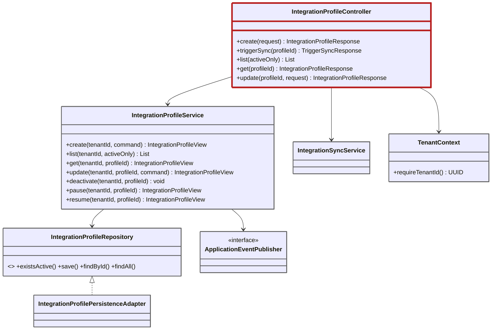

# Code

Fuentes: [IntegrationProfileController.java](../../src/main/java/com/cl2/integration/adapter/in/web/IntegrationProfileController.java), [IntegrationProfileService.java](../../src/main/java/com/cl2/integration/application/IntegrationProfileService.java).

El diagrama omite `pause`, `resume`, `delete` y los dry-runs del controller, y `IntegrationProfilePersistenceAdapter → IntegrationProfileRepository` es una relación por convención de nombres (`INFERRED`).

