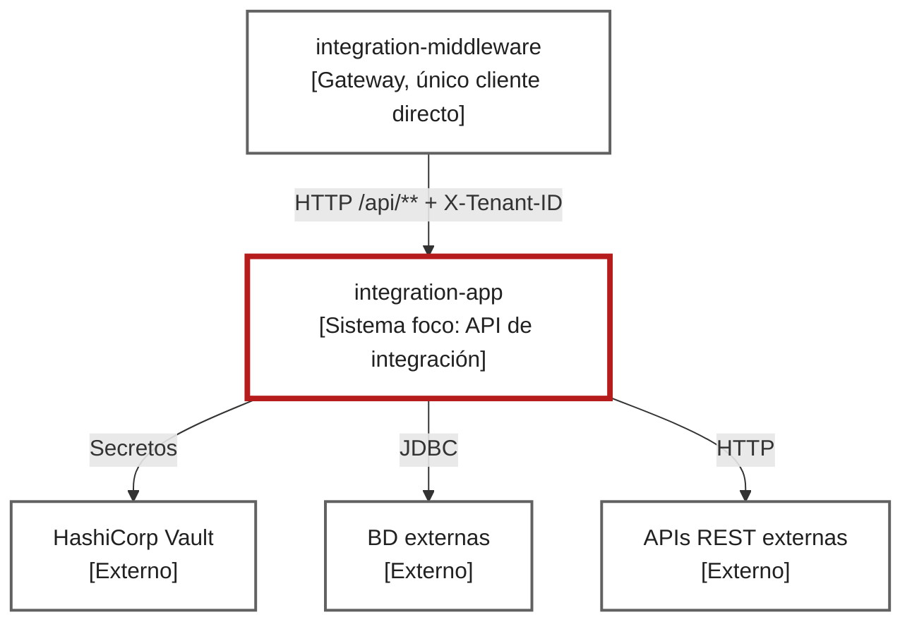

# Context

El gateway es el único cliente que ve el servicio; autentica el JWT y entrega `X-Tenant-ID` ([TenantClaimGatewayFilter.java](../../../gateway/src/main/java/com/cl2/integration/gateway/security/TenantClaimGatewayFilter.java)). `integration-app` no aplica Spring Security: no hay `SecurityFilterChain`, según el agente que lo revisó. Verifícalo antes de exponerlo sin gateway.
