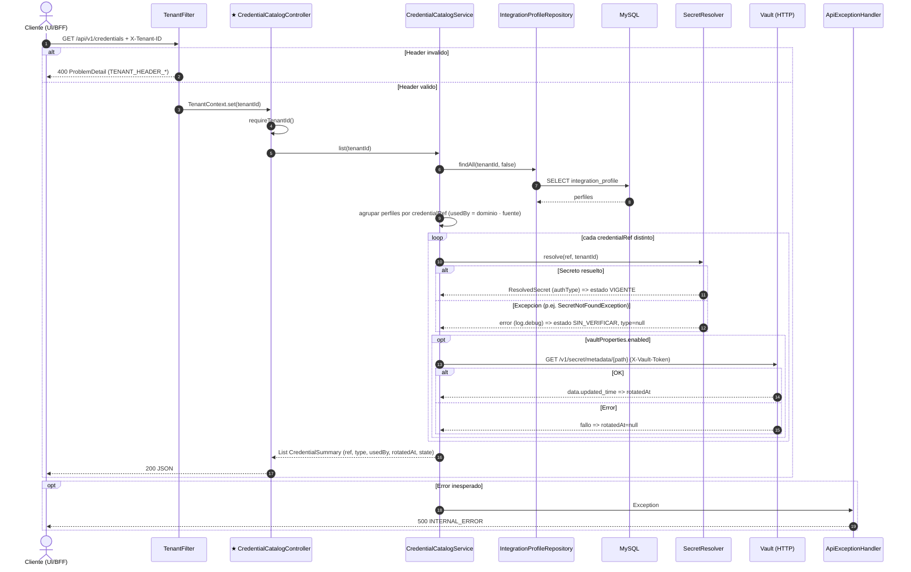

# GET /api/v1/credentials

Catalogo de credenciales por tenant. Origen: INFERRED_FROM_CONTROLLER (no existe OpenAPI). Participante foco marcado con ★.

## Archivos fuente

- [CredentialCatalogController](../../../src/main/java/com/cl2/integration/adapter/in/web/CredentialCatalogController.java)
- [CredentialCatalogService](../../../src/main/java/com/cl2/integration/integration/credential/CredentialCatalogService.java)
- [IntegrationProfilePersistenceAdapter](../../../src/main/java/com/cl2/integration/adapter/out/persistence/IntegrationProfilePersistenceAdapter.java)
- [SecretResolver](../../../src/main/java/com/cl2/integration/integration/security/SecretResolver.java)
- [VaultSecretResolver](../../../src/main/java/com/cl2/integration/integration/security/VaultSecretResolver.java)
- [InMemorySecretResolver](../../../src/main/java/com/cl2/integration/integration/security/InMemorySecretResolver.java)
- [VaultProperties](../../../src/main/java/com/cl2/integration/integration/security/VaultProperties.java)
- [TenantFilter](../../../src/main/java/com/cl2/integration/infrastructure/tenant/TenantFilter.java)
- [TenantContext](../../../src/main/java/com/cl2/integration/infrastructure/tenant/TenantContext.java)
- [ApiExceptionHandler](../../../src/main/java/com/cl2/integration/adapter/in/web/ApiExceptionHandler.java)

## Procedencia

- Contrato del endpoint: INFERRED_FROM_CONTROLLER.
- EXTRACTED: service y llamada REST a Vault metadata. INFERRED: la implementacion de SecretResolver activa (Vault o InMemory) y la tabla MySQL de perfiles; no se verifico la condicion de activacion.
- Todas las rutas (excepto /actuator) exigen cabecera X-Tenant-ID (TenantFilter).
