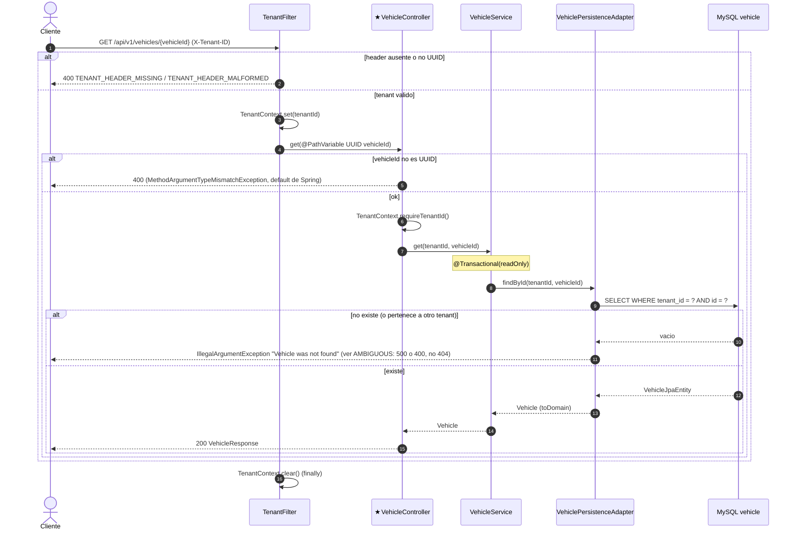

# GET /api/v1/vehicles/{vehicleId} (INFERRED_FROM_CONTROLLER)

## Archivos fuente

- [VehicleController](../../src/main/java/com/cl2/integration/vehicle/adapter/in/web/VehicleController.java)
- [VehicleService](../../src/main/java/com/cl2/integration/vehicle/application/VehicleService.java)
- [VehiclePersistenceAdapter](../../src/main/java/com/cl2/integration/vehicle/adapter/out/persistence/VehiclePersistenceAdapter.java)
- [SpringDataVehicleRepository](../../src/main/java/com/cl2/integration/vehicle/adapter/out/persistence/SpringDataVehicleRepository.java)
- [TenantFilter](../../src/main/java/com/cl2/integration/infrastructure/tenant/TenantFilter.java)

## Procedencia

- EXTRACTED: `findByTenantIdAndId` + `orElseThrow(IllegalArgumentException)`.
- INFERRED: el status del "no encontrado" (el handler global no cubre este paquete). Un vehiculo de otro tenant se trata igual que uno inexistente (no 403).
- Marca: INFERRED_FROM_CONTROLLER (no hay OpenAPI).
