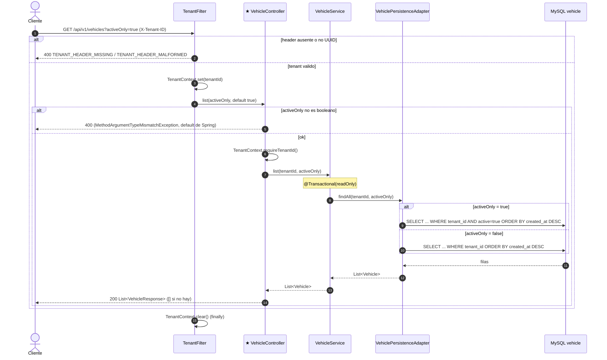

# GET /api/v1/vehicles (INFERRED_FROM_CONTROLLER)

## Archivos fuente

- [VehicleController](../../src/main/java/com/cl2/integration/vehicle/adapter/in/web/VehicleController.java)
- [VehicleService](../../src/main/java/com/cl2/integration/vehicle/application/VehicleService.java)
- [VehiclePersistenceAdapter](../../src/main/java/com/cl2/integration/vehicle/adapter/out/persistence/VehiclePersistenceAdapter.java)
- [SpringDataVehicleRepository](../../src/main/java/com/cl2/integration/vehicle/adapter/out/persistence/SpringDataVehicleRepository.java)
- [TenantFilter](../../src/main/java/com/cl2/integration/infrastructure/tenant/TenantFilter.java)

## Procedencia

- EXTRACTED: dos variantes de consulta segun `activeOnly`, orden por `createdAt` descendente.
- INFERRED: 400 por tipo invalido (default de Spring). Sin Kafka/outbox. Sin 403/404.
- Marca: INFERRED_FROM_CONTROLLER (no hay OpenAPI).
