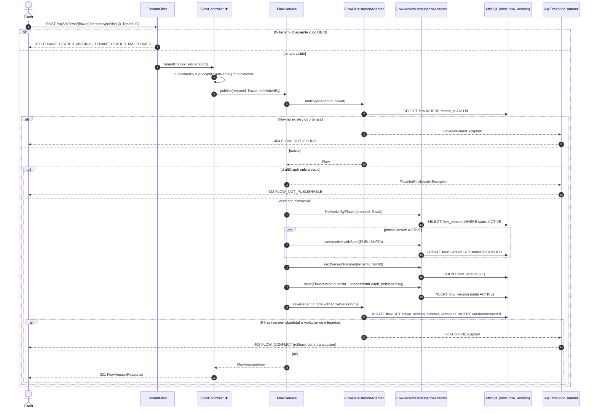

# POST /api/v1/flows/{flowId}/versions/publish

Origen del contrato: INFERRED_FROM_CONTROLLER (no existe OpenAPI). El participante foco es `FlowController` (marcado con ★).

## Archivos fuente

- [FlowController](../../../src/main/java/com/cl2/integration/adapter/in/web/FlowController.java)
- [ApiExceptionHandler](../../../src/main/java/com/cl2/integration/adapter/in/web/ApiExceptionHandler.java)
- [TenantFilter](../../../src/main/java/com/cl2/integration/infrastructure/tenant/TenantFilter.java)
- [TenantContext](../../../src/main/java/com/cl2/integration/infrastructure/tenant/TenantContext.java)
- [FlowService](../../../src/main/java/com/cl2/integration/application/FlowService.java)
- [Flow (dominio)](../../../src/main/java/com/cl2/integration/domain/model/Flow.java)
- [FlowVersion (dominio)](../../../src/main/java/com/cl2/integration/domain/model/FlowVersion.java)
- [FlowRepository (puerto)](../../../src/main/java/com/cl2/integration/domain/port/FlowRepository.java)
- [FlowVersionRepository (puerto)](../../../src/main/java/com/cl2/integration/domain/port/FlowVersionRepository.java)
- [FlowPersistenceAdapter](../../../src/main/java/com/cl2/integration/adapter/out/persistence/FlowPersistenceAdapter.java)
- [FlowVersionPersistenceAdapter](../../../src/main/java/com/cl2/integration/adapter/out/persistence/FlowVersionPersistenceAdapter.java)

## Procedencia

- EXTRACTED: ruta, verbos, DTOs, llamadas controller -> servicio -> puerto -> adapter, consultas y excepciones/codigos HTTP, leidos directamente del codigo.
- INFERRED: la base de datos es MySQL (supuesto del proyecto; el codigo usa JPA/SQL nativo sin fijar el motor), nombres de tablas tomados de `@Table`, y la mencion de codigos 400/422 por tipo de excepcion.
- No existe respuesta 403 por tenant: el aislamiento es por filtrado `tenant_id` y un tenant ajeno recibe 404 (o 400 si falta/esta mal el header `X-Tenant-ID`).
- Sin Kafka ni sistemas externos en este endpoint.
