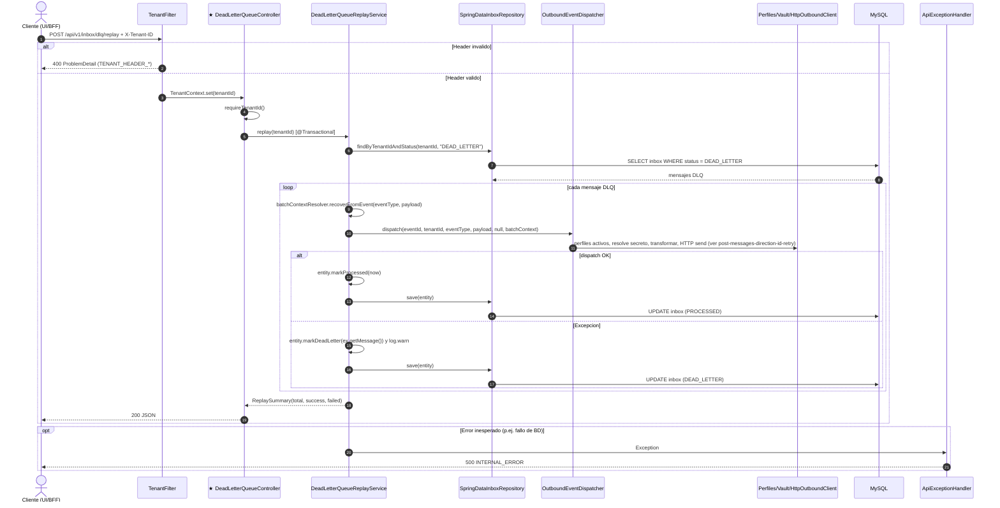

# POST /api/v1/inbox/dlq/replay

Reproducir mensajes en DLQ del tenant. Origen: INFERRED_FROM_CONTROLLER (no existe OpenAPI). Participante foco marcado con ★.

## Archivos fuente

- [DeadLetterQueueController](../../../src/main/java/com/cl2/integration/adapter/in/web/DeadLetterQueueController.java)
- [DeadLetterQueueReplayService](../../../src/main/java/com/cl2/integration/integration/inbox/DeadLetterQueueReplayService.java)
- [SpringDataInboxRepository](../../../src/main/java/com/cl2/integration/integration/inbox/SpringDataInboxRepository.java)
- [OutboundEventDispatcher](../../../src/main/java/com/cl2/integration/integration/outbound/OutboundEventDispatcher.java)
- [HttpOutboundClient](../../../src/main/java/com/cl2/integration/adapter/out/http/HttpOutboundClient.java)
- [SecretResolver](../../../src/main/java/com/cl2/integration/integration/security/SecretResolver.java)
- [IntegrationProfilePersistenceAdapter](../../../src/main/java/com/cl2/integration/adapter/out/persistence/IntegrationProfilePersistenceAdapter.java)
- [TenantFilter](../../../src/main/java/com/cl2/integration/infrastructure/tenant/TenantFilter.java)
- [TenantContext](../../../src/main/java/com/cl2/integration/infrastructure/tenant/TenantContext.java)
- [ApiExceptionHandler](../../../src/main/java/com/cl2/integration/adapter/in/web/ApiExceptionHandler.java)

## Procedencia

- Contrato del endpoint: INFERRED_FROM_CONTROLLER.
- EXTRACTED: controller y service. INFERRED: detalle interno del dispatcher resumido; no hay uso de Kafka en este camino (DeadLetterQueuePublisher no se invoca desde el replay).
- Todas las rutas (excepto /actuator) exigen cabecera X-Tenant-ID (TenantFilter).
