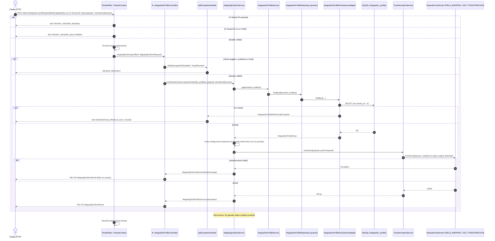

# POST /api/v1/integration-profiles/{profileId}/mapping/dry-run

INFERRED_FROM_CONTROLLER: no existe OpenAPI; el contrato se derivo de `IntegrationProfileController.mappingDryRun` y del codigo que invoca. Ejecuta una transformacion de prueba con transformationJson sin persistir. Errores de transformacion van en el cuerpo con 200.

El foco (el controller) se marca con `★`.

## Archivos fuente

- [IntegrationProfileController](../../../src/main/java/com/cl2/integration/adapter/in/web/IntegrationProfileController.java)
- [TenantFilter](../../../src/main/java/com/cl2/integration/infrastructure/tenant/TenantFilter.java)
- [TenantContext](../../../src/main/java/com/cl2/integration/infrastructure/tenant/TenantContext.java)
- [ApiExceptionHandler](../../../src/main/java/com/cl2/integration/adapter/in/web/ApiExceptionHandler.java)
- [MappingDryRunRequest](../../../src/main/java/com/cl2/integration/adapter/in/web/dto/MappingDryRunRequest.java)
- [MappingDryRunService](../../../src/main/java/com/cl2/integration/integration/transformation/MappingDryRunService.java)
- [IntegrationProfileService](../../../src/main/java/com/cl2/integration/application/IntegrationProfileService.java)
- [TransformationService](../../../src/main/java/com/cl2/integration/integration/transformation/TransformationService.java)
- [IntegrationProfileRepository](../../../src/main/java/com/cl2/integration/domain/port/IntegrationProfileRepository.java)
- [IntegrationProfilePersistenceAdapter](../../../src/main/java/com/cl2/integration/adapter/out/persistence/IntegrationProfilePersistenceAdapter.java)

## Procedencia

- EXTRACTED: rutas, codigos de estado (@ResponseStatus), flujo controller -> service -> puerto -> adaptador, eventos, mapeo de excepciones en ApiExceptionHandler y errores de TenantFilter (400).
- INFERRED: nombres de tabla MySQL (por migraciones Flyway `integration_profile`, `integration_sync_state`), codigos HTTP de errores sin handler dedicado, y comportamiento de borde marcado AMBIGUOUS.
- No se documenta 403: no hay Spring Security en la aplicacion.

## Notas y dudas

- MappingDryRunService.run no es @Transactional; la lectura del perfil usa la transaccion readOnly de IntegrationProfileService.get.
- Los PayloadTransformer concretos (FieldMapping, Jslt, Passthrough) se resumen en un participante.
