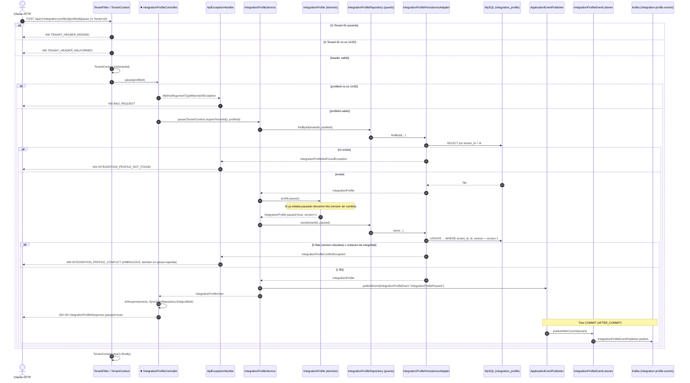

# POST /api/v1/integration-profiles/{profileId}/pause

INFERRED_FROM_CONTROLLER: no existe OpenAPI; el contrato se derivo de `IntegrationProfileController.pause` y del codigo que invoca. Pausa el perfil (paused=true) y publica IntegrationProfilePaused.

El foco (el controller) se marca con `★`.

## Archivos fuente

- [IntegrationProfileController](../../../src/main/java/com/cl2/integration/adapter/in/web/IntegrationProfileController.java)
- [TenantFilter](../../../src/main/java/com/cl2/integration/infrastructure/tenant/TenantFilter.java)
- [TenantContext](../../../src/main/java/com/cl2/integration/infrastructure/tenant/TenantContext.java)
- [ApiExceptionHandler](../../../src/main/java/com/cl2/integration/adapter/in/web/ApiExceptionHandler.java)
- [IntegrationProfileService](../../../src/main/java/com/cl2/integration/application/IntegrationProfileService.java)
- [IntegrationProfile](../../../src/main/java/com/cl2/integration/domain/model/IntegrationProfile.java)
- [IntegrationProfileRepository](../../../src/main/java/com/cl2/integration/domain/port/IntegrationProfileRepository.java)
- [IntegrationProfilePersistenceAdapter](../../../src/main/java/com/cl2/integration/adapter/out/persistence/IntegrationProfilePersistenceAdapter.java)
- [IntegrationProfileEventPublisher](../../../src/main/java/com/cl2/integration/integration/profile/IntegrationProfileEventPublisher.java)
- [IntegrationProfileEventListener](../../../src/main/java/com/cl2/integration/integration/profile/IntegrationProfileEventListener.java)
- [SyncStatePersistenceAdapter](../../../src/main/java/com/cl2/integration/integration/sync/SyncStatePersistenceAdapter.java)

## Procedencia

- EXTRACTED: rutas, codigos de estado (@ResponseStatus), flujo controller -> service -> puerto -> adaptador, eventos, mapeo de excepciones en ApiExceptionHandler y errores de TenantFilter (400).
- INFERRED: nombres de tabla MySQL (por migraciones Flyway `integration_profile`, `integration_sync_state`), codigos HTTP de errores sin handler dedicado, y comportamiento de borde marcado AMBIGUOUS.
- No se documenta 403: no hay Spring Security en la aplicacion.

## Notas y dudas

- AMBIGUOUS: si ya estaba pausado, pause() devuelve la misma instancia sin incrementar version; save() usa version-1 como esperada, por lo que probablemente da 0 filas y 409. Verificar con una prueba.
