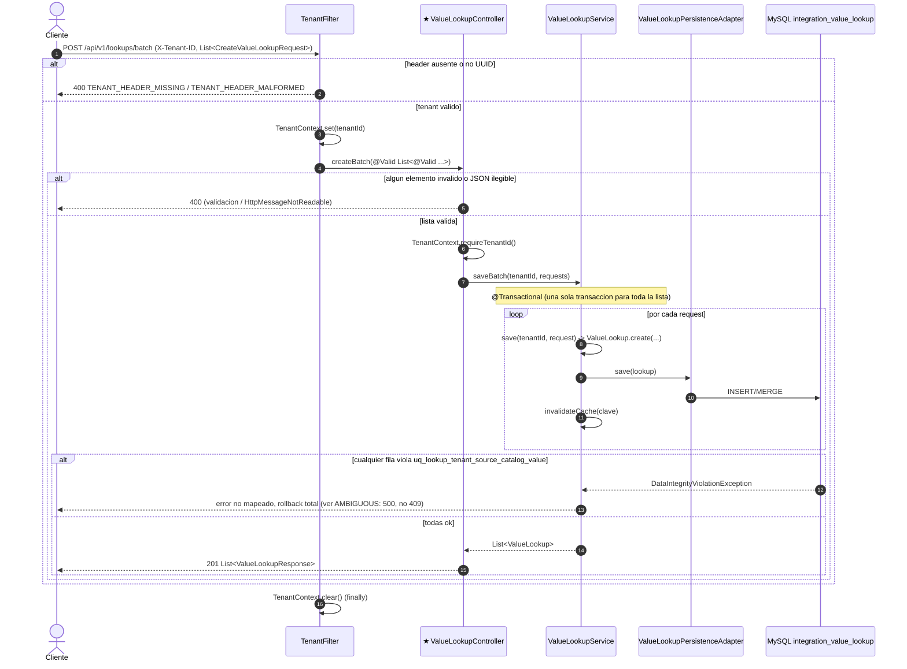

# POST /api/v1/lookups/batch (INFERRED_FROM_CONTROLLER)

## Archivos fuente

- [ValueLookupController](../../src/main/java/com/cl2/integration/integration/lookup/adapter/in/web/ValueLookupController.java)
- [CreateValueLookupRequest](../../src/main/java/com/cl2/integration/integration/lookup/adapter/in/web/dto/CreateValueLookupRequest.java)
- [ValueLookupService](../../src/main/java/com/cl2/integration/integration/lookup/application/ValueLookupService.java)
- [ValueLookupPersistenceAdapter](../../src/main/java/com/cl2/integration/integration/lookup/adapter/out/persistence/ValueLookupPersistenceAdapter.java)
- [TenantFilter](../../src/main/java/com/cl2/integration/infrastructure/tenant/TenantFilter.java)
- [V8__create_integration_value_lookup.sql](../../src/main/resources/db/migration/V8__create_integration_value_lookup.sql)

## Procedencia

- EXTRACTED: bucle de `save` dentro de `saveBatch` transaccional; invalidacion de cache por clave.
- INFERRED: rollback total ante fallo (por `@Transactional` de `saveBatch`); status 400/500 de errores no mapeados. Sin Kafka/outbox. Sin 403.
- Marca: INFERRED_FROM_CONTROLLER (no hay OpenAPI).
