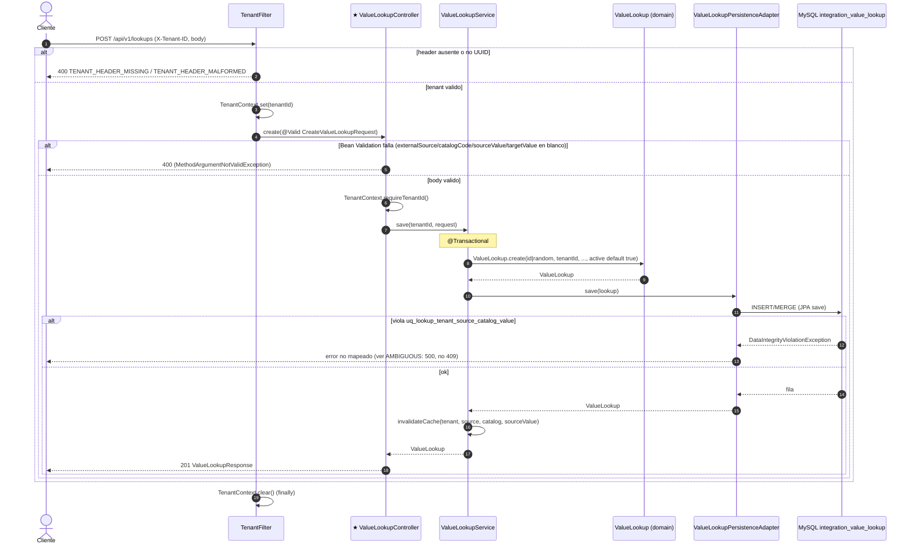

# POST /api/v1/lookups (INFERRED_FROM_CONTROLLER)

## Archivos fuente

- [ValueLookupController](../../src/main/java/com/cl2/integration/integration/lookup/adapter/in/web/ValueLookupController.java)
- [CreateValueLookupRequest](../../src/main/java/com/cl2/integration/integration/lookup/adapter/in/web/dto/CreateValueLookupRequest.java)
- [ValueLookupService](../../src/main/java/com/cl2/integration/integration/lookup/application/ValueLookupService.java)
- [ValueLookup](../../src/main/java/com/cl2/integration/integration/lookup/domain/ValueLookup.java)
- [ValueLookupPersistenceAdapter](../../src/main/java/com/cl2/integration/integration/lookup/adapter/out/persistence/ValueLookupPersistenceAdapter.java)
- [TenantFilter](../../src/main/java/com/cl2/integration/infrastructure/tenant/TenantFilter.java)
- [V8__create_integration_value_lookup.sql](../../src/main/resources/db/migration/V8__create_integration_value_lookup.sql)

## Procedencia

- EXTRACTED: flujo controller -> service -> domain -> adapter -> MySQL, validaciones, cache, 201 y 400 del filtro de tenant.
- INFERRED: status 400 por validacion (default de Spring) y 500 por violacion de unicidad. `ApiExceptionHandler` solo cubre el paquete `adapter.in.web` raiz, no este controller. No hay Kafka/outbox en este endpoint. No existe 403 de tenant: la falta de tenant produce 400.
- Marca: INFERRED_FROM_CONTROLLER (no hay OpenAPI).
