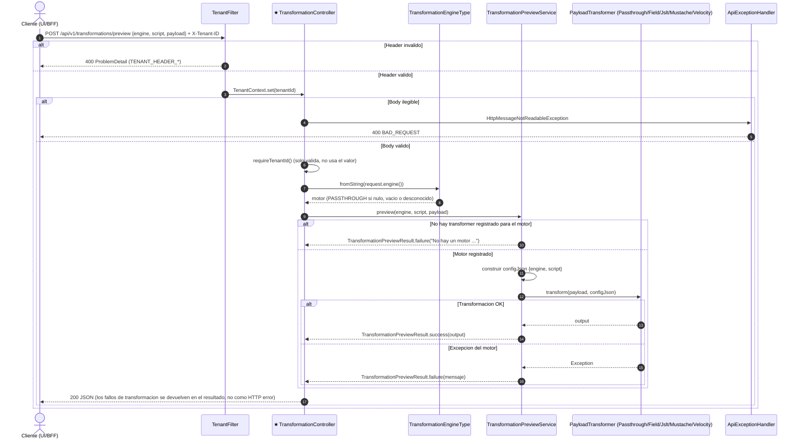

# POST /api/v1/transformations/preview

Previsualizar una transformacion. Origen: INFERRED_FROM_CONTROLLER (no existe OpenAPI). Participante foco marcado con ★.

## Archivos fuente

- [TransformationController](../../../src/main/java/com/cl2/integration/adapter/in/web/TransformationController.java)
- [TransformationPreviewService](../../../src/main/java/com/cl2/integration/integration/transformation/TransformationPreviewService.java)
- [TransformationEngineType](../../../src/main/java/com/cl2/integration/integration/transformation/TransformationEngineType.java)
- [PayloadTransformer](../../../src/main/java/com/cl2/integration/integration/transformation/PayloadTransformer.java)
- [TransformationPreviewRequest](../../../src/main/java/com/cl2/integration/adapter/in/web/dto/TransformationPreviewRequest.java)
- [TenantFilter](../../../src/main/java/com/cl2/integration/infrastructure/tenant/TenantFilter.java)
- [TenantContext](../../../src/main/java/com/cl2/integration/infrastructure/tenant/TenantContext.java)
- [ApiExceptionHandler](../../../src/main/java/com/cl2/integration/adapter/in/web/ApiExceptionHandler.java)

## Procedencia

- Contrato del endpoint: INFERRED_FROM_CONTROLLER.
- EXTRACTED: controller y service (sin persistencia ni I/O externo). INFERRED: comportamiento interno de cada motor no revisado.
- Todas las rutas (excepto /actuator) exigen cabecera X-Tenant-ID (TenantFilter).
