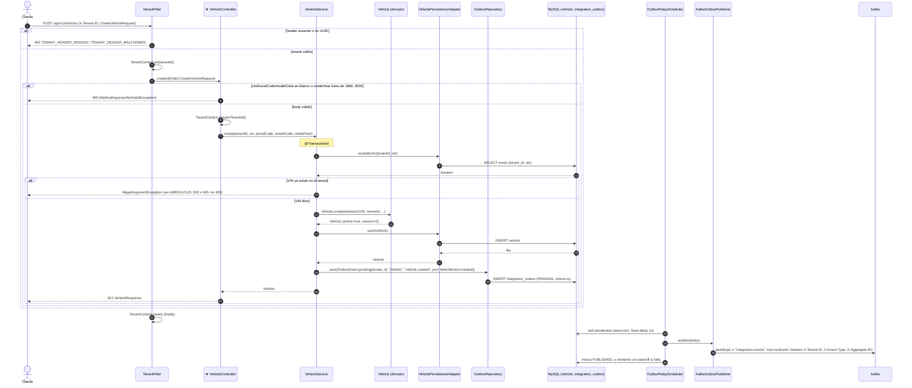

# POST /api/v1/vehicles (INFERRED_FROM_CONTROLLER)

## Archivos fuente

- [VehicleController](../../src/main/java/com/cl2/integration/vehicle/adapter/in/web/VehicleController.java)
- [VehicleService](../../src/main/java/com/cl2/integration/vehicle/application/VehicleService.java)
- [VehicleEvent](../../src/main/java/com/cl2/integration/vehicle/application/VehicleEvent.java)
- [Vehicle](../../src/main/java/com/cl2/integration/vehicle/domain/Vehicle.java)
- [VehiclePersistenceAdapter](../../src/main/java/com/cl2/integration/vehicle/adapter/out/persistence/VehiclePersistenceAdapter.java)
- [OutboxRelayScheduler](../../src/main/java/com/cl2/integration/integration/outbox/OutboxRelayScheduler.java)
- [KafkaOutboxPublisher](../../src/main/java/com/cl2/integration/integration/outbox/KafkaOutboxPublisher.java)
- [TenantFilter](../../src/main/java/com/cl2/integration/infrastructure/tenant/TenantFilter.java)
- [V2__create_vehicle_outbox_inbox.sql](../../src/main/resources/db/migration/V2__create_vehicle_outbox_inbox.sql)

## Procedencia

- EXTRACTED: pre-chequeo `existsByVin`, insercion de vehiculo y de evento outbox en la misma transaccion; relay programado y envio a Kafka.
- INFERRED: topic real del evento (depende de `OutboxEvent.pending`, que no se leyo; el publisher usa `integration.events` si es vacio); status de error del VIN duplicado (no hay 409; `uq_vehicle_tenant_vin` tambien protege ante carrera). Sin 403.
- Marca: INFERRED_FROM_CONTROLLER (no hay OpenAPI).
