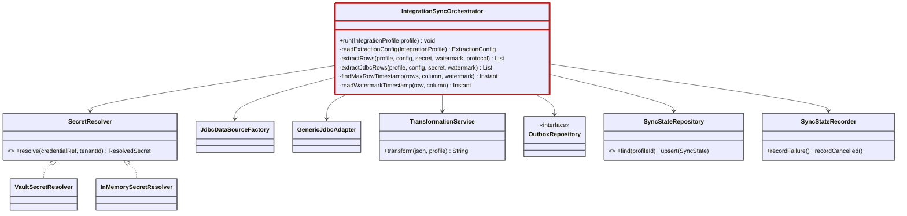

# C4 Code: IntegrationSyncOrchestrator

Las dependencias salen del constructor de [IntegrationSyncOrchestrator.java](../../application/src/main/java/com/cl2/integration/integration/sync/IntegrationSyncOrchestrator.java). El constructor también recibe un `ResilienceExecutor`, un `ObjectMapper` y las métricas, y hay otro parámetro opcional (el 4.º) que no identifiqué. Los omití para no sobrecargar el diagrama.

Comportamiento de `run(profile)` (líneas 111-205):
1. Resuelve el secreto con `credentialRef` y lee el watermark previo.
2. Extrae filas según el protocolo; el caso `JDBC` usa `GenericJdbcAdapter`.
3. Transforma cada fila (o el lote) con `TransformationService` y escribe en el outbox.
4. En éxito hace `syncStateRepository.upsert(...)` con el watermark avanzado y estado `SUCCESS`.
5. En cancelación o fallo, `SyncStateRecorder` registra el estado.

La firma exacta de los métodos privados es una simplificación (`INFERRED`): no leí sus cuerpos completos.
