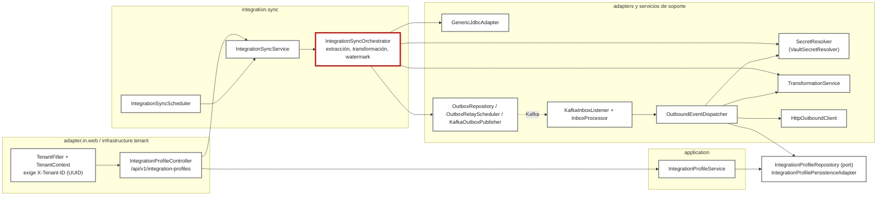

# C4 Component: integration-app

Arquitectura descubierta: hexagonal. Hay `domain/port`, `adapter/in/web`, `adapter/out/*`, `application` e `infrastructure`. Encima hay un paquete `integration/*` con los motores de sincronización, mensajería y transformación.

Este diagrama muestra el subconjunto de componentes que participan en las secuencias S2 y S3. No lista los de `flow`, `lookup`, `vehicle`, `monitor` ni `batch`.

| Componente | Responsabilidad | Código | Procedencia |
|---|---|---|---|
| TenantFilter / TenantContext | Exige `X-Tenant-ID` UUID; lo guarda en un ThreadLocal | [TenantFilter.java](../../application/src/main/java/com/cl2/integration/infrastructure/tenant/TenantFilter.java) | EXTRACTED |
| IntegrationProfileController | CRUD y acciones sobre perfiles | [IntegrationProfileController.java](../../application/src/main/java/com/cl2/integration/adapter/in/web/IntegrationProfileController.java) | EXTRACTED |
| IntegrationProfileService | Casos de uso transaccionales y eventos de perfil | [IntegrationProfileService.java](../../application/src/main/java/com/cl2/integration/application/IntegrationProfileService.java) | EXTRACTED |
| IntegrationSyncService, IntegrationSyncScheduler | Disparo manual y programado de la sync | [sync](../../application/src/main/java/com/cl2/integration/integration/sync) | INFERRED (relación con el Orchestrator) |
| IntegrationSyncOrchestrator | Extrae, transforma, escribe outbox y avanza el watermark | [IntegrationSyncOrchestrator.java](../../application/src/main/java/com/cl2/integration/integration/sync/IntegrationSyncOrchestrator.java) | EXTRACTED |
| Outbox (relay, publisher) | Publica eventos en Kafka | [outbox](../../application/src/main/java/com/cl2/integration/integration/outbox) | EXTRACTED |
| KafkaInboxListener, InboxProcessor | Consume eventos y deduplica | [inbox](../../application/src/main/java/com/cl2/integration/integration/inbox) | EXTRACTED |
| OutboundEventDispatcher, HttpOutboundClient | Resuelve perfiles outbound y entrega por HTTP | [outbound](../../application/src/main/java/com/cl2/integration/integration/outbound) | EXTRACTED |
