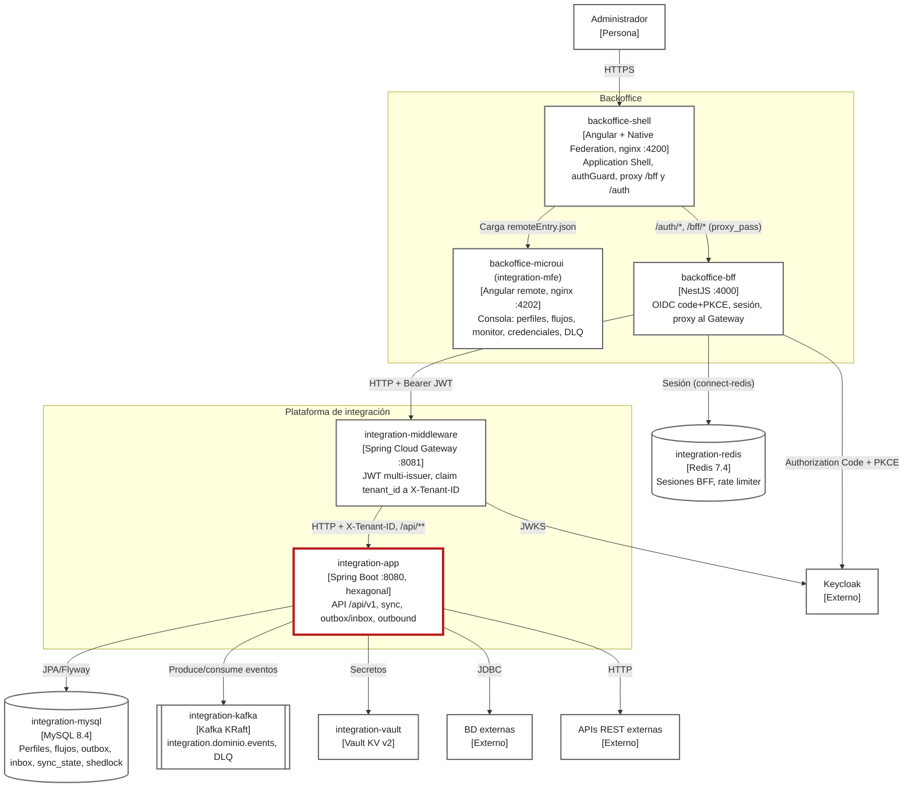

# C4 Container

Foco: `integration-app`, el backend Spring Boot que contiene la API, la sincronización y el motor de mensajería.

| Container | Tecnología / puerto | Fuente | Procedencia |
|---|---|---|---|
| backoffice-shell | Angular + Native Federation, nginx, 4200 | [docker-compose.yaml](../../docker-compose.yaml), [shell.nginx.conf](../../backoffice/docker/shell.nginx.conf) | EXTRACTED |
| backoffice-microui | Angular remote `integration-mfe`, nginx, 4202 | [app.routes.ts](../../backoffice/apps/shell/src/app/app.routes.ts) | EXTRACTED |
| backoffice-bff | NestJS, 4000 | [main.ts](../../backoffice/apps/bff/src/main.ts), [ADR 0007](../adrs/0007-bff-nodejs-framework-nestjs.md) | EXTRACTED |
| integration-middleware | Spring Cloud Gateway, 8081 | [gateway](../../gateway) | EXTRACTED |
| integration-app | Spring Boot, 8080 | [application](../../application) | EXTRACTED |
| integration-mysql, integration-kafka, integration-vault | MySQL, Kafka, Vault | [docker-compose.yaml](../../docker-compose.yaml) | EXTRACTED |
| integration-redis | Redis; sesiones del BFF y rate limiter | [configure-session.ts](../../backoffice/apps/bff/src/session/configure-session.ts) | EXTRACTED (uso por el BFF); INFERRED (que sea la misma instancia que usa `integration-app`) |

Fuera de este diagrama quedan `integration-prometheus` e `integration-grafana`, que son observabilidad y también corren en el compose.

El perfil `qa-e2e` activa en el gateway la validación JWT contra `microservicios` y `Apps` ([GatewaySecurityConfig.java](../../gateway/src/main/java/com/cl2/integration/gateway/security/GatewaySecurityConfig.java)).
