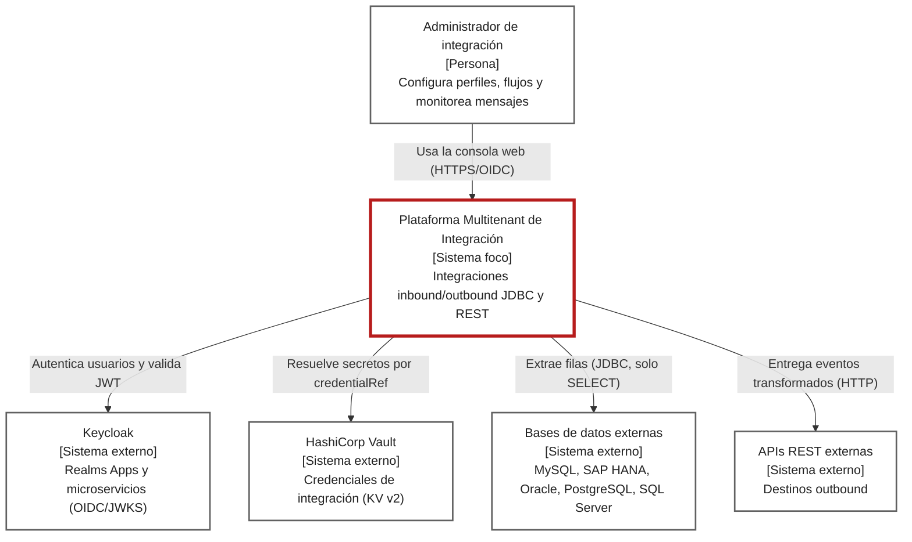

# C4 Context

El sistema foco (borde rojo) integra sistemas origen y destino mediante perfiles configurables. Un administrador los gestiona desde la consola web.

| Elemento | Tipo | Fuente | Procedencia |
|---|---|---|---|
| Administrador de integración | Persona | [README del backoffice](../../backoffice/README.md), rutas del [shell](../../backoffice/apps/shell/src/app/app.routes.ts) | EXTRACTED |
| Keycloak (realms `Apps`, `microservicios`) | Externo | [ADR 0003](../adrs/0003-gateway-multi-issuer-trust-realm-apps.md), [application.yml del gateway](../../gateway/src/main/resources/application.yml) | EXTRACTED |
| HashiCorp Vault | Externo | [docker-compose.yaml](../../docker-compose.yaml), `VaultSecretResolver` | EXTRACTED |
| Bases de datos externas | Externo | [solution_architecture.md](../solution_architecture.md), `GenericJdbcAdapter` | EXTRACTED |
| APIs REST externas | Externo | `HttpOutboundClient`, `OutboundEventDispatcher` | EXTRACTED |
