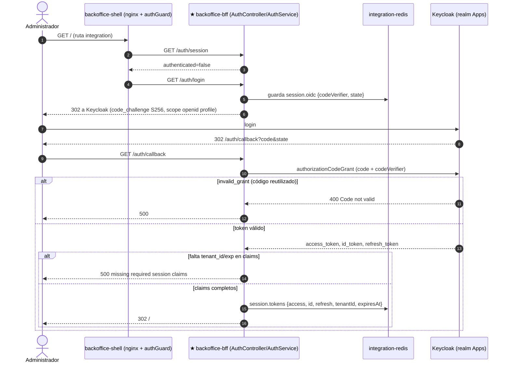
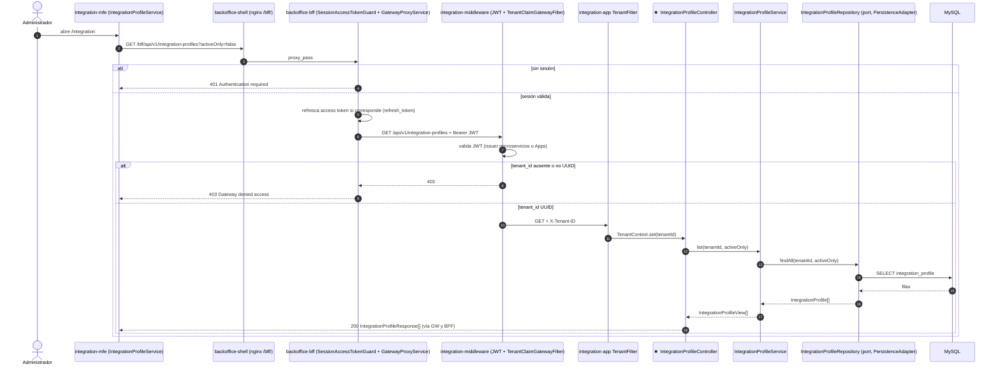
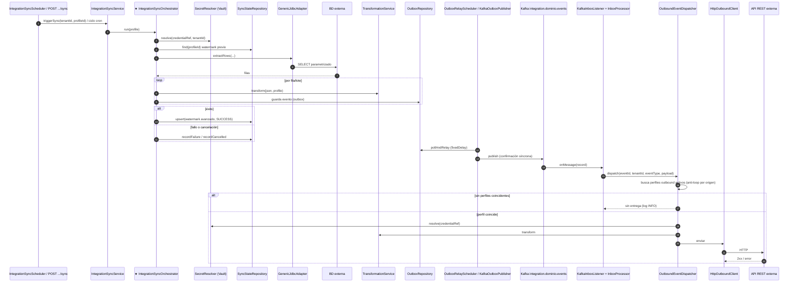

# Secuencias E2E

El foco de cada secuencia se marca con `★` en el participante. Mermaid no permite borde por participante, así que `★` sustituye al borde `dark red 700` en esta vista.

Procedencia: todos los mensajes salen de código leído (`EXTRACTED`), salvo los marcados `INFERRED`.

## S1. Login OIDC (foco: backoffice-bff)

Fuentes: [auth.controller.ts](../../backoffice/apps/bff/src/auth/auth.controller.ts), [auth.service.ts](../../backoffice/apps/bff/src/auth/auth.service.ts), [auth.guard.ts](../../backoffice/apps/shell/src/app/auth.guard.ts).

## S2. Listar perfiles de integración (foco: IntegrationProfileController)

Atraviesa las capas completas: Shell/MFE → BFF → Gateway → API → Application → Port/Adapter → MySQL.

Fuentes: [gateway-proxy.controller.ts](../../backoffice/apps/bff/src/gateway-proxy/gateway-proxy.controller.ts), [TenantClaimGatewayFilter.java](../../gateway/src/main/java/com/cl2/integration/gateway/security/TenantClaimGatewayFilter.java), [TenantFilter.java](../../application/src/main/java/com/cl2/integration/infrastructure/tenant/TenantFilter.java), [IntegrationProfileController.java](../../application/src/main/java/com/cl2/integration/adapter/in/web/IntegrationProfileController.java), [IntegrationProfileService.java](../../application/src/main/java/com/cl2/integration/application/IntegrationProfileService.java).

## S3. Sync inbound JDBC → outbox → Kafka → entrega outbound (foco: IntegrationSyncOrchestrator)

Fuentes: [IntegrationSyncOrchestrator.java](../../application/src/main/java/com/cl2/integration/integration/sync/IntegrationSyncOrchestrator.java), [OutboxRelayScheduler.java](../../application/src/main/java/com/cl2/integration/integration/outbox/OutboxRelayScheduler.java), [KafkaInboxListener.java](../../application/src/main/java/com/cl2/integration/integration/inbox/KafkaInboxListener.java), [OutboundEventDispatcher.java](../../application/src/main/java/com/cl2/integration/integration/outbound/OutboundEventDispatcher.java).

`INFERRED`: la llamada `IntegrationSyncService → IntegrationSyncOrchestrator.run` (no leí el cuerpo de `IntegrationSyncService`). Tampoco verifiqué qué clase invoca el cron: `IntegrationSyncScheduler` está en el paquete, pero no leí su código.

