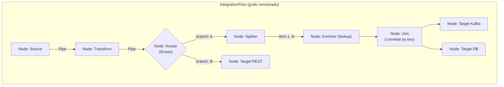
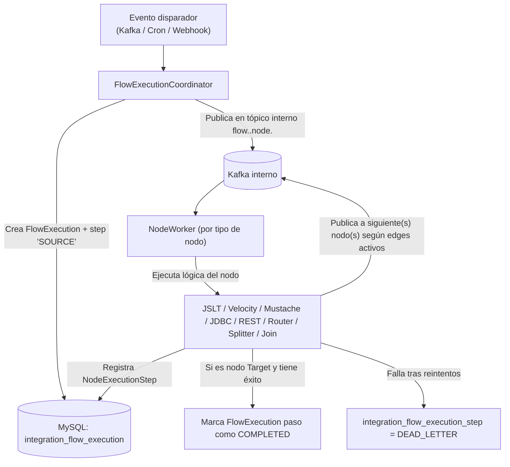
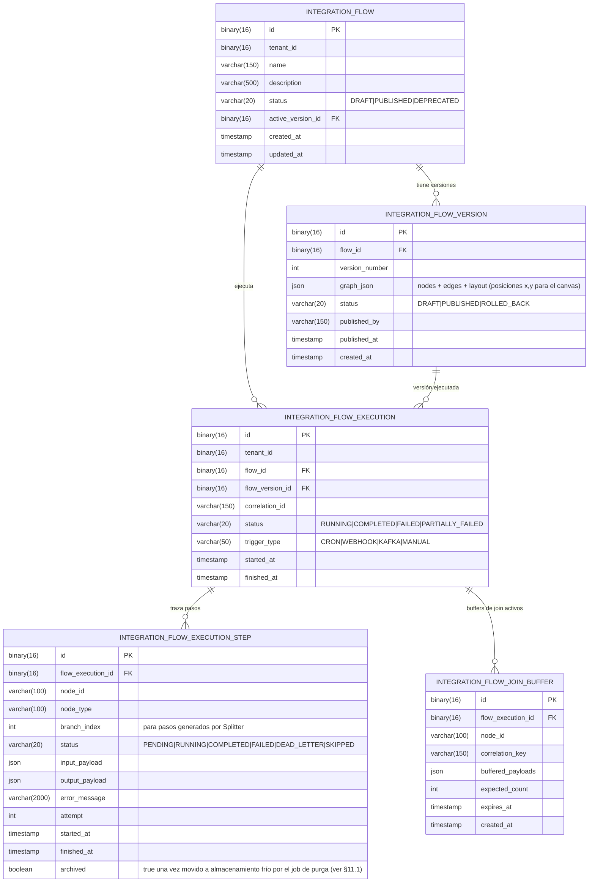

# Feature Design: Diseñador Visual de Flujos de Integración (Flow Designer)

**Estado**: Propuesta de diseño (draft para revisión)
**Autor**: Generado con Claude a partir de la arquitectura actual de la Plataforma Multitenant de Integración
**Relacionado con**: `solution_architecture.md`, `flujo-procesamiento.md`, `transformacion-lookup.md`, `db-adapter.md`, `api-rest-adapter.md`, ADR 0001 (Micro-UI Shell + Native Federation), ADR 0005 (Nx Monorepo)

---

## 1. Resumen ejecutivo

Hoy cada integración se define como un `IntegrationProfile`: un registro JSON declarativo con **una** fuente, **una** transformación (`FIELD_MAPPING` o `JSLT`) y **un** destino (JDBC, REST o Kafka). Es potente para el caso 1-a-1, pero no permite componer flujos con múltiples pasos, ramas condicionales, divisiones ("splitters") o combinaciones ("joins") de datos.

Este documento propone un **nuevo motor de flujos (`IntegrationFlow`)**, paralelo al motor de `IntegrationProfile` existente (no lo reemplaza ni lo migra), que implementa el patrón **Pipe & Filter**: un grafo dirigido de nodos conectados por *pipes* tipados, donde cada nodo es un *filter* (fuente, procesamiento o destino) con una responsabilidad única. Incluye:

1. **Motor de ejecución de flujos** (backend, Spring Boot) — orquesta el grafo, con soporte de branching, split/join, reintentos y trazabilidad por nodo.
2. **Diseñador visual de flujos** (frontend, Angular MFE + Rete.js) — canvas drag-and-drop para construir el grafo.
3. **Editor de transformaciones** — UI integrada para editar y previsualizar scripts JSLT, Velocity y Mustache con datos de muestra.
4. **Visualizador de ejecuciones** — vista tipo traza/timeline por instancia de ejecución, con estado, payload y errores por nodo.

Los `IntegrationProfile` actuales siguen funcionando sin cambios; `IntegrationFlow` es la opción a usar cuando el caso de integración requiere más de un paso de procesamiento o lógica de enrutamiento/combinación.

---

## 2. Motivación y alcance

### 2.1 Limitaciones del modelo actual que este feature resuelve

- No hay forma de encadenar más de una transformación o de enrutar un mismo evento a distintos destinos según una condición.
- No existen primitivas de **splitter** (un mensaje de entrada genera N mensajes de salida, p. ej. explotar un array) ni de **join/aggregator** (combinar N mensajes en uno, p. ej. correlacionar por clave y esperar a que lleguen varias fuentes).
- Las transformaciones están limitadas a `FIELD_MAPPING` y `JSLT`; no hay soporte para plantillas basadas en texto (Velocity, Mustache), necesarias para generar payloads no estrictamente JSON (XML, texto plano, SQL, mensajes EDI, etc.).
- No hay una herramienta visual: cada integración se configura vía JSON crudo por API, lo que dificulta el diseño, la revisión y el onboarding de nuevos integradores.
- No hay visualización de ejecuciones a nivel de flujo — solo hay tablas planas (`integration_outbox`, `integration_inbox`) sin una vista de "qué pasó en esta ejecución, nodo por nodo".

### 2.2 Fuera de alcance (v1)

- Migración automática de `IntegrationProfile` existentes a `IntegrationFlow`.
- Edición colaborativa en tiempo real (multi-usuario simultáneo sobre el mismo flujo).
- Marketplace de nodos de terceros / SDK de nodos custom en runtime (se define el catálogo cerrado de nodos en v1; extensibilidad vía plugin se deja para v2).
- Orquestación de larga duración tipo Saga con compensación explícita (se cubre con reintentos y DLQ, no con lógica de rollback de negocio).

---

## 3. Modelo conceptual



| Concepto | Definición |
|---|---|
| **Flow** | Grafo dirigido versionado que representa un caso de integración completo. Tiene metadatos (`name`, `tenantId`, `status`: `DRAFT`/`PUBLISHED`/`DEPRECATED`), una o más versiones inmutables, y una versión "activa" en ejecución. |
| **Node** | Unidad de trabajo del grafo. Tiene un `type` (del catálogo §4), una configuración específica de ese tipo, y puertos de entrada/salida tipados. |
| **Port** | Punto de conexión de un nodo. Los *source* solo tienen puertos de salida; los *target* solo de entrada; los intermedios tienen ambos. Un puerto declara el *shape* de datos esperado (`JSON`, `RECORD_LIST`, `RAW_TEXT`) para validar conexiones incompatibles en el canvas.
| **Edge / Pipe** | Conexión dirigida entre un puerto de salida y uno de entrada. Puede llevar una condición asociada (para nodos de tipo Router) o ser incondicional. |
| **FlowVersion** | Snapshot inmutable del grafo (nodos + edges + config) al momento de publicar. Permite rollback y auditoría. Solo una versión por flujo está `ACTIVE` para ejecución. |
| **FlowExecution** | Una corrida concreta del flujo, disparada por un evento de entrada (mensaje Kafka, fila JDBC extraída, request REST). Contiene el estado global (`RUNNING`, `COMPLETED`, `FAILED`, `PARTIALLY_FAILED`) y referencia a la `FlowVersion` ejecutada. |
| **NodeExecutionStep** | Traza de la ejecución de un nodo específico dentro de una `FlowExecution`: input, output, estado, duración, error. Es la unidad atómica que alimenta el visualizador de ejecuciones (§7). |

---

## 4. Catálogo de nodos (v1)

### 4.1 Nodos Source (fuentes)

| Nodo | Descripción | Reutiliza de la plataforma actual |
|---|---|---|
| **JDBC Source** | Extracción incremental por watermark desde BD externa. | `GenericJdbcAdapter`, `SqlSecurityValidator`, `JdbcDataSourceFactory` |
| **REST Source (Polling)** | Invoca un endpoint REST externo periódicamente (cron) y emite cada elemento de la respuesta como mensaje. | Patrón de `extractionConfig` REST Inbound ya documentado |
| **REST Source (Webhook)** | Expone un endpoint entrante `/api/v1/flows/{flowId}/webhook` que recibe payloads push desde el sistema externo. | Nuevo — reutiliza autenticación de Gateway/Keycloak |
| **Kafka Source** | Se suscribe a uno o más tópicos (incluye tópicos ya poblados por `IntegrationProfile` existentes, permitiendo componer flujos sobre eventos ya integrados). | `KafkaInboxListener` (patrón de suscripción dinámica) |

### 4.2 Nodos intermedios

| Categoría | Nodo | Detalle |
|---|---|---|
| **Transformación** | Transform (JSLT) | Reutiliza `TransformationService` + `lookup()` existente. |
| | Transform (Velocity) | Nuevo motor — Apache Velocity para plantillas basadas en texto (XML, SQL, texto plano). Contexto expone el payload de entrada como variables `$root`, más helpers (`$lookup`, `$date`, `$string`). |
| | Transform (Mustache) | Nuevo motor — JMustache/Mustache.java, "logic-less templates", útil para payloads de salida simples y mensajes legibles (notificaciones, plantillas de email/SMS embebidas en el flujo). |
| | Field Mapping | Igual al `FIELD_MAPPING` actual, expuesto como nodo visual con editor de mapeo campo-a-campo. |
| | Enricher (Lookup) | Aplica `ValueLookupService` como paso explícito, o hace un *lookup* remoto (llamada REST/JDBC de solo lectura) para enriquecer el payload antes de continuar. |
| **Control de flujo** | Router (if/then) | Evalúa una expresión booleana sobre el payload y enruta por la rama `true`/`false`. Soporta dos lenguajes de expresión intercambiables vía el campo `config.language` (ver §4.2.1): **SpEL** (default) o **JSLT**. |
| | Switch (case) | Evalúa una expresión (SpEL por defecto, o JSLT) y enruta según el valor resultante a N ramas nombradas + una rama `default`. |
| | Filter | Descarta mensajes que no cumplen una condición (rama única, sin `else`); mismo soporte dual SpEL/JSLT. |
| **Split / Join** | Splitter | Divide un payload tipo lista/array en N mensajes individuales que continúan el flujo en paralelo lógico, preservando un `correlationId` común. Fan-out máximo **10,000** elementos por ejecución de split (ver §5.2). |
| | Aggregator / Join | Combina mensajes correlacionados (por `correlationId` o por clave de negocio) hasta cumplir una condición de completitud (`count` fijo, `timeout`, o expresión SpEL/JSLT), y emite un único payload combinado. |
| **Utilidad** | Delay/Throttle | Introduce espera o control de tasa antes de continuar (reutiliza Token Bucket de Redis ya usado en Rate Limiting). |
| | Script (avanzado) | Nodo de escape hatch: expresión JSLT libre para lógica no cubierta por los nodos anteriores. |

### 4.3 Nodos Target (destinos)

| Nodo | Descripción | Reutiliza |
|---|---|---|
| **Kafka Target** | Publica el payload en un tópico (fijo o derivado dinámicamente, igual que `integration.<domain>.events`). | `KafkaOutboxPublisher`, Transactional Outbox |
| **DB Target** | Insert/Upsert parametrizado sobre BD externa o interna. | Extiende `GenericJdbcAdapter` a modo escritura (nuevo `GenericJdbcSinkAdapter` con `SqlSecurityValidator` adaptado para permitir `INSERT`/`UPDATE` solo en modo *sink* explícitamente configurado, nunca en modo *source*). |
| **REST Target** | POST/PUT/PATCH hacia API externa, con inyección de auth (OAuth2/Vault) igual que hoy. | `HttpOutboundClient`, `OAuth2TokenCacheManager`, `VaultSecretResolver` |

Todo nodo Target soporta política de reintentos y, al agotarlos, escribe en una **DLQ por nodo** (`integration_flow_execution_step` con estado `DEAD_LETTER`), visible y reprocesable desde el visualizador de ejecuciones.

### 4.2.1 Lenguaje de expresión para condiciones (Router / Switch / Filter / Join)

Se soportan **ambos lenguajes**, seleccionables por nodo mediante `config.language`:

| Lenguaje | Uso | Cuándo usarlo |
|---|---|---|
| **SpEL** (Spring Expression Language) — **default** | Nativo de Spring, sin dependencias nuevas; expresivo para comparaciones, operadores lógicos, acceso a propiedades anidadas (`payload.estado == 'ACTIVO' and payload.monto > 100`). | Caso general — es el valor por defecto al crear un nodo Router/Switch/Filter/Join nuevo en el canvas. |
| **JSLT** | Reutiliza el motor de transformación ya presente en la plataforma (`TransformationService`) y su función `lookup()`, útil cuando la condición necesita traducir un código externo antes de comparar (p. ej. `lookup("ESTADOS", .estado_codigo, "ACTIVO") == "ACTIVO"`). | Cuando la condición depende de un Value Lookup, o el equipo prefiere mantener consistencia con las transformaciones JSLT del mismo flujo. |

El panel de propiedades del nodo (§8.2) expone un selector `SpEL | JSLT` y adapta el syntax highlighting del editor de expresión en consecuencia. El resultado de evaluar la expresión debe ser booleano (Router/Filter) o un valor comparable contra las ramas declaradas (Switch).

---

## 5. Arquitectura del motor de ejecución

### 5.1 Decisión de diseño: motor propio vs. embeber un runtime existente

Se evaluaron tres opciones:

| Opción | Pros | Contras | Decisión |
|---|---|---|---|
| Embeber Apache NiFi / Camel completo | Motor maduro, UI propia | Stack nuevo pesado, dos sistemas de seguridad/multitenancy a mantener, no encaja con Spring Boot + hexagonal actual | Descartado |
| Motor BPMN (Camunda/Flowable) | Estándar de orquestación, buena UI de proceso | BPMN modela procesos de negocio, no pipe & filter de datos; overhead conceptual para algo que es ETL de eventos | Descartado |
| **Motor propio ligero sobre Spring Boot**, grafo DAG in-memory + persistencia de estado en MySQL, ejecución dirigida por eventos (Kafka ya es el bus) | Reutiliza 100% de la infraestructura y patrones ya construidos (Outbox/Inbox, Vault, Keycloak, multitenancy); control total del modelo de nodos | Hay que construirlo | **Elegido** |

### 5.2 Ejecución dirigida por eventos

El motor **no** mantiene el flujo completo "vivo" en memoria de extremo a extremo. Cada arista del grafo se materializa como una entrada en Kafka (reutilizando el patrón Outbox/Inbox ya probado), de modo que:

- El sistema es resiliente a caídas: si el proceso se reinicia a mitad de un flujo, el siguiente nodo retoma desde el mensaje persistido en su tópico interno.
- Se preserva el orden y backpressure naturalmente vía particiones de Kafka.
- El `NodeExecutionStep` se escribe de forma transaccional junto con la publicación al siguiente nodo (mismo patrón transactional-outbox que ya usa la plataforma).



- **NodeWorker**: un `@KafkaListener` genérico que resuelve el `nodeType` desde el mensaje y delega a la estrategia correspondiente (patrón Strategy, un `NodeExecutor` por tipo, igual espíritu que los adaptadores genéricos actuales).
- **Splitter**: al ejecutar, genera N mensajes hijos con el mismo `flowExecutionId` + `correlationId` heredado y un `branchIndex`; cada uno sigue el flujo de forma independiente. **Límite de fan-out: 10,000 elementos** por invocación del nodo — es un techo fijo de la plataforma (no configurable al alza desde el diseñador visual); si el payload de entrada excede el límite, el nodo falla la ejecución completa con estado `FAILED` y un `error_message` explícito, en vez de truncar silenciosamente el conjunto de salida. Esto protege a Kafka y a los nodos aguas abajo de una integración mal configurada (p. ej. una consulta JDBC sin filtro que devuelve un array gigante).
- **Join/Aggregator**: mantiene un buffer transaccional (tabla `integration_flow_join_buffer`) indexado por `correlationId`; cuando se cumple la condición de completitud, emite el mensaje combinado y limpia el buffer. Un scheduler evalúa timeouts de join igual que `IntegrationSyncScheduler` hoy.
- **Anti-fan-out infinito**: cada mensaje interno lleva un contador `hopCount`; se rechaza y se manda a DLQ si excede un máximo configurable (protección contra ciclos accidentales, ya que el diseñador visual valida DAG pero un edge condicional mal configurado podría re-visitar un nodo).

### 5.3 Multitenancy y seguridad

Se mantiene el mismo modelo que hoy: `tenant_id` viaja en cada mensaje interno (igual que `X-Tenant-ID` hoy), `TenantContext` (ThreadLocal) se resuelve al inicio de cada `NodeWorker`, y todas las tablas nuevas llevan `tenant_id` con los mismos índices y aislamiento que `integration_profile`.

---

## 6. Modelo de datos



`graph_json` (dentro de `INTEGRATION_FLOW_VERSION`) tiene esta forma conceptual:

```json
{
  "nodes": [
    {
      "id": "n1",
      "type": "JDBC_SOURCE",
      "position": { "x": 80, "y": 120 },
      "config": { "credentialRef": "secret/sigo/db", "query": "SELECT ... WHERE updated_at > :last_date", "watermarkColumn": "updated_at" }
    },
    {
      "id": "n2",
      "type": "TRANSFORM_JSLT",
      "position": { "x": 340, "y": 120 },
      "config": { "script": "{ \"tipoUnidadId\": number(lookup(\"TIPO_VEHICULO\", .tipo, \"2\")) }" }
    },
    {
      "id": "n3",
      "type": "ROUTER_IF",
      "position": { "x": 600, "y": 120 },
      "config": { "condition": ".estado == \"ACTIVO\"" }
    }
  ],
  "edges": [
    { "id": "e1", "from": { "nodeId": "n1", "port": "out" }, "to": { "nodeId": "n2", "port": "in" } },
    { "id": "e2", "from": { "nodeId": "n2", "port": "out" }, "to": { "nodeId": "n3", "port": "in" } },
    { "id": "e3", "from": { "nodeId": "n3", "port": "true" }, "to": { "nodeId": "n4", "port": "in" } },
    { "id": "e4", "from": { "nodeId": "n3", "port": "false" }, "to": { "nodeId": "n5", "port": "in" } }
  ]
}
```

---

## 7. API REST (`/api/v1/flows`)

| Método | Ruta | Propósito |
|---|---|---|
| `POST` | `/api/v1/flows` | Crea un flujo vacío (`DRAFT`). |
| `GET` | `/api/v1/flows` | Lista flujos del tenant. |
| `GET` | `/api/v1/flows/{flowId}` | Detalle + versión activa. |
| `PUT` | `/api/v1/flows/{flowId}/versions/draft` | Guarda el grafo en edición (autosave del canvas), sin publicar. |
| `POST` | `/api/v1/flows/{flowId}/versions/{versionId}/validate` | Valida el grafo: ciclos, puertos sin conectar, tipos incompatibles, config incompleta por nodo. Devuelve lista de errores/warnings por `nodeId`. |
| `POST` | `/api/v1/flows/{flowId}/versions/{versionId}/publish` | Publica una versión (queda inmutable) y la activa. |
| `POST` | `/api/v1/flows/{flowId}/rollback/{versionId}` | Reactiva una versión previa. |
| `POST` | `/api/v1/flows/{flowId}/trigger` | Disparo manual (equivalente a `/sync` en `IntegrationProfile`). |
| `GET` | `/api/v1/flows/{flowId}/executions` | Lista ejecuciones (filtrable por estado, rango de fechas). |
| `GET` | `/api/v1/flows/{flowId}/executions/{executionId}` | Detalle de una ejecución con todos sus `NodeExecutionStep` (para el visualizador, §8). |
| `POST` | `/api/v1/flows/{flowId}/executions/{executionId}/steps/{stepId}/replay` | Reprocesa un paso en `DEAD_LETTER` (reutiliza el `input_payload` guardado). |
| `POST` | `/api/v1/transformations/preview` | Ejecuta un script (JSLT/Velocity/Mustache) contra un payload de muestra sin persistir nada — usado por el editor de transformaciones (§9). |
| `GET` | `/api/v1/node-types` | Catálogo de tipos de nodo disponibles con su JSON Schema de configuración (permite que el frontend genere el panel de propiedades dinámicamente). |

Todos los endpoints heredan el mismo contrato de tenancy (`X-Tenant-ID` vía Gateway/JWT) y las mismas políticas de Vault/Keycloak que la plataforma actual.

### 7.1 Roles y autorización (editor / publisher)

Se definen dos roles Keycloak nuevos, separados, sobre el realm `microservicios` ya existente:

| Rol | Alcance | Endpoints que autoriza |
|---|---|---|
| `flow:editor` | Crear flujos, editar el grafo, guardar drafts, ejecutar validación, disparar manualmente, ver ejecuciones, reprocesar pasos DLQ. | `POST /flows`, `PUT /versions/draft`, `POST /versions/{id}/validate`, `POST /trigger`, `GET /executions*`, `POST /steps/{id}/replay` |
| `flow:publisher` | Todo lo de `flow:editor`, **más** publicar una versión y hacer rollback a una versión previa (operaciones que activan un grafo en producción). | `POST /versions/{id}/publish`, `POST /rollback/{versionId}` |

Un usuario con solo `flow:editor` puede diseñar y probar (vía `trigger` manual sobre una versión `DRAFT`, ejecutado en modo aislado sin activar el flujo) pero no puede promover esa versión a `PUBLISHED`. Esto separa el diseño/prueba de la promoción a producción, relevante en entornos regulados donde se exige un segundo actor (o un flujo de aprobación) antes de que un cambio impacte integraciones reales. La UI (§8) refleja esto deshabilitando el botón "Publicar" y mostrando un tooltip cuando el usuario autenticado no tiene `flow:publisher`.

---

## 8. Diseñador visual de flujos (Frontend)

### 8.1 Ubicación en la arquitectura frontend

Nuevo módulo dentro del MFE `integration-mfe` existente (Nx monorepo, cargado vía Native Federation por el `shell`, ADR 0001). No requiere un nuevo microfrontend: es una sección adicional ("Flows") dentro del MFE de integración ya existente, junto a la gestión de `IntegrationProfile` y `lookups`.

### 8.2 Librería de canvas: Rete.js

Se usa **Rete.js v2** (headless node-editor engine) con su `area-plugin` para pan/zoom/drag y `connection-plugin` para las aristas, envuelto en un componente Angular (`FlowCanvasComponent`) que:

- Renderiza cada tipo de nodo del catálogo (§4) como un componente Angular embebido en el nodo Rete (Rete.js soporta renderers custom por framework).
- Colorea los nodos por categoría: **Source** (verde), **Transform** (azul), **Control de flujo** (ámbar), **Split/Join** (púrpura), **Target** (gris oscuro) — reutilizando la paleta del design-system existente del backoffice.
- Valida en tiempo real la compatibilidad de puertos al conectar (usa el `shape` de puerto de §3) y bloquea ciclos (excepto en nodos Join que declaran explícitamente un puerto de "retorno" controlado).
- Autoguarda el `graph_json` como `DRAFT` cada N segundos y al perder foco (usa `PUT /versions/draft`).
- Panel lateral de **paleta de nodos** (drag desde catálogo) y **panel de propiedades** (formulario generado dinámicamente desde el JSON Schema devuelto por `GET /node-types`, usando un renderer de formularios dinámico, p. ej. `@ngx-formly`, ya evaluado como opción común en stacks Angular/Nx).
- Botón "Validar" invoca `POST /versions/{id}/validate` y superpone badges de error/warning directamente sobre los nodos afectados en el canvas.
- Botón "Publicar" solo se habilita si la validación pasa sin errores (warnings no bloquean).

### 8.3 Layout de pantalla propuesto

```
┌─────────────────────────────────────────────────────────────────┐
│ Topbar: nombre del flujo | estado (Draft/Published) | Validar | Publicar │
├───────────┬───────────────────────────────────────┬─────────────┤
│ Paleta de │                                       │  Panel de   │
│ Nodos     │           Canvas (Rete.js)            │ propiedades │
│ (drag)    │                                       │  del nodo   │
│ - Sources │                                       │  seleccionado│
│ - Transf. │                                       │             │
│ - Control │                                       │             │
│ - Split/  │                                       │             │
│   Join    │                                       │             │
│ - Targets │                                       │             │
├───────────┴───────────────────────────────────────┴─────────────┤
│ Minimapa | Zoom controls | Historial de versiones (dropdown)     │
└─────────────────────────────────────────────────────────────────┘
```

---

## 9. Editor de transformaciones

Un modal/panel dedicado, abierto al hacer doble clic en un nodo de tipo `TRANSFORM_*`:

- **Panel izquierdo**: editor de código (Monaco Editor, ya común en stacks Angular) con syntax highlighting específico por engine:
  - JSLT → highlighting JSON-like + funciones nativas (`lookup`, `number`, etc.) con autocompletado de catálogos de lookup existentes (vía `GET /api/v1/lookups?...` ya disponible).
  - Velocity (`.vm`) → highlighting VTL, autocompletado de variables de contexto (`$root`, `$lookup`, `$date`).
  - Mustache → highlighting `{{mustache}}`, con listado de variables disponibles inferidas del payload de muestra.
- **Panel derecho**: payload de entrada de muestra (editable, JSON) y resultado en vivo, obtenido llamando a `POST /api/v1/transformations/preview` con *debounce* mientras el usuario escribe (misma idea de "preview" que ya usan herramientas tipo Postman/JSONata playground).
- **Selector de payload de muestra**: permite cargar un ejemplo real desde una `NodeExecutionStep` histórica del mismo nodo (botón "Usar payload de una ejecución reciente"), cerrando el ciclo entre diseño y ejecuciones reales.
- Errores de sintaxis o de ejecución del script se muestran inline (línea/columna) reutilizando los mensajes de error ya producidos por el motor JSLT actual, y análogamente por los nuevos motores Velocity/Mustache.

---

## 10. Visualizador de ejecuciones

Vista nueva `/flows/{flowId}/executions/{executionId}` con dos modos:

### 10.1 Vista de grafo con estado (por defecto)

Reutiliza el mismo layout del canvas de diseño (posiciones `graph_json.nodes[].position`), pero en modo solo-lectura, coloreando cada nodo según el `status` agregado de sus `NodeExecutionStep` en esa ejecución:

- Gris: `SKIPPED` (rama no tomada por un Router).
- Azul pulsante: `RUNNING`.
- Verde: `COMPLETED`.
- Rojo: `FAILED` / `DEAD_LETTER` (con badge de conteo si el nodo tuvo múltiples pasos, p. ej. tras un Splitter).

Al hacer clic en un nodo se abre un panel lateral con la lista de `NodeExecutionStep` de ese nodo en esta ejecución (relevante para Splitter/Join, donde un nodo puede tener N pasos), cada uno mostrando `input_payload`, `output_payload`, `error_message`, duración y intentos. Incluye botón **"Reprocesar"** para pasos en `DEAD_LETTER` (invoca `.../steps/{stepId}/replay`).

### 10.2 Vista de timeline (alternativa)

Línea de tiempo horizontal con cada `NodeExecutionStep` ordenado por `started_at`, útil para detectar cuellos de botella de latencia entre nodos (similar a un trace de APM). Incluye duración total de la ejecución y duración por nodo.

### 10.3 Vista de lista de ejecuciones (nivel flujo)

Tabla paginada (`GET /executions`) con filtros por estado, rango de fechas y `trigger_type`, más métricas agregadas en la cabecera (ejecuciones últimas 24h, tasa de error, P50/P95 de duración) — mismo patrón de `KPICard` ya usado en el `knowledge-context-platform` y otras pantallas del backoffice.

---

## 11. Consideraciones de resiliencia y observabilidad

- **Reintentos por nodo**: cada nodo Target hereda política de retry configurable (`maxAttempts`, `backoffMs`), igual que hoy vía Resilience4j, pero ahora aislada por nodo en vez de por perfil completo — un fallo en un Target no reintenta desde el Source.
- **DLQ por nodo, no solo global**: permite reprocesar exactamente el paso que falló sin reejecutar todo el flujo desde el origen.
- **Circuit breaker por combinación `(flowId, nodeId, externalSource)`**: si un Target externo está caído, se abre el circuito para ese nodo específico sin afectar otros nodos del mismo flujo que apunten a otros sistemas.
- **Métricas**: exponer contadores/histogramas por `(flowId, nodeType, nodeId)` vía Micrometer (ya presente en el stack Spring Boot) para alimentar dashboards existentes.
- **Anti-loop**: se mantiene el mismo principio que `OutboundEventDispatcher` hoy (comparar `externalSource` origen/destino) para nodos Target que escriben de vuelta a un tópico que un Source del mismo flujo podría re-consumir.

### 11.1 Política de purga y archivado de trazas de ejecución

`INTEGRATION_FLOW_EXECUTION_STEP` guarda `input_payload`/`output_payload` completos por nodo, por lo que su volumen crece proporcionalmente al número de nodos por flujo y al fan-out de Splitters. Se define:

- **Retención por defecto: 30 días** en la tabla operativa (`integration_flow_execution_step`), configurable por tenant si un caso de negocio requiere más (auditoría regulatoria, por ejemplo), pero 30 días es el valor con el que se activa el feature.
- **Job de archivado**: un scheduler (mismo mecanismo que `IntegrationSyncScheduler`/ShedLock ya usado) recorre diariamente los `NodeExecutionStep` con `finished_at` mayor a 30 días, los exporta a almacenamiento frío (archivo comprimido, p. ej. a un bucket o volumen de archivado ya usado por la organización) y los marca `archived = true`; **no se eliminan físicamente en v1** — se retiran de las consultas activas (índices y vistas del visualizador de ejecuciones) pero permanecen recuperables ante una auditoría.
- El registro agregado (`INTEGRATION_FLOW_EXECUTION`: estado, duración, conteo de pasos) **no** se purga junto con el detalle — permanece indefinidamente para métricas históricas (tasa de error, throughput) aunque el detalle de payload ya esté archivado.
- `INTEGRATION_FLOW_JOIN_BUFFER` no aplica a esta política: sus filas se eliminan al completarse o expirar el join (son estado transitorio, no traza histórica).

---

## 12. Plan de implementación por fases

| Fase | Alcance | Notas |
|---|---|---|
| **Fase 0 — Fundaciones backend** | Modelo de datos (§6), `FlowExecutionCoordinator`, `NodeWorker` genérico, catálogo mínimo de nodos: JDBC Source, JSLT Transform, Router (if/then), Kafka Target, REST Target. | Sin UI todavía; se opera vía API/Postman para validar el motor. |
| **Fase 1 — Diseñador visual (MVP)** | Canvas Rete.js con paleta reducida (los nodos de Fase 0), autosave, validación básica, publicar/activar. | Sin editor de transformaciones avanzado ni visualizador de ejecuciones todavía. |
| **Fase 2 — Catálogo completo de nodos** | Switch/case, Filter, Splitter, Join/Aggregator, DB Target (sink), REST Source (polling y webhook), Kafka Source, Enricher. | Incluye `INTEGRATION_FLOW_JOIN_BUFFER` y su scheduler de timeout. |
| **Fase 3 — Motores de transformación adicionales + editor dedicado** | Velocity, Mustache, endpoint `/transformations/preview`, Monaco Editor con autocompletado. | |
| **Fase 4 — Visualizador de ejecuciones** | Vista de grafo con estado, timeline, replay de DLQ por paso, métricas agregadas. | |
| **Fase 5 — Endurecimiento** | Circuit breaker por nodo, límites de `hopCount`, pruebas de carga sobre Splitter/Join, auditoría de publicaciones (quién publicó qué versión). | |

---

## 13. Decisiones confirmadas

Las siguientes decisiones fueron validadas con el equipo y ya están reflejadas en el resto del documento (referencias entre paréntesis):

1. **Lenguaje de expresión para Router/Switch/Filter/Join**: se soportan **ambos**, SpEL como default y JSLT como alternativa seleccionable por nodo (§4.2.1). SpEL se eligió como default por ser nativo de Spring (sin dependencia nueva) y más expresivo para comparaciones lógicas de propósito general; JSLT queda disponible para condiciones que dependen de un Value Lookup o cuando se prefiere consistencia con las transformaciones del mismo flujo.
2. **Límite de fan-out de Splitter**: fijado en **10,000** elementos por invocación, como techo duro de la plataforma, no configurable al alza desde el diseñador (§4.2, §5.2). Un payload que exceda el límite falla explícitamente el nodo en vez de truncarse en silencio.
3. **Retención de `NodeExecutionStep`**: **30 días** en la tabla operativa por defecto (configurable por tenant), con job diario de archivado a almacenamiento frío antes de purgar de las consultas activas; sin borrado físico en v1 (§11.1).
4. **Permisos**: roles Keycloak separados **`flow:editor`** (crear, editar, validar, disparar manualmente, ver ejecuciones, reprocesar DLQ) y **`flow:publisher`** (además, publicar versiones y hacer rollback) (§7.1).

### 13.1 Nuevas preguntas abiertas derivadas de estas decisiones

- **SpEL sandboxing**: SpEL permite invocar métodos y navegar el classpath si no se restringe; se debe usar un `SimpleEvaluationContext` (no `StandardEvaluationContext`) para exponer solo el payload y las funciones permitidas (`lookup`, etc.), evitando que un usuario con `flow:editor` pueda ejecutar código arbitrario vía una expresión Router. Se recomienda definirlo en la Fase 0 antes de exponer el editor de expresiones.
- **Configuración de retención por tenant**: definir dónde vive el override (¿un campo en `IntegrationFlow` o una tabla de configuración de tenant separada?) y quién puede cambiarlo (¿requiere un rol adicional tipo `flow:admin`, distinto de `editor`/`publisher`?).
- **Rol `flow:publisher` y aprobación de cambios**: si a futuro se requiere un flujo de aprobación explícito (p. ej. cuatro-ojos) en vez de solo un rol con permiso de publicar, esto implicaría un estado adicional `PENDING_APPROVAL` en `IntegrationFlowVersion` — no incluido en v1, pero la separación de roles ya sienta la base para agregarlo después.
