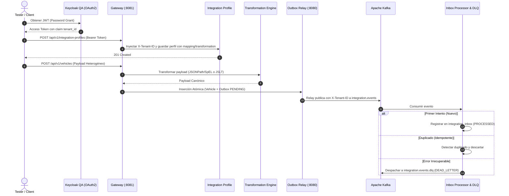

# Suite y Catálogo de Casos de Prueba E2E — Plataforma de Integración Multitenant

Bienvenido al catálogo oficial de planes y casos de prueba End-to-End (E2E) para la plataforma de integración multitenant. Cada documento contiene especificaciones de pruebas automatizadas, matrices de cobertura y guías de ejecución paso a paso con scripts nativos de PowerShell, Docker Compose, MySQL y Kafka.

---

## 📁 Catálogo de Planes de Prueba por Módulo

| Módulo | Documento de Casos de Prueba | Alcance y Flujos Cubiertos |
|---|---|---|
| **1. Motor de Transformación Dinámica de Payloads** | [`test-cases-payload-transformation.md`](test-cases-payload-transformation.md) | Validación de `FIELD_MAPPING` (JSONPath + SpEL en sandbox), `JSLT` declarativo, casting de tipos, valores por defecto, fallback a `PASSTHROUGH` y orquestación con `IntegrationProfile`. |
| **2. Core de Resiliencia: Outbox, Inbox & DLQ** | [`test-cases-outbox-inbox.md`](test-cases-outbox-inbox.md) | Inserción atómica en MySQL, Relay concurrente con `SELECT ... FOR UPDATE SKIP LOCKED`, publicación a Kafka con cabeceras multitenant, deduplicación en `Inbox` y enrutamiento a Dead Letter Queue (`.dlq`). |
| **3. Configuración Extendida de Perfiles** | [`test-cases-integration-profile-configuration.md`](test-cases-integration-profile-configuration.md) | CRUD de `IntegrationProfile`, validación de protocolos (`REST`, `SOAP`, `JSON_RPC`, `KAFKA`, `JDBC`), políticas de reintento/rate limit y control de concurrencia optimista (`version`). |
| **4. Seguridad en Runtime y Resiliencia Distribuida** | [`test-cases-runtime-security-resilience.md`](test-cases-runtime-security-resilience.md) | Resolución segura de credenciales vía `SecretResolver` (Vault KV v2 e In-Memory), Rate Limiter distribuido en Redis (script Lua atómico) y Circuit Breakers dinámicos con Resilience4j. |
| **5. Suite E2E General del Sistema** | [`test-cases-manual-e2e.md`](test-cases-manual-e2e.md) | Flujo E2E completo: Autenticación OAuth2 Keycloak QA ➔ Ingress Spring Cloud Gateway (`:8081`) ➔ Microservicios de Dominio ➔ Kafka ➔ Base de Datos. |

---

## 🚀 Flujo de Ejecución E2E Integrado



---

## 🛠️ Requisitos de Ejecución Local

1. **Infraestructura Activa:**
   ```powershell
   docker compose up -d --build mysql kafka redis app middleware
   docker compose ps
   ```

2. **Ejecución de Pruebas Automatizadas:**
   ```powershell
   mvn clean test
   ```
   *Criterio de Aceptación:* 100% de los tests en verde (`BUILD SUCCESS`).
