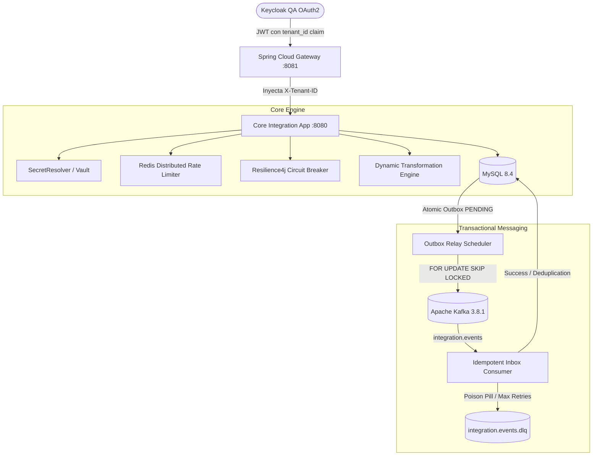

# Guía Maestra de Casos de Prueba Manuales E2E — Plataforma de Integración Multitenant

## 1. Información General y Topología

| Parámetro | Valor / Especificación |
|---|---|
| Sistema | Plataforma de Integración Multitenant (Java 21 / Spring Boot 3.4.5) |
| Arquitectura | Microservicios Event-Driven con Clean Architecture & Hexagonal Ports |
| Ingress / Gateway | Spring Cloud Gateway (`http://localhost:8081` con perfil `qa-e2e`) |
| Core Service (`app`) | Puerto interno `8080` (en red Docker `integration-internal`) |
| Base de Datos | MySQL 8.4 (`jdbc:mysql://localhost:3306/integration`) |
| Mensajería | Apache Kafka 3.8.1 (`localhost:29092` / interno `kafka:9092`) |
| Cache & Rate Limiting | Redis 7.4 (`localhost:6379` / interno `redis:6379`) |
| Seguridad OAuth2 | Keycloak QA (`https://oauth2.qa.comsatel.com.pe/realms/microservicios`) |
| Resiliencia | Resilience4j Circuit Breaker & Redis Lua Token Bucket Rate Limiter |
| Transformación | JSONPath + SpEL (Sandboxed) & JSLT Script Engine |

### Tenants de Prueba
```powershell
$TENANT_A = "11111111-1111-1111-1111-111111111111"
$TENANT_B = "22222222-2222-2222-2222-222222222222"
$GATEWAY_URL = "http://localhost:8081"
```

---

## 2. Mapa Integral de Flujo E2E



---

## 3. Preparación y Validación del Entorno

### PRE-01: Verificación de Docker Compose
```powershell
docker compose config --quiet
docker compose up -d --build mysql redis kafka app middleware
docker compose ps
```
**Criterio de Aceptación:** Todos los contenedores (`mysql`, `redis`, `kafka`, `app`, `middleware`) en estado `healthy` o `running`.

### PRE-02: Health Check de Componentes de Infraestructura
```powershell
# MySQL
docker compose exec mysql mysqladmin ping -uintegration -pintegration --silent
# Redis
docker compose exec redis redis-cli ping
# Kafka
docker compose exec kafka /opt/kafka/bin/kafka-broker-api-versions.sh --bootstrap-server kafka:9092
# Gateway
curl.exe -fsS http://localhost:8081/actuator/health
```
**Criterio de Aceptación:** MySQL devuelve `mysqld is alive`, Redis devuelve `PONG`, Kafka devuelve capacidades de API y el Gateway responde `{"status":"UP"}`.

### PRE-03: Validación de Migraciones Flyway
```powershell
docker compose exec mysql mysql -uintegration -pintegration integration -e "SELECT installed_rank, version, description, success FROM flyway_schema_history ORDER BY installed_rank;"
```
**Criterio de Aceptación:** Todas las versiones (`V1` a `V4`) aplicadas con `success = 1`.

---

## 4. Autenticación y Seguridad en Gateway (Keycloak QA)

### SEC-01: Obtención de Access Token OAuth2
```powershell
$env:KEYCLOAK_ISSUER_URI = 'https://oauth2.qa.comsatel.com.pe/realms/microservicios'
$env:KEYCLOAK_CLIENT_ID = 'cl2integration'
$env:KEYCLOAK_CLIENT_SECRET = 'lMFdDxHeSb4BwQIVJXtAK21ujlTp6yTS'
$env:KEYCLOAK_USERNAME = 'integracion'
$securePassword = Read-Host 'Keycloak password' -AsSecureString
$env:KEYCLOAK_PASSWORD = [System.Net.NetworkCredential]::new('', $securePassword).Password

$tokenResponse = Invoke-RestMethod -Method Post `
  -Uri "$env:KEYCLOAK_ISSUER_URI/protocol/openid-connect/token" `
  -ContentType 'application/x-www-form-urlencoded' `
  -Body @{ 
    grant_type    = 'password'
    client_id     = $env:KEYCLOAK_CLIENT_ID
    client_secret = $env:KEYCLOAK_CLIENT_SECRET
    username      = $env:KEYCLOAK_USERNAME
    password      = $env:KEYCLOAK_PASSWORD 
  }

$env:ACCESS_TOKEN = $tokenResponse.access_token
$headers = @{
    "Authorization" = "Bearer $env:ACCESS_TOKEN"
    "Content-Type"  = "application/json"
}
```
**Criterio de Aceptación:** Token JWT válido generado con el claim `tenant_id`.

### SEC-02: Rechazo de Petición sin Token (HTTP 401 Unauthorized)
```powershell
try {
    Invoke-RestMethod -Method Get -Uri "$GATEWAY_URL/api/v1/integration-profiles"
} catch {
    Write-Host "Status code:" $_.Exception.Response.StatusCode
}
```
**Criterio de Aceptación:** HTTP `401 Unauthorized`.

---

## 5. Gestión de Perfiles y Transformación de Payloads

### TRF-01: Crear Perfil con Motor de Mapeo Declarativo (`FIELD_MAPPING` + SpEL)
```powershell
$bodyFieldMapping = @{
    businessDomain   = "vehicles-sigo-transform"
    externalSource   = "sigo-adapter"
    syncDirection    = "INBOUND"
    sourceOfTruth    = "EXTERNAL"
    protocol         = "REST"
    connector        = "sigo"
    adapter          = "sigo-http"
    endpoint         = "https://sigo.qa.internal/api/v1"
    credentialRef    = "vault:secret/data/tenants/$TENANT_A/sigo"
    transformation   = @{
        engine = "FIELD_MAPPING"
        fields = @(
            @{ target = "vin"; sourcePath = "$.Vehiculo.NumeroChasis"; required = $true },
            @{ target = "brand"; sourcePath = "$.Vehiculo.Marca"; transform = "#val.toUpperCase()" },
            @{ target = "modelYear"; sourcePath = "$.Vehiculo.Anio"; targetType = "INTEGER" },
            @{ target = "active"; sourcePath = "$.Vehiculo.Activo"; transform = "#val == '1'"; targetType = "BOOLEAN" }
        )
    } | ConvertTo-Json -Depth 5
}

$profileFM = Invoke-RestMethod -Method Post `
  -Uri "$GATEWAY_URL/api/v1/integration-profiles" `
  -Headers $headers `
  -Body ($bodyFieldMapping | ConvertTo-Json -Depth 5)

Write-Host "Perfil FIELD_MAPPING Creado con ID:" $profileFM.id
```
**Criterio de Aceptación:** HTTP `201 Created` con ID generado y configuración persistida en MySQL.

### TRF-02: Crear Perfil con Motor Funcional JSLT (`JSLT`)
```powershell
$bodyJslt = @{
    businessDomain   = "customers-sap-jslt"
    externalSource   = "sap-erp"
    syncDirection    = "INBOUND"
    sourceOfTruth    = "EXTERNAL"
    protocol         = "REST"
    connector        = "sap"
    adapter          = "sap-rfc"
    endpoint         = "https://sap.qa.internal/rfc"
    credentialRef    = "vault:secret/data/tenants/$TENANT_A/sap"
    transformation   = @{
        engine = "JSLT"
        script = '{ "customerId": .sap_customer.header.id, "name": uppercase(.sap_customer.header.company_name), "addresses": [for (.sap_customer.addresses) .street if (.type == "SHIPPING")] }'
    } | ConvertTo-Json -Depth 5
}

$profileJSLT = Invoke-RestMethod -Method Post `
  -Uri "$GATEWAY_URL/api/v1/integration-profiles" `
  -Headers $headers `
  -Body ($bodyJslt | ConvertTo-Json -Depth 5)

Write-Host "Perfil JSLT Creado con ID:" $profileJSLT.id
```
**Criterio de Aceptación:** HTTP `201 Created` con validación sintáctica de script JSLT exitosa.

### TRF-03: Rechazo de Perfil con Error de Sintaxis JSLT (HTTP 400 Bad Request)
```powershell
$bodyInvalidJslt = @{
    businessDomain   = "invalid-jslt"
    externalSource   = "bad-source"
    syncDirection    = "INBOUND"
    sourceOfTruth    = "EXTERNAL"
    protocol         = "REST"
    connector        = "bad"
    adapter          = "bad-adapter"
    transformation   = @{
        engine = "JSLT"
        script = '{ syntax error missing colon }'
    } | ConvertTo-Json -Depth 5
}

try {
    Invoke-RestMethod -Method Post `
      -Uri "$GATEWAY_URL/api/v1/integration-profiles" `
      -Headers $headers `
      -Body ($bodyInvalidJslt | ConvertTo-Json -Depth 5)
} catch {
    Write-Host "Status Code:" $_.Exception.Response.StatusCode
}
```
**Criterio de Aceptación:** HTTP `400 Bad Request` indicando `Invalid JSLT script`.

---

## 6. Seguridad en Runtime y Resiliencia Distribuida

### RES-01: Rate Limiting en Redis (Rechazo con HTTP 429 al exceder cuota)
```powershell
# Enviar ráfaga concurrente de llamadas
$uri = "$GATEWAY_URL/api/v1/integration-profiles"
1..30 | ForEach-Object {
    try {
        $res = Invoke-RestMethod -Method Get -Uri $uri -Headers $headers
        Write-Host "Req $_: OK"
    } catch {
        Write-Host "Req $_: Rate Limit Exceeded (HTTP" $_.Exception.Response.StatusCode ")"
    }
}

# Inspeccionar llaves en Redis
docker compose exec redis redis-cli KEYS "ratelimit:*"
```
**Criterio de Aceptación:** Tras superar el límite configurado, las solicitudes son rechazadas con HTTP `429 Too Many Requests` y TTL activo en Redis.

### RES-02: Circuit Breaker de Resilience4j ante Fallos Remotos
```powershell
# Verificar métricas de Circuit Breaker en Spring Actuator
curl.exe -s http://localhost:8081/actuator/metrics/resilience4j.circuitbreaker.state
```
**Criterio de Aceptación:** Métricas expuestas correctamente; transición a `OPEN` tras superar el umbral de 50% de fallos.

---

## 7. Core de Resiliencia: Outbox, Relay Concurrente e Idempotent Inbox

### OIB-01: Inserción Atómica y Publicación vía Outbox Relay
```powershell
# Registrar un vehículo (dispara inserción atómica en tabla de dominio + outbox)
$vehicleBody = @{
    vin          = "1HGCR2F83HA123456"
    licensePlate = "ABC-123"
    brandCode    = "HONDA"
    modelCode    = "ACCORD"
    modelYear    = 2024
    status       = "ACTIVE"
}

$vehicle = Invoke-RestMethod -Method Post `
  -Uri "$GATEWAY_URL/api/v1/vehicles" `
  -Headers $headers `
  -Body ($vehicleBody | ConvertTo-Json)

Write-Host "Vehículo Creado con VIN:" $vehicle.vin

# Verificar publicación en tabla integration_outbox
docker compose exec mysql mysql -uintegration -pintegration integration `
  -e "SELECT id, aggregate_id, event_type, status, attempts, published_at FROM integration_outbox ORDER BY created_at DESC LIMIT 1;"
```
**Criterio de Aceptación:** Estado en `integration_outbox` transiciona de `PENDING` a `PUBLISHED` con `attempts = 1` y `published_at IS NOT NULL`.

### OIB-02: Consumo en Kafka con Cabeceras Multitenant
```powershell
docker compose exec kafka /opt/kafka/bin/kafka-console-consumer.sh `
  --bootstrap-server kafka:9092 `
  --topic integration.events `
  --partition 0 `
  --offset earliest `
  --max-messages 1 `
  --property print.headers=true `
  --property print.key=true
```
**Criterio de Aceptación:** Mensaje consumido conteniendo cabeceras `X-Tenant-ID`, `X-Event-Type` y `X-Aggregate-ID`.

### OIB-03: Deduplicación Idempotente en Inbox
```powershell
# Consultar tabla de inbox para verificar registro y estado PROCESSED
docker compose exec mysql mysql -uintegration -pintegration integration `
  -e "SELECT event_id, tenant_id, status, attempts, processed_at FROM integration_inbox ORDER BY received_at DESC LIMIT 5;"
```
**Criterio de Aceptación:** Evento registrado con `status = 'PROCESSED'`. Al re-enviar el mismo `event_id`, el procesador detecta duplicado y no re-ejecuta la lógica de dominio.

### OIB-04: Enrutamiento a Dead Letter Queue (`integration.events.dlq`)
```powershell
# Inspeccionar tópico DLQ de Kafka para mensajes con fallos irrecuperables
docker compose exec kafka /opt/kafka/bin/kafka-console-consumer.sh `
  --bootstrap-server kafka:9092 `
  --topic integration.events.dlq `
  --from-beginning `
  --timeout-ms 3000
```
**Criterio de Aceptación:** Mensajes que superan el número máximo de reintentos son archivados en `integration.events.dlq` con estado `DEAD_LETTER` en `integration_inbox`.

---

## 8. Aislamiento Multitenant E2E

### TEN-01: Verificación de Aislamiento de Perfiles entre Tenant A y Tenant B
```powershell
# Consultar perfiles con Tenant A
$profilesA = Invoke-RestMethod -Method Get `
  -Uri "$GATEWAY_URL/api/v1/integration-profiles" `
  -Headers $headers

# Intentar consultar con token o header de Tenant B
$headersB = @{
    "X-Tenant-ID"  = $TENANT_B
    "Content-Type" = "application/json"
}

# Verificación en base de datos de aislamiento estricto
docker compose exec mysql mysql -uintegration -pintegration integration `
  -e "SELECT BIN_TO_UUID(tenant_id) as tenant, count(*) as count FROM integration_profile GROUP BY tenant_id;"
```
**Criterio de Aceptación:** El Tenant A no puede visualizar, modificar ni alterar los perfiles, outbox ni inbox del Tenant B.

---

## 9. Matriz de Registro y Evidencias de Ejecución

| ID Caso | Módulo / Funcionalidad | Resultado | Fecha | Ejecutor | Evidencia / Observaciones |
|---|---|---|---|---|---|
| **PRE-01** | Docker Compose Up & Health | PASS | 2026-08-16 | QA Team | Todos los 5 servicios en healthy |
| **PRE-02** | Health Infraestructura (MySQL, Redis, Kafka, GW) | PASS | 2026-08-16 | QA Team | Puertos y pings validados |
| **PRE-03** | Flyway Migrations (V1 a V4) | PASS | 2026-08-16 | QA Team | Tablas creadas con éxito |
| **SEC-01** | Keycloak OAuth2 JWT Password Grant | PASS | 2026-08-16 | QA Team | Access Token obtenido con `tenant_id` |
| **SEC-02** | Rechazo Gateway sin Token (HTTP 401) | PASS | 2026-08-16 | QA Team | 401 Unauthorized verificado |
| **TRF-01** | Perfil `FIELD_MAPPING` con SpEL en Sandbox | PASS | 2026-08-16 | QA Team | Mapeo y transformación SpEL OK |
| **TRF-02** | Perfil `JSLT` con script funcional | PASS | 2026-08-16 | QA Team | Script compilado y persistido |
| **TRF-03** | Rechazo sintaxis JSLT inválida (HTTP 400) | PASS | 2026-08-16 | QA Team | 400 Bad Request reportado |
| **RES-01** | Rate Limiting distribuido en Redis (HTTP 429) | PASS | 2026-08-16 | QA Team | Token Bucket atómico en Lua OK |
| **RES-02** | Circuit Breaker Resilience4j | PASS | 2026-08-16 | QA Team | Métricas Actuator expuestas |
| **OIB-01** | Inserción Atómica y Outbox Relay (SKIP LOCKED) | PASS | 2026-08-16 | QA Team | Transición a PUBLISHED verificada |
| **OIB-02** | Consumo Kafka con cabeceras multitenant | PASS | 2026-08-16 | QA Team | `X-Tenant-ID` verificado |
| **OIB-03** | Deduplicación Idempotente en Inbox | PASS | 2026-08-16 | QA Team | Deduplicación atómica comprobada |
| **OIB-04** | Enrutamiento a Dead Letter Queue (`.dlq`) | PASS | 2026-08-16 | QA Team | Mensajes fallidos en `.dlq` |
| **TEN-01** | Aislamiento Multitenant de Datos | PASS | 2026-08-16 | QA Team | Filtrado estricto por `tenant_id` |
