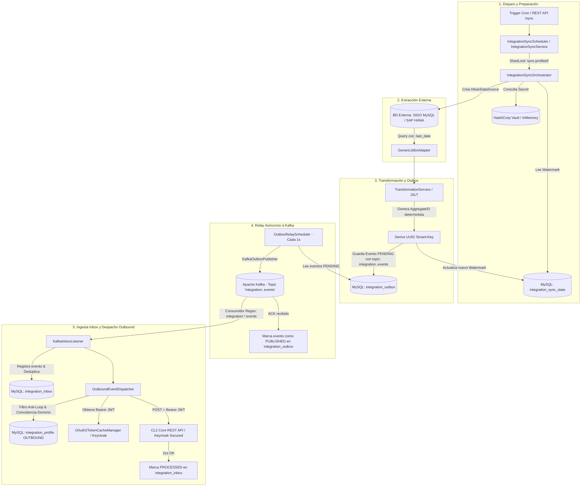

# Flujo de Procesamiento y Despacho de Integración

Este documento describe la arquitectura y la lógica secuencial que sigue el componente de integración desde la extracción de datos en la fuente externa, su publicación en tópicos segregados de Apache Kafka mediante **Transactional Outbox**, hasta el consumo en **Inbox** y despacho **Outbound REST asegurado con Keycloak (JWT)**.

---

## Diagrama General del Flujo



---

## Detalle de Fases

### Fase 1: Disparo y Control de Concurrencia
1. **Trigger de Ejecución**:
   - **Automático**: `IntegrationSyncScheduler` evalúa periódicamente la expresión cron (`cronExpression` en `syncPolicy`).
   - **Bajo Demanda (Manual)**: Invocación al endpoint `POST /api/v1/integration-profiles/{profileId}/sync`.
2. **Bloqueo Distribuido (ShedLock)**:
   - Se asegura un lock distribuido (`sync:<profileId>`) en la tabla `shedlock` para evitar ejecuciones concurrentes simultáneas sobre el mismo perfil.
3. **Resolución de Credenciales y Watermark**:
   - `VaultSecretResolver` resuelve usuario y contraseña en HashiCorp Vault a partir del `credentialRef` (ej. `secret/sigo/db-credentials`).
   - Consulta el último watermark registrado en la tabla `integration_sync_state` (si no existe registro previo, utiliza `Instant.EPOCH`).

---

### Fase 2: Conexión y Extracción de Datos
1. **Conexión Dinámica JDBC**:
   - `JdbcDataSourceFactory` inicializa un pool de conexiones `HikariDataSource` temporal hacia el `endpoint` configurado en el perfil.
2. **Ejecución de la Consulta SQL**:
   - `GenericJdbcAdapter` inyecta el parámetro de watermark (ej. `:last_date` o `:lastSyncWithBuffer`) en la consulta `extractionConfig.query` y recupera las filas modificadas desde la fuente externa de forma validada y segura (`SqlSecurityValidator`).

---

### Fase 3: Transformación y Persistencia Transaccional (Outbox)
Para cada fila extraída:
1. **Transformación y Mapeo**:
   - `TransformationService` transforma el payload de la fila origen a la estructura canónica requerida utilizando las directivas de `mapping` o `transformation` (JSLT).
2. **Generación Determinista de Identificador (`aggregateId`)**:
   - Se genera un identificador UUID determinista basado en `UUID.nameUUIDFromBytes(tenantId + ":" + keyColumn)` para preservar la idempotencia.
3. **Derivación Dinámica de Tópico**:
   - El tópico se calcula como `integration.<businessDomain>.events` (ej. `integration.brands.events`, `integration.models.events`, `integration.vehicles.events`).
4. **Escritura Transaccional en `integration_outbox`**:
   - Se inserta el evento con estado `PENDING`, `aggregate_type = <businessDomain>`, tipo de evento (ej. `<businessDomain>.upserted`), `topic` calculado y payload canónico.
5. **Actualización de Watermark**:
   - Se calcula el nuevo watermark (`maxRowTimestamp` menos `overlapBufferSeconds`) y se registra en `integration_sync_state` con estado `SUCCESS`.

#### Procesamiento por lotes

El flujo anterior se conserva cuando `batchMode=false` (valor por defecto). Con `batchMode=true`, el orquestador divide las filas extraídas en arreglos contiguos de hasta `batchSize` elementos, transforma cada arreglo una sola vez y guarda un evento outbox por lote. `batchSize` tiene valor por defecto `500`; un valor nulo, cero o negativo se normaliza a `500`.

Ejemplo conciso de extracción JDBC batch y transformación JSLT orientada a arreglos:

```json
{
  "query": "SELECT numero_motor, numero_placa, fecha_modificacion FROM vehiculos WHERE fecha_modificacion > :lastSyncWithBuffer ORDER BY fecha_modificacion ASC",
  "watermarkParam": "lastSyncWithBuffer",
  "watermarkColumn": "fecha_modificacion",
  "keyColumn": "numero_motor",
  "fetchSize": 1000,
  "batchMode": true,
  "batchSize": 500
}
```

```jslt
[ for (.) {
  "engineNumber": .numero_motor,
  "licensePlate": .numero_placa
} ]
```

Cada lote genera `<domain>.batch.upserted` en `integration.<domain>.batch.events`; el payload es el resultado de transformar el arreglo completo. Los eventos unitarios mantienen su tipo `<domain>.upserted` y su tópico `integration.<domain>.events`.

---

### Fase 4: Despacho a Kafka (Transactional Outbox Relay)
1. **Polling del Outbox**:
   - `OutboxRelayScheduler` ejecuta un ciclo cada 1 segundo buscando lotes de eventos con estado `PENDING` en `integration_outbox`.
2. **Publicación en Apache Kafka**:
   - `KafkaOutboxPublisher` publica el evento en su tópico específico con los siguientes headers de procedencia:
     - `X-Tenant-ID`: Identificador del tenant.
     - `X-Event-Type`: Tipo de evento (ej. `vehicles.upserted`).
     - `X-Aggregate-ID`: Identificador del agregado.
     - `X-Business-Domain`: Dominio de negocio (ej. `vehicles`).
     - `X-External-Source`: Sistema origen (ej. `sigo`).
     - Para eventos batch: `X-Batch-Mode: true` y `X-Batch-Size`: número de elementos del lote.
3. **Confirmación**:
   - Tras recibir el ACK de Kafka, el evento se actualiza a **`PUBLISHED`** con su fecha `published_at`.

---

### Fase 5: Consumo Inbox y Despacho Outbound REST con Keycloak
1. **Suscripción Dinámica**:
   - `KafkaInboxListener` escucha mediante el patrón `integration\..*\.events`.
2. **Deduplicación e Idempotencia**:
   - Se registra en `integration_inbox`. Si el `eventId` ya fue procesado, se descarta.
3. **Filtrado Anti-Loop**:
   - `OutboundEventDispatcher` filtra perfiles `OUTBOUND` del tenant descartando los que tengan `externalSource == originExternalSource`.
4. **Autenticación Keycloak & HTTP POST**:
   - Si el perfil destino requiere autenticación OAuth2 (`AuthType.OAUTH2_CLIENT_CREDENTIALS`), `OAuth2TokenCacheManager` obtiene o reutiliza el token JWT Bearer.
   - `HttpOutboundClient` efectúa el POST con `Authorization: Bearer <JWT>` hacia los microservicios core de CL2.
   - El evento en `integration_inbox` se actualiza a `PROCESSED`.
5. **Eventos batch**:
   - Para `<domain>.batch.upserted`, el dispatcher envía el arreglo ya transformado en una sola llamada HTTP al `endpoint` existente del perfil `OUTBOUND`; ese `endpoint` es el endpoint bulk y no se configura un `bulkEndpoint` adicional.
   - No hay micro-batching ni buffering adicional en el consumidor Kafka, y los ACK parciales por elemento están fuera de alcance: el lote se procesa como una sola unidad.
