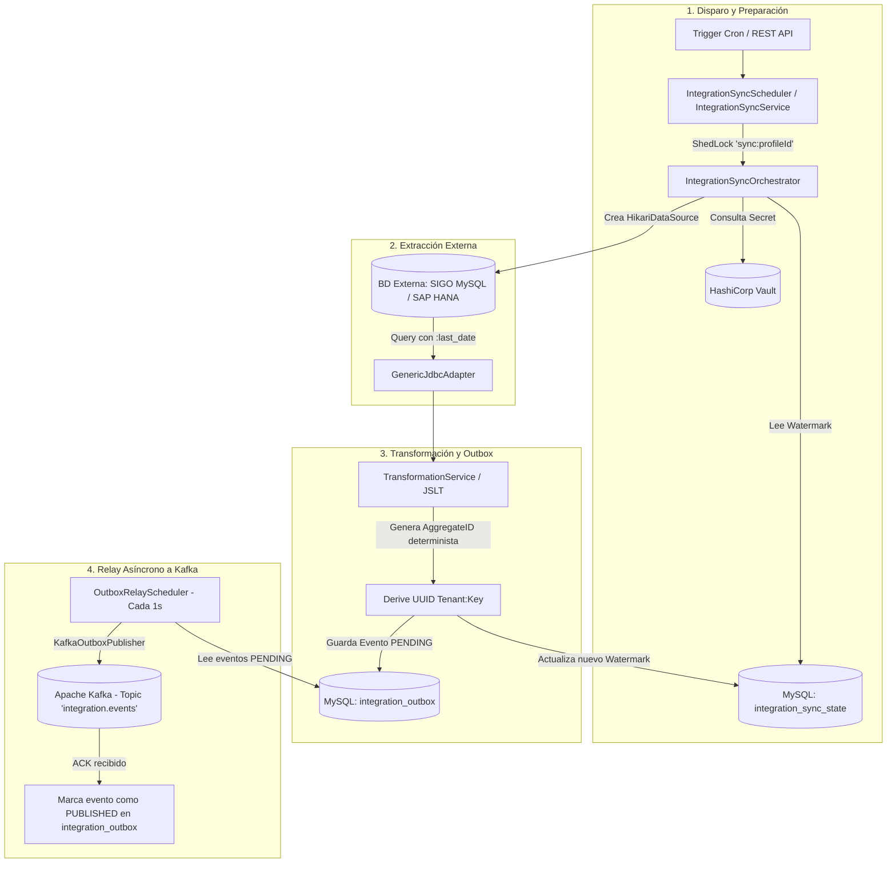

# Flujo de Procesamiento y Despacho de Integración

Este documento describe la arquitectura y la lógica secuencial que sigue el componente de integración desde la extracción de datos en la fuente externa hasta su publicación en el bus de eventos Apache Kafka, implementando el patrón **Transactional Outbox**.

---

## Diagrama General del Flujo

---

## Detalle de Fases

### Fase 1: Disparo y Control de Concurrencia
1. **Trigger de Ejecución**:
   - **Automático**: `IntegrationSyncScheduler` evalúa periódicamente la expresión cron (`cronExpression` en `syncPolicy`).
   - **Bajo Demanda (Manual)**: Invocación al endpoint `POST /api/v1/integration-profiles/{profileId}/sync`.
2. **Bloqueo Distribuido (ShedLock)**:
   - Se asegura un lock distribuido (`sync:<profileId>`) en la tabla `shedlock` para garantizar que no existan ejecuciones concurrentes simultáneas sobre el mismo perfil.
3. **Resolución de Credenciales y Watermark**:
   - `VaultSecretResolver` resuelve usuario y contraseña en HashiCorp Vault a partir del `credentialRef` (ej. `secret/sigo/db-credentials`).
   - Consulta el último watermark registrado en la tabla `integration_sync_state` (si no existe registro previo, utiliza `Instant.EPOCH`).

---

### Fase 2: Conexión y Extracción de Datos
1. **Conexión Dinámica JDBC**:
   - `JdbcDataSourceFactory` inicializa un pool de conexiones `HikariDataSource` temporal hacia el `endpoint` configurado en el perfil.
2. **Ejecución de la Consulta SQL**:
   - `GenericJdbcAdapter` inyecta el parámetro de watermark (ej. `:last_date` o `:lastSyncWithBuffer`) en la consulta `extractionConfig.query` y recupera las filas modificadas desde la fuente externa.

---

### Fase 3: Transformación y Persistencia Transaccional (Outbox)
Para cada fila extraída:
1. **Transformación y Mapeo**:
   - `TransformationService` transforma el payload de la fila origen a la estructura canónica requerida utilizando las directivas de `mapping` o `transformation` (JSLT).
2. **Generación Determinista de Identificador (`aggregateId`)**:
   - Se genera un identificador UUID determinista basado en `UUID.nameUUIDFromBytes(tenantId + ":" + keyColumn)` para preservar la idempotencia.
3. **Escritura Transaccional en `integration_outbox`**:
   - Se inserta el evento con estado `PENDING`, `aggregate_type = 'Customer'` (o el dominio correspondiente), tipo de evento (ej. `customer.upserted`) y el payload canónico.
4. **Actualización de Watermark**:
   - Se calcula el nuevo watermark (`maxRowTimestamp` menos `overlapBufferSeconds`) y se registra en `integration_sync_state` con estado `SUCCESS`.

---

### Fase 4: Despacho a Kafka (Transactional Outbox Relay)
1. **Polling del Outbox**:
   - `OutboxRelayScheduler` ejecuta un ciclo cada 1 segundo buscando lotes de eventos con estado `PENDING` en `integration_outbox`.
2. **Publicación en Apache Kafka**:
   - `KafkaOutboxPublisher` publica el evento en el tópico `integration.events` con los siguientes headers:
     - `X-Tenant-ID`: Identificador del tenant.
     - `X-Event-Type`: Tipo de evento de dominio.
     - `X-Aggregate-ID`: Identificador del agregado.
3. **Confirmación y Manejo de Errores**:
   - Tras recibir la confirmación de entrega (ACK) de Kafka, el evento se actualiza a **`PUBLISHED`** con su fecha `published_at`.
   - En caso de error, se aplica reintento con backoff exponencial hasta alcanzar el límite máximo (`max-attempts`).
