# Scope & Propuesta Técnica (FEAT1): Procesamiento y Despacho en Lote (Batch & Bulk Processing)

Este documento describe la especificación funcional y técnica, alternativas de diseño, transformaciones JSLT en bucle y cambios requeridos para habilitar el **procesamiento y despacho en lote (Batch Processing)** de extremo a extremo en la plataforma de integración.

---

## 1. Motivación y Objetivos

Actualmente, la plataforma procesa los registros de manera unitaria:
* $N$ filas extraídas en Inbound $\rightarrow$ $N$ eventos individuales en Outbox $\rightarrow$ $N$ mensajes en Kafka $\rightarrow$ $N$ llamadas HTTP Outbound individuales.

### Problemas del Modelo Unitario en Volúmenes Altos:
1. **Sobrecarga de Red y Latencia**: 1,000 registros implican 1,000 handshakes TLS y peticiones HTTP secuenciales/concurrentes.
2. **Saturación del Endpoint Destino**: Riesgo de activar Rate Limiters remotos y abrir el Circuit Breaker innecesariamente.
3. **Alto Consumo de Tokens OAuth2**: Aunque existe caché, se realizan validaciones recurrentes por cada solicitud unitaria.

### Objetivos:
- Permitir agrupar $N$ registros en paquetes o lotes configurables (ej. 100, 500, 1000 items).
- Transformar arreglos de entidades mediante JSLT utilizando la sintaxis de bucle `[ for (.) ... ]`.
- Emitir una única petición HTTP Bulk al endpoint destino.

---

## 2. Alternativas de Arquitectura

```mermaid
flowchart TD
    subgraph Alt1["Alternativa 1: Batch End-to-End (Recomendada para APIs Bulk)"]
        Extract1["Inbound Sync (JDBC/REST)"] -->|"Extrae N filas"| Chunk1["Particionador en Lotes (batchSize: 500)"]
        Chunk1 -->|"1 evento Bulk por Lote"| Outbox1["integration_outbox (JSON Array)"]
        Outbox1 -->|"1 mensaje por Lote"| Kafka1["Kafka Topic: integration.<domain>.batch.events"]
        Kafka1 -->|"1 consumo"| Inbox1["Inbox & Outbound Dispatcher"]
        Inbox1 -->|"POST /api/v1/units/batch"| Target1["API Destino Bulk"]
    end

    subgraph Alt2["Alternativa 2: Micro-Batching en Consumidor Inbox"]
        Extract2["Inbound Sync"] -->|"1 evento por fila"| Outbox2["integration_outbox (Unitario)"]
        Outbox2 -->|"N mensajes"| Kafka2["Kafka Topic (Unitario)"]
        Kafka2 -->|"Batch Listener + Buffer"| Buffer2["Inbox Aggregator (Ventana 5s / 200 msgs)"]
        Buffer2 -->|"POST /api/v1/units/batch"| Target2["API Destino Bulk"]
    end
```



### Comparación de Alternativas:

| Criterio | Alternativa 1: Batch End-to-End | Alternativa 2: Micro-Batching en Inbox |
|---|---|---|
| **Impacto en BD Outbox** | Muy bajo (1 registro por cada 500 filas). | Alto (1 registro por cada fila extraída). |
| **Carga en Broker Kafka** | Mínima (1 mensaje por lote). | Elevada ($N$ mensajes individuales). |
| **Complejidad de Código** | Baja: Agrupación en `IntegrationSyncOrchestrator` y JSLT loop. | Media-Alta: Requiere búfer concurrente en memoria y timeouts de flush. |
| **Garantías Transaccionales** | Atómica por lote en base de datos. | Requiere manejo de ACKs parciales en Kafka. |
| **Recomendación** | **Recomendada (Opción Principal)**. | Opcional para destinos mixtos. |

---

## 3. Configuración Declarativa del Perfil (`IntegrationProfile`)

Se amplía el esquema de `extractionConfig` para soportar `batchMode` y `batchSize`:

```json
{
  "businessDomain": "units",
  "externalSource": "sigo-mysql",
  "syncDirection": "INBOUND",
  "protocol": "JDBC",
  "connector": "sigo-mysql-connector",
  "adapter": "generic-jdbc-adapter",
  "endpoint": "jdbc:mysql://192.168.1.180:3306/sigo_db?useSSL=false",
  "credentialRef": "secret/sigo/db-credentials",
  "extractionConfig": {
    "query": "SELECT numero_motor, numero_placa, cod_marca, modelo, anio, fecha_modificacion FROM vehiculos WHERE fecha_modificacion > :lastSyncWithBuffer ORDER BY fecha_modificacion ASC",
    "watermarkParam": "lastSyncWithBuffer",
    "watermarkColumn": "fecha_modificacion",
    "keyColumn": "numero_motor",
    "fetchSize": 1000,
    "batchMode": true,
    "batchSize": 500
  },
  "transformation": {
    "engine": "JSLT",
    "script": "{\n  \"loteId\": now(),\n  \"totalRegistros\": size(.),\n  \"unidades\": [\n    for (.) {\n      \"tipoUnidadId\": 2,\n      \"externoId\": .numero_motor,\n      \"alias\": .numero_placa,\n      \"marca\": lookup(\"BRAND_CODES\", .cod_marca, \"TOYOTA\"),\n      \"modelo\": (if (.modelo) .modelo else \"DESCONOCIDO\"),\n      \"anio\": (if (.anio) number(.anio) else 2026)\n    }\n  ]\n}"
  },
  "syncPolicy": {
    "cronExpression": "0 */10 * * * *"
  }
}
```

---

## 4. Patrones y Ejemplos de Transformación JSLT para Lotes

### 4.1. Transformación de Lista Plana a Envoltorio Jerárquico con Arreglo Interno

**Entrada (JSON Array recibido de la extracción JDBC)**:
```json
[
  {
    "numero_motor": "MTR-1001",
    "numero_placa": "ABC-123",
    "marca": "TOYOTA",
    "anio": 2024
  },
  {
    "numero_motor": "MTR-1002",
    "numero_placa": "XYZ-789",
    "marca": "NISSAN",
    "anio": 2023
  }
]
```

**Script JSLT con Bucles y Atributos Anidados**:
```javascript
{
  "timestamp": now(),
  "cantidad": size(.),
  "items": [
    for (.) {
      "tipoUnidadId": 2,
      "externoId": .numero_motor,
      "alias": .numero_placa,
      "atributosUnidad": [
        { "atributoId": 1, "valor": .numero_placa },
        { "atributoId": 2, "valor": .numero_motor },
        { "atributoId": 3, "valor": lookup("BRAND_CODES", .marca, "TOYOTA") },
        { "atributoId": 5, "valor": number(.anio) }
      ]
    }
  ]
}
```

**Salida Transformada (Enviada en un único POST HTTP Bulk)**:
```json
{
  "timestamp": 1787385000000,
  "cantidad": 2,
  "items": [
    {
      "tipoUnidadId": 2,
      "externoId": "MTR-1001",
      "alias": "ABC-123",
      "atributosUnidad": [
        { "atributoId": 1, "valor": "ABC-123" },
        { "atributoId": 2, "valor": "MTR-1001" },
        { "atributoId": 3, "valor": "TOYOTA" },
        { "atributoId": 5, "valor": 2024 }
      ]
    },
    {
      "tipoUnidadId": 2,
      "externoId": "MTR-1002",
      "alias": "XYZ-789",
      "atributosUnidad": [
        { "atributoId": 1, "valor": "XYZ-789" },
        { "atributoId": 2, "valor": "MTR-1002" },
        { "atributoId": 3, "valor": "NISSAN" },
        { "atributoId": 5, "valor": 2023 }
      ]
    }
  ]
}
```

---

## 5. Cambios Requeridos en el Código Fuente

1. **`ExtractionConfig.java`**:
   - Añadir campos `Boolean batchMode` y `Integer batchSize` (con valor por defecto `500`).
2. **`IntegrationSyncOrchestrator.java`**:
   - Si `batchMode == true`, particionar `rows` en sub-listas de tamaño `batchSize`.
   - Serializar el sub-lote a JSON Array y ejecutar `transformationService.transform(batchJson, profile)`.
   - Guardar un único `OutboxEvent` por cada sub-lote con tipo de evento `<domain>.batch.upserted`.
3. **`KafkaOutboxPublisher.java` & `KafkaInboxListener.java`**:
   - Transmitir la cabecera `X-Batch-Mode: true` y el tamaño del lote.
4. **`OutboundEventDispatcher.java`**:
   - Despachar el payload del lote directamente al endpoint bulk configurado en el perfil de salida.
