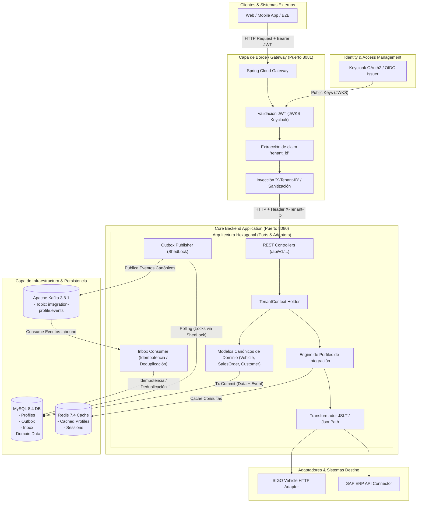

# Análisis de Arquitectura de la Solución: Plataforma Multitenant de Integración Flexible

Este documento presenta el análisis técnico detallado y la visualización arquitectónica de la **Plataforma Multitenant de Integración Flexible** y el **MVP SIGO Vehicle**.

---

## 1. Diagrama General de Arquitectura

El siguiente diagrama representa la arquitectura enterprise de la solución, sus capas, componentes clave y el flujo de datos desde la autenticación del cliente hasta los adaptadores externos.

---

## 2. Diagrama de Flujo y Componentes (Mermaid)

---

## 3. Patrones Arquitectónicos Clave

### 3.1. Multitenancy Estricto & Seguridad en Gateway
- **Aislamiento por Tenant**: Cada operación de dominio requiere un `tenant_id` obligatorio activo en el hilo de ejecución (`TenantContext`).
- **Seguridad en Borde (Spring Cloud Gateway)**:
  - El Gateway valida tokens OAuth2/JWT emitidos por **Keycloak**.
  - Extrae la claim `tenant_id` del payload del JWT de forma segura.
  - Elimina cualquier cabecera `X-Tenant-ID` maliciosa o enviada por el cliente y reinyecta `X-Tenant-ID: <tenant_id>` validada hacia el backend.

### 3.2. Arquitectura Hexagonal (Puertos y Adaptadores)
- **Desacoplamiento Total**: Los microservicios de dominio (Customer, Vehicle, SalesOrder) no poseen acoplamiento con SAP, SIGO, SOAP, REST o Kafka.
- **Modelos Canónicos**: Los dominios internos operan exclusivamente con modelos de dominio canónicos y eventos propios.
- **Adaptadores Intercambiables**: La integración con proveedores externos se realiza mediante adaptadores independientes, permitiendo agregar conectores adicionales sin modificar el núcleo.

### 3.3. Transactional Outbox e Inbox Patterns
- **Garantía de Consistencia Eventual**:
  - **Outbox**: La creación de entidades de negocio y la escritura del evento en la tabla `outbox_events` se efectúan dentro de la misma transacción relacional MySQL.
  - **Outbox Publisher**: Polling asíncrono optimizado con bloqueos distribuidos **ShedLock** para publicar eventos en **Apache Kafka** (`integration-profile.events`).
  - **Inbox**: Ingesta de mensajes entrantes registrados previamente en `inbox_events` para garantizar **idempotencia**, **deduplicación**, auditoría y soporte para Dead Letter Queues (DLQ).

### 3.4. Motor de Perfiles de Integración Declarativos
- **Configuración Dinámica por Tenant**: Define el dominio de negocio, fuente externa, protocolo, conector, adaptador, dirección de sincronización (`INBOUND`, `OUTBOUND`, `BIDIRECTIONAL`) y Fuente de Verdad (`PLATFORM`, `EXTERNAL`, `SHARED`).
- **Transformación Declarativa**: Utiliza motores **JSLT** y **JsonPath** para mapear automáticamente los esquemas heterogéneos de sistemas externos a las entidades canónicas de la plataforma.

---

## 4. Stack Tecnológico

| Capa / Componente | Tecnología | Descripción / Responsabilidad |
| --- | --- | --- |
| **Lenguaje & Runtime** | Java 21 / OpenJDK | Runtime moderno con Virtual Threads y mejoras de rendimiento. |
| **Framework Principal** | Spring Boot 3.4.5 | Framework core de la aplicación backend. |
| **API Gateway** | Spring Cloud Gateway | Proxy inverso, enrutamiento, resiliencia y validación de seguridad en el borde. |
| **Seguridad & IAM** | Keycloak 26.x + Spring Security OAuth2 | Proveedor de identidad y servidor de recursos JWT. |
| **Base de Datos Relacional** | MySQL 8.4 | Persistencia multitenant de perfiles, modelos canónicos, Outbox e Inbox. |
| **Migración de DB** | Flyway | Gestión y control de versiones de esquemas SQL (`V1__create_integration_profile.sql`). |
| **Event Broker** | Apache Kafka 3.8.1 (KRaft) | Event bus distribuido para comunicación asíncrona desacoplada. |
| **Caché y Estado** | Redis 7.4 | Almacenamiento en caché de perfiles de integración activos. |
| **Transformación de Datos** | JSLT (Schibsted) + JsonPath | Motor de mapeo y transformación declarativa de JSON/Payloads. |
| **Resiliencia & Coordinación** | Resilience4j + ShedLock | Circuit breaker, rate limiting y coordinación distribuida de tareas scheduled. |
