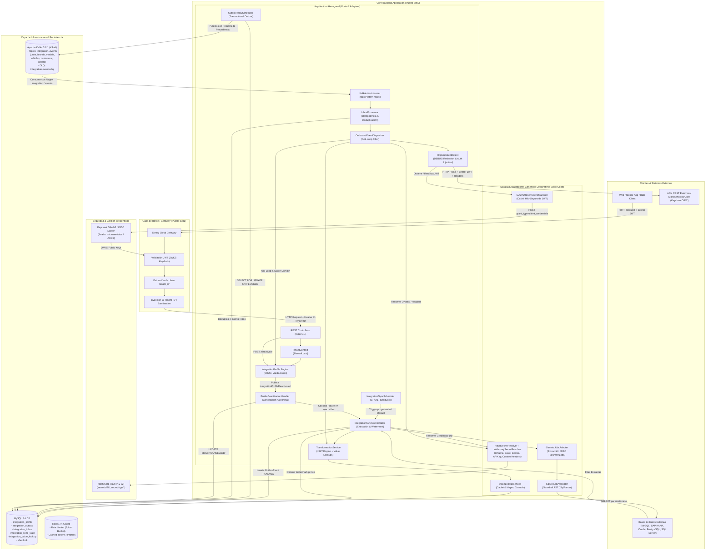
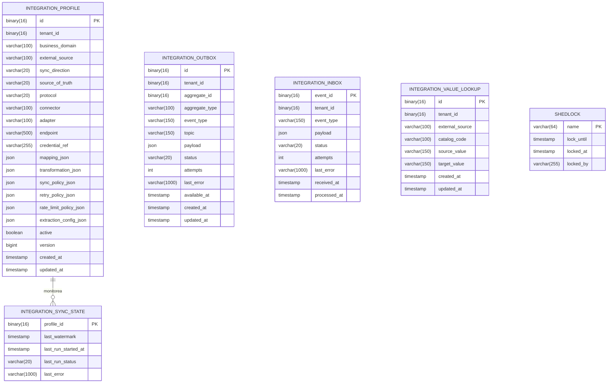

# Análisis de Arquitectura de la Solución: Plataforma Multitenant de Integración Flexible

Este documento presenta la arquitectura integral, patrones de diseño, componentes desacoplados, modelos de datos, flujos de eventos y seguridad de la **Plataforma Multitenant de Integración Flexible** para integraciones Inbound y Outbound con bases de datos relacionales (JDBC) y APIs REST aseguradas con Keycloak y HashiCorp Vault.

---

## 1. Diagrama General de Arquitectura

El siguiente diagrama ilustra la topología completa de la solución, sus capas de seguridad en el borde, backend hexagonal multitenant, el bus de eventos segregado por dominio, la gestión de secretos en Vault y los adaptadores genéricos declarativos.

---

## 2. Componentes de Dominio y Capas Hexagonales

### 2.1. Gestión de Perfiles (`IntegrationProfile`)
El agregado `IntegrationProfile` es el corazón declarativo del sistema:
- **`businessDomain`**: Dominio de negocio (`units`, `brands`, `models`, `vehicles`, `customers`, `orders`, `billing`, `catalog`).
- **`syncDirection`**: Sentido de integración:
  - `INBOUND`: Ingesta desde orígenes externos hacia Kafka.
  - `OUTBOUND`: Despacho desde Kafka hacia APIs o bases externas.
  - `BIDIRECTIONAL`: Operación en ambos sentidos.
- **`sourceOfTruth`**: Origen de la verdad (`SOURCE`, `PLATFORM`, `BIDIRECTIONAL`).
- **`protocol`**: Protocolo de transporte (`JDBC`, `REST`, `KAFKA`, `SOAP`).
- **`configuration`**:
  - `endpoint`: URL REST o JDBC Connection String.
  - `credentialRef`: Referencia al secreto en Vault (`vault:secret/data/...` o `secret/...`).
  - `extractionConfig`: Configuración de query SQL y columna watermark para JDBC, o endpoints, JSONPaths y `keyProperty` para REST Inbound (sin paginación en este slice).
  - `transformation`: Script declarativo `JSLT` o mapeo de campos `FIELD_MAPPING`.
  - `syncPolicy`: Expresión CRON de ejecución periódica (ej. `*/30 * * * * *`).
  - `retryPolicy`: Configuración de reintentos (`maxAttempts`, `backoffMs`).
  - `rateLimitPolicy`: Límite de peticiones por segundo (`requestsPerSecond`).

---

### 2.2. Ingesta Inbound y Sincronización JDBC (`IntegrationSyncOrchestrator`)
- **Extracción Incremental basada en Watermark**: Utiliza `lastWatermark` almacenado en `integration_sync_state` para consultar únicamente registros nuevos o modificados (`WHERE updated_at > :lastSyncWithBuffer`).
- **Validación AST de Seguridad SQL (`SqlSecurityValidator`)**:
  - Analiza el árbol sintáctico con **JSqlParser 4.9**.
  - Exige consultas exclusivas de tipo `SELECT`.
  - Prohíbe inyecciones, DML (`INSERT`, `UPDATE`, `DELETE`), DDL (`DROP`, `ALTER`, `TRUNCATE`), multi-statements (`;`) y acceso a esquemas de catálogo del motor (`information_schema`, `mysql`, `performance_schema`, `sys`).
- **Transaccionalidad Outbox**: La persistencia de los eventos extraídos en `integration_outbox` se realiza dentro de la misma transacción relacional, garantizando consistencia atómica.

---

### 2.3. Transactional Outbox Relay (`OutboxRelayScheduler`)
- **Polling Concurrente Seguro**: Recupera lotes de eventos con `status = 'PENDING'` mediante `SELECT ... FOR UPDATE SKIP LOCKED`.
- **Encabezados de Procedencia Estándar**: Cada mensaje publicado en Kafka incluye cabeceras para trazabilidad y anti-bucle:
  - `X-Tenant-ID`: Identificador único del tenant emisor.
  - `X-Aggregate-ID`: Clave de negocio de la entidad.
  - `X-Event-Type`: Tipo de evento (ej. `units.upserted`, `customers.created`).
  - `X-Business-Domain`: Dominio de negocio (ej. `units`, `customers`).
  - `X-External-Source`: Fuente externa que originó el dato (ej. `sigo-erp`, `sap-hana`).

---

### 2.4. Suscripción Dinámica de Inbox e Idempotencia (`KafkaInboxListener`)
- **Regex Topic Pattern**: Escucha dinámicamente cualquier tópico bajo el patrón `integration\..*\.events`.
- **Deduplicación en `integration_inbox`**: Verifica el `eventId` para garantizar procesamiento *exactly-once* a nivel de aplicación.
- **Dead Letter Queue (`DeadLetterQueuePublisher`)**: Desvía eventos fallidos a `integration.events.dlq` con detalle del stacktrace tras agotar los reintentos.

---

### 2.5. Despacho Outbound REST y Anti-Loop (`OutboundEventDispatcher`)
- **Filtro Anti-Loop**: Compara el `X-External-Source` recibido con el `externalSource` del perfil destino. Si coinciden, el evento se descarta para prevenir rebotes y bucles infinitos.
- **Transformación de Payload Declarativa**: Aplica transformaciones `JSLT` con soporte para funciones personalizadas de catálogo como `lookup("CATALOG_CODE", .source_field, "DEFAULT_VALUE")`.
- **Inyección de Tokens y Cabeceras en `HttpOutboundClient`**:
  - Resuelve secretos OAuth2 desde Vault.
  - Solicita o reutiliza tokens JWT desde `OAuth2TokenCacheManager` (con caché hilo-segura basada en el TTL del JWT).
  - Inyecta `Authorization: Bearer <TOKEN>` y cabeceras fijas (`x-audit`, `X-Distribuidor-Id`, `X-API-Key`, etc.).
  - Aplica enmascaramiento en logs en modo `DEBUG` preservando los primeros 3 caracteres y protegiendo el resto con `[REDACTED]`.

---

### 2.6. Ciclo de Vida y Tratamiento en Desactivación de Perfiles (`ProfileDeactivationHandler`)
Al invocar `POST /api/v1/integration-profiles/{profileId}/deactivate`:
1. El perfil se marca como `active = false`.
2. Se publica el evento de dominio `IntegrationProfileDeactivated`.
3. `ProfileDeactivationHandler` ejecuta:
   - **Interrupción de Hilos en Curso**: Invoca `cancelRunningExecution(profileId)`, enviando una señal cooperativa `Thread.interrupt()` al hilo de sincronización.
   - **Cancelación Masiva de Outbox**: Actualiza en lote todos los eventos `PENDING` para ese tenant y tópico a estado `CANCELLED` (`UPDATE integration_outbox SET status = 'CANCELLED' ...`).
   - **Protección del Watermark**: Se registra el estado de sincronización como `CANCELLED` en `integration_sync_state`, manteniendo inalterado el último watermark exitoso anterior.

---

## 3. Modelo de Datos y Esquema Relacional

---

## 4. Matriz de Stack Tecnológico y Responsabilidades

| Componente | Versión / Librería | Propósito Arquitectónico |
|---|---|---|
| **Runtime** | Java 21 LTS | Soporte de Virtual Threads, Records y Pattern Matching. |
| **Framework Base** | Spring Boot 3.4.5 | Inyección de dependencias, gestión transaccional y componentes modulares. |
| **Borde / Gateway** | Spring Cloud Gateway | Validación de JWT de Keycloak, extracción de Tenant ID y enrutamiento seguro. |
| **Gestión de Identidad** | Keycloak 26.x | Servidor de autorización OAuth2 / OIDC con soporte para Client Credentials. |
| **Almacén de Secretos** | HashiCorp Vault 1.18 (KV v2) | Almacenamiento seguro de credenciales DB y secretos de cliente OAuth2. |
| **Base de Datos Principal** | MySQL 8.4 | Persistencia relacional ACID de perfiles, estados y patrones Outbox/Inbox. |
| **Control de Versiones BD** | Flyway | Migraciones reproducibles y versionadas de bases de datos. |
| **Event Broker** | Apache Kafka 3.8.1 (KRaft) | Bus distribuido de eventos desacoplados por dominio (`integration.<domain>.events`). |
| **Caché y Concurrencia** | Redis 7.4 | Almacenamiento en caché y algoritmos Token Bucket para Rate Limiting. |
| **Motor de Transformación** | JSLT (Schibsted) + Jackson | Transformación declarativa JSON a JSON con funciones nativas de Value Lookup. |
| **Seguridad SQL** | JSqlParser 4.9 | Análisis AST para restringir estrictamente queries Inbound a solo `SELECT`. |
| **Resiliencia & Coordinación** | Resilience4j + ShedLock | Circuit Breaker por conector/tenant y bloqueos distribuidos de ejecución. |
