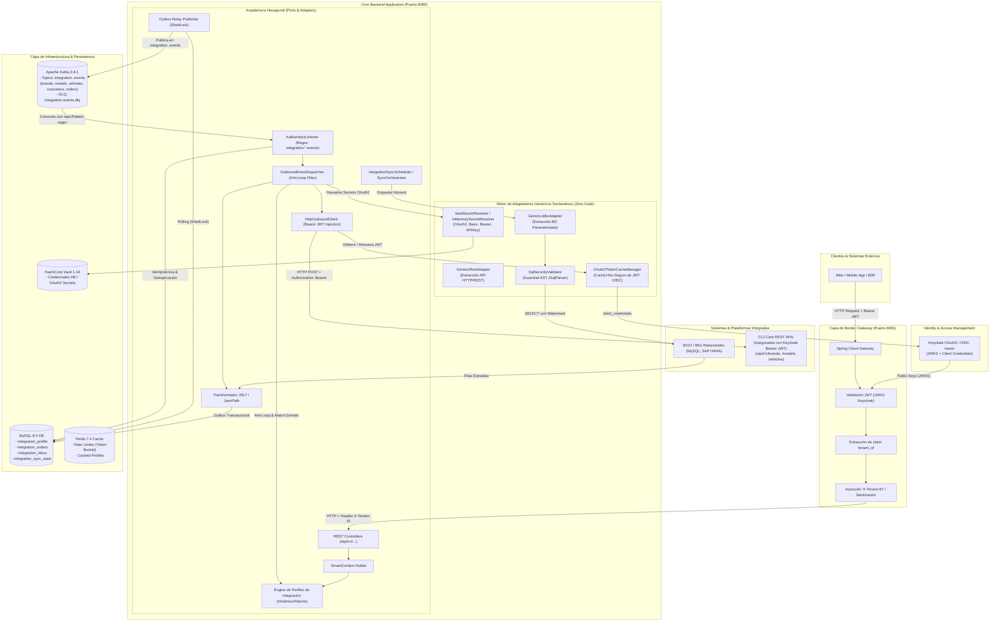

# Análisis de Arquitectura de la Solución: Plataforma Multitenant de Integración Flexible

Este documento presenta el análisis técnico detallado y la visualización arquitectónica de la **Plataforma Multitenant de Integración Flexible**, el **MVP SIGO Vehicle** y el **Motor Declarativo de Adaptadores Genéricos (Zero-Code Adapters)**.

---

## 1. Diagrama General de Arquitectura

El siguiente diagrama representa la arquitectura enterprise de la solución, sus capas, componentes clave, el motor declarativo de adaptadores y el flujo de datos desde la autenticación del cliente hasta los adaptadores y sistemas externos.

---

## 2. Diagrama de Flujo y Componentes (Mermaid)

---

## 3. Patrones Arquitectónicos Clave

### 3.1. Multitenancy Estricto & Seguridad en Gateway
- **Aislamiento por Tenant**: Cada operación de dominio requiere un `tenant_id` obligatorio activo en el hilo de ejecución (`TenantContext`).
- **Seguridad en Borde (Spring Cloud Gateway)**:
  - El Gateway valida tokens OAuth2/JWT emitidos por **Keycloak**.
  - Extrae la claim `tenant_id` del payload del JWT de forma segura.
  - Elimina cualquier cabecera `X-Tenant-ID` maliciosa enviada por el cliente y reinyecta `X-Tenant-ID: <tenant_id>` validada hacia el backend.

### 3.2. Segregación de Tópicos Kafka por Dominio & Protección Anti-Loop
- **Tópicos Dedicados (`integration.<businessDomain>.events`)**:
  - Cada evento generado por sincronización Inbound se publica en su tópico canónico segregado por dominio (`integration.brands.events`, `integration.models.events`, `integration.vehicles.events`, `integration.customers.events`, `integration.orders.events`).
  - Los eventos transportan encabezados de procedencia estandarizados: `X-Tenant-ID`, `X-Event-Type`, `X-Aggregate-ID`, `X-Business-Domain` y `X-External-Source`.
- **Suscripción Dinámica de Inbox (`KafkaInboxListener`)**:
  - Utiliza `topicPattern = "${integration.inbox.topic-pattern:integration\..*\.events}"` permitiendo ingestar nuevos tópicos de dominio sobre la marcha sin reinicios ni cambios de código.
- **Protección Anti-Loop Bidireccional (`OutboundEventDispatcher`)**:
  - Al despachar eventos hacia sistemas externos (`OUTBOUND` o `BIDIRECTIONAL`), el despachador descarta perfiles cuyo `externalSource` coincida con la fuente de origen del evento (`originExternalSource`), evitando bucles infinitos de sincronización.

### 3.3. Despacho Outbound REST Asegurado con Keycloak (JWT Bearer)
- **Despacho Desacoplado**: Para dominios como Units (`brands`, `models`, `vehicles`), los eventos se despachan directamente a las APIs REST del Core de CL2 mediante perfiles de tipo `OUTBOUND` o `BIDIRECTIONAL`.
- **Autenticación OAuth2 Client Credentials (`OAuth2TokenCacheManager` & `VaultSecretResolver`)**:
  - Soporte nativo para secretos de tipo `OAUTH2_CLIENT_CREDENTIALS` almacenados en Vault con `tokenUrl`, `clientId`, `clientSecret` y `scope`.
  - El gestor obtiene tokens JWT mediante el flujo *client_credentials* de Keycloak y mantiene una caché hilo-segura con renovación proactiva antes del vencimiento.
  - `HttpOutboundClient` inyecta automáticamente la cabecera `Authorization: Bearer <JWT>`.

### 3.4. Motor Declarativo de Adaptadores Genéricos (Zero-Code Adapters)
- **Extracción de BD sin Código (`GenericJdbcAdapter`)**: Permite integrar bases de datos externas (MySQL, SAP HANA, SQL Server, Oracle, PostgreSQL) mediante configuración de perfiles en metadatos.
- **Guardrail de Seguridad SQL (`SqlSecurityValidator`)**:
  - Analizador sintáctico AST (**JSqlParser 4.9**) que garantiza estrictamente ejecuciones de tipo `SELECT`.
  - Rechaza cualquier operación DML/DDL (`INSERT`, `UPDATE`, `DELETE`, `DROP`, `ALTER`, `EXEC`), multi-statements concatenados con `;` y accesos a tablas de catálogo del sistema (`information_schema`, `sys`, `mysql`, etc.).

### 3.5. Transactional Outbox e Inbox Patterns con Resiliencia
- **Garantía de Consistencia Eventual**:
  - **Outbox**: La extracción y el registro del evento en `integration_outbox` ocurren bajo la misma transacción relacional.
  - **Outbox Relay**: Polling asíncrono con bloqueos distribuidos **ShedLock** publicando a Kafka.
  - **Inbox**: Ingesta deduplicada e idempotente en `integration_inbox`, soporte para Dead Letter Queues (`integration.events.dlq`) y reintentos exponenciales.
  - **Resilience4j & Redis Token Bucket**: Circuit breaker por `tenantId:connector` y rate limiting distribuido para proteger los microservicios destino.

---

## 4. Stack Tecnológico

| Capa / Componente | Tecnología | Descripción / Responsabilidad |
| --- | --- | --- |
| **Lenguaje & Runtime** | Java 21 / OpenJDK | Runtime moderno con Virtual Threads y mejoras de rendimiento. |
| **Framework Principal** | Spring Boot 3.4.5 | Framework core multi-módulo (`application`, `e2e`). |
| **API Gateway** | Spring Cloud Gateway | Proxy inverso, enrutamiento, resiliencia y validación de seguridad en el borde. |
| **Seguridad & IAM** | Keycloak 26.x + Spring Security OAuth2 | Proveedor de identidad OIDC, emisión y validación de tokens JWT. |
| **Gestor de Secretos** | HashiCorp Vault 1.18 + REST | Almacenamiento seguro de credenciales DB y OAuth2 client secrets. |
| **Seguridad SQL** | JSqlParser 4.9 | Validador sintáctico AST para asegurar consultas de solo lectura (`SELECT`). |
| **Base de Datos Relacional** | MySQL 8.4 | Persistencia multitenant de perfiles, Outbox, Inbox y Sync State. |
| **Migración de DB** | Flyway | Gestión y control de versiones de esquemas SQL. |
| **Event Broker** | Apache Kafka 3.8.1 (KRaft) | Event bus distribuido con tópicos segregados por dominio (`integration.<domain>.events`). |
| **Caché y Rate Limiting** | Redis 7.4 + Token Cache | Rate limiter distribuido (Token Bucket) y caché de tokens JWT Keycloak. |
| **Transformación de Datos** | JSLT (Schibsted) + JsonPath | Motor de mapeo y transformación declarativa de JSON/Payloads. |
| **Resiliencia & Coordinación** | Resilience4j + ShedLock | Circuit breaker, reintentos y coordinación distribuida de sincronización. |
