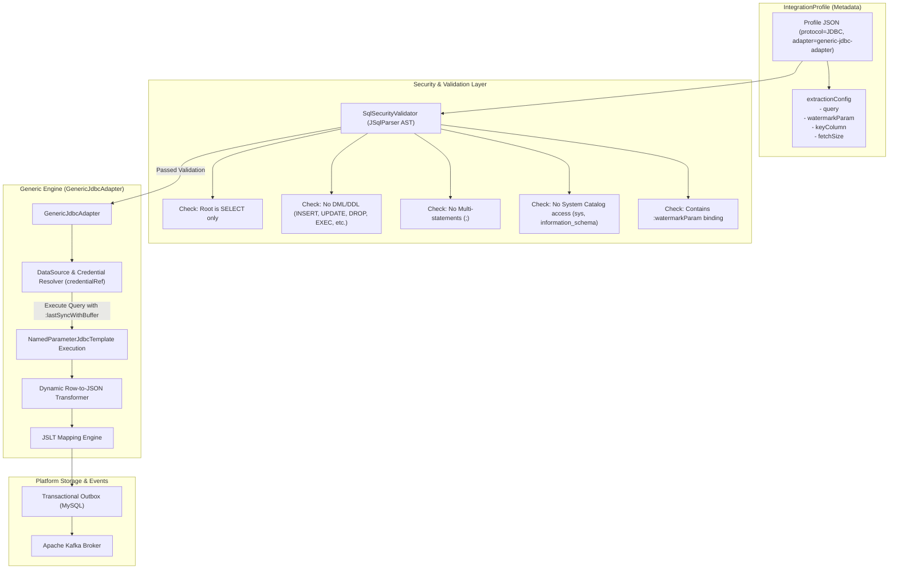

# Design Spec: Generic Declarative Integration Adapter (`GenericJdbcAdapter` & `SqlSecurityValidator`)

**Date**: 2026-08-17  
**Status**: Approved by User  
**Target Architecture**: Java 21 + Spring Boot 3.4.5 + Multi-tenant Hexagonal Integration Platform  

---

## 1. Overview & Objective

To eliminate the need for developing and compiling custom Java classes for each new database integration source (SAP HANA, SQL Server, Oracle, PostgreSQL, MySQL, etc.), this specification introduces a **Zero-Code Declarative Adapter Engine**. 

The engine enables complete configuration of database extraction pipelines via `IntegrationProfile` metadata, governed by a rigorous **AST-based SQL Security Guardrail (`SqlSecurityValidator`)**.

---

## 2. Architecture & Data Flow



---

## 3. Detailed Component Specification

### 3.1 Data Model Extension: `IntegrationProfileConfiguration`

The `IntegrationProfileConfiguration` record is updated to support an optional declarative `extractionConfig` object (or structured JSON):

```json
{
  "protocol": "JDBC",
  "connector": "generic-jdbc",
  "adapter": "generic-jdbc-adapter",
  "endpoint": "jdbc:sap://hana-server.internal:30015?databaseName=S4H",
  "credentialRef": "secret/sap/hana-readonly-user",
  "extractionConfig": "{\"query\":\"SELECT k.KUNNR AS customerId, k.STCD1 AS taxId, k.NAME1 AS legalName, k.AEDAT AS lastChangeDate FROM KNA1 k WHERE k.AEDAT >= :lastSyncWithBuffer ORDER BY lastChangeDate ASC\",\"watermarkParam\":\"lastSyncWithBuffer\",\"keyColumn\":\"customerId\",\"fetchSize\":500}",
  "mapping": "{\"customerId\":\"customerId\",\"taxId\":\"taxId\",\"legalName\":\"legalName\"}",
  "syncPolicy": "{\"cronExpression\":\"0 */15 * * * *\",\"overlapBufferSeconds\":300}"
}
```

#### Fields Schema for `extractionConfig`:
- `query` (`String`, required): The SQL SELECT query containing named watermark parameter.
- `watermarkParam` (`String`, optional, default: `"lastSyncWithBuffer"`): Named parameter used for incremental timestamp filtering.
- `keyColumn` (`String`, required): Primary business key column in the result set for inbox deduplication.
- `fetchSize` (`Integer`, optional, default: `500`): JDBC result set fetch size for memory efficiency.

---

### 3.2 SQL Security Guardrail (`SqlSecurityValidator`)

The `SqlSecurityValidator` ensures no arbitrary malicious SQL can be stored or executed.

#### Validation Pipeline Rules:
1. **AST Parsing**: Uses JSqlParser to parse `extractionConfig.query` into a structural AST.
2. **Statement Type Assertion**: The root AST node MUST be an instance of `net.sf.jsqlparser.statement.select.Select`. Any other statement type (`Insert`, `Update`, `Delete`, `Drop`, `Alter`, `Execute`, `Truncate`, `Create`, `Grant`) immediately throws `InvalidSqlExtractionException`.
3. **No Multi-Statement Execution**: Verifies no semicolon `;` exists to prevent SQL chaining attacks.
4. **Forbidden Catalog Schema Guard**: Rejects queries referencing system schemas (`information_schema`, `sys`, `mysql`, `pg_catalog`, `master`, `dbo.sys*`).
5. **Parameter Binding Enforcement**: Verifies the query contains the specified `:watermarkParam` binding to guarantee parameterization rather than string concatenation.

---

### 3.3 Engine Implementation (`GenericJdbcAdapter`)

1. **Lifecycle & Triggering**: Invoked by the scheduler according to `syncPolicy` (cron/polling).
2. **Connection Pooling & Credential Resolution**:
   - Resolves target database connection using `endpoint` and `credentialRef` via Vault / SecretManager.
3. **Execution**:
   - Computes `lastSyncWithBuffer = lastSyncAt - overlapBufferSeconds`.
   - Executes the validated AST query using `NamedParameterJdbcTemplate` passing `lastSyncWithBuffer`.
4. **Row Mapping & JSLT Transformation**:
   - Maps each `ResultSet` row into a generic `Map<String, Object>`.
   - Passes row JSON through the `JSLT` transformation engine using the profile's `mapping`.
5. **Inbox / Outbox Transaction**:
   - Writes event into MySQL `integration_outbox` inside a single local database transaction.

---

## 4. Verification & Testing Strategy

1. **Unit Tests (`SqlSecurityValidatorTest`)**:
   - Test valid SELECT queries with joins, aliases, and `GREATEST`/`COALESCE` functions.
   - Test rejection of `DROP TABLE`, `DELETE FROM`, `UPDATE`, `EXEC`, multiple statements, and system tables.
2. **Integration Tests (`GenericJdbcAdapterTest`)**:
   - Test end-to-end extraction against a MySQL Testcontainers instance.
   - Verify incremental watermark delta queries and outbox event generation.
