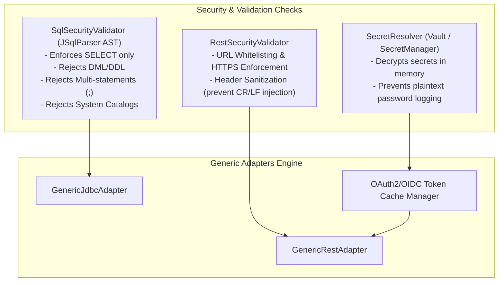

# Design Spec: Generic Declarative Integration Adapters (`GenericJdbcAdapter`, `GenericRestAdapter` & `SqlSecurityValidator`)

**Date**: 2026-08-17  
**Status**: Revised with API/OIDC Authentication, Concrete Case Examples & Implementation Base  
**Target Architecture**: Java 21 + Spring Boot 3.4.5 + Multi-tenant Hexagonal Integration Platform  

---

## 1. Overview & Objective

To eliminate the need for developing and compiling custom Java code for each new integration source (whether **Databases** like SAP HANA, SQL Server, PostgreSQL, MySQL or **REST/HTTP APIs** like SAP OData, Salesforce, external webhooks/REST endpoints), this specification defines a **Zero-Code Declarative Integration Adapter Engine**.

The engine supports:
1. **Generic Database Adapters (`GenericJdbcAdapter`)**: Controlled by `SqlSecurityValidator` (AST-based SQL guardrail).
2. **Generic HTTP/REST API Adapters (`GenericRestAdapter`)**: Supporting configurable endpoints, JSONPath extraction, and dynamic authentication (OIDC / OAuth2 Client Credentials, Bearer Token, Basic Auth, API Key).
3. **Generic Event Streaming Adapters (`GenericKafkaAdapter`)**: Supporting configurable topics, deduplication via Inbox, and JSLT transformation.

---

## 2. Declarative Schema Extensions in `IntegrationProfileConfiguration`

The `IntegrationProfileConfiguration` record is extended to include two declarative JSON blocks:
1. `extractionConfig`: Defines how to pull data from the source (SQL for JDBC, HTTP/Path/Params for REST, or Topic for Kafka).
2. `authConfig`: Defines the authentication/security credentials and mechanism for external APIs.

---

## 3. Extraction Configuration (`extractionConfig`) Specification

### 3.1 JDBC Extraction Configuration (`protocol: "JDBC"`)
- `query` (`String`, required): The SQL `SELECT` query containing named parameter binding `:lastSyncWithBuffer`.
- `watermarkParam` (`String`, default: `"lastSyncWithBuffer"`): Parameter name used for incremental timestamp filtering.
- `keyColumn` (`String`, required): Column name for record primary key / business ID (for deduplication in Inbox).
- `fetchSize` (`Integer`, default: `500`): JDBC batch fetch size.

### 3.2 REST/API Extraction Configuration (`protocol: "REST"` / `"REST_ODATA"`)
- `method` (`String`, default: `"GET"`): HTTP method (`GET`, `POST`).
- `path` (`String`, optional): Relative endpoint path appended to `endpoint`.
- `queryParams` (`Map<String, String>`): Dynamic URL query parameters with `{lastSyncWithBuffer}` placeholder.
- `headers` (`Map<String, String>`): HTTP headers (e.g. `Accept: application/json`).
- `responseJsonPath` (`String`, default: `"$.d.results"` or `"$"`): JSONPath expression to isolate the array of items from the API response payload.
- `watermarkFormat` (`String`, default: `"ISO_8601"`): Timestamp formatting string (e.g. `"ISO_8601"`, `"EPOCH_MS"`, `"yyyy-MM-dd'T'HH:mm:ss'Z'"`).
- `keyProperty` (`String`, required): Property name within each item JSON for business deduplication.

---

## 4. Authentication Engine Specification (`authConfig`)

To handle external API security without code changes, the platform introduces the **`AuthenticationProviderRegistry`**.

### Supported `authType` Options:

#### 1. `OAUTH2_CLIENT_CREDENTIALS` / `OIDC`
- **Fields**: `tokenUrl`, `clientId`, `clientSecretRef`, `scope`, `grantType` (default: `"client_credentials"`).
- **Behavior**:
  - The adapter requests a Bearer JWT token from `tokenUrl` passing `client_credentials`.
  - Maintains an in-memory **Thread-Safe OAuth2 Token Cache** keyed by tenant and profile ID.
  - Automatically refreshes tokens before expiration (`expires_in - 60s`).
  - Injects `Authorization: Bearer <access_token>` into the outgoing HTTP request.

#### 2. `BEARER_TOKEN`
- **Fields**: `tokenRef` (Vault reference to a static or long-lived JWT).
- **Behavior**: Injects `Authorization: Bearer <token>` retrieved from Vault.

#### 3. `BASIC_AUTH`
- **Fields**: `credentialRef` (Vault reference containing `username` and `password`).
- **Behavior**: Injects HTTP `Authorization: Basic <base64(username:password)>`.

#### 4. `API_KEY`
- **Fields**: `headerName` (e.g. `"X-API-Key"`, `"Ocp-Apim-Subscription-Key"`), `keyRef` (Vault reference to key).
- **Behavior**: Injects `<headerName>: <key>` into request headers.

---

## 5. Security & Safety Architecture



1. **SQL Guardrail (`SqlSecurityValidator`)**: AST-based verification enforcing strict `SELECT` only, no multi-statements, no DML/DDL, and parameter binding enforcement.
2. **REST Guardrail (`RestSecurityValidator`)**: Validates HTTPS endpoints, sanitizes headers against CRLF injection, and enforces timeout limits (Connect timeout: 5s, Read timeout: 30s).
3. **Secret Security**: No secrets or passwords are stored in `IntegrationProfile` plaintext. All sensitive credentials (`clientSecretRef`, `keyRef`, `credentialRef`) reference HashiCorp Vault.

---

## 6. Concrete Example Cases for Each Adapter Type

### Caso 1: Extracción por Base de Datos (`GenericJdbcAdapter` - SAP HANA / SQL Server)

#### Perfil de Integración (`IntegrationProfile` JSON):
```json
{
  "businessDomain": "customers",
  "externalSource": "sap-hana",
  "syncDirection": "INBOUND",
  "sourceOfTruth": "EXTERNAL",
  "protocol": "JDBC",
  "connector": "generic-jdbc",
  "adapter": "generic-jdbc-adapter",
  "endpoint": "jdbc:sap://hana-server.internal:30015?databaseName=S4H",
  "credentialRef": "secret/sap/hana-readonly-user",
  "extractionConfig": "{\"query\":\"SELECT k.KUNNR AS customerId, k.STCD1 AS taxId, k.NAME1 AS legalName, k.STRAS AS street, k.LAND1 AS countryCode, a.SMTP_ADDR AS email, GREATEST(COALESCE(k.AEDAT, k.ERDAT), COALESCE(b.AEDAT, '1970-01-01')) AS lastChangeDate FROM KNA1 k LEFT JOIN KNB1 b ON k.KUNNR = b.KUNNR LEFT JOIN ADR6 a ON k.ADRNR = a.ADDRNUMBER WHERE k.AEDAT >= :lastSyncWithBuffer OR k.ERDAT >= :lastSyncWithBuffer ORDER BY lastChangeDate ASC\",\"watermarkParam\":\"lastSyncWithBuffer\",\"keyColumn\":\"customerId\",\"fetchSize\":500}",
  "mapping": "{\"customerId\":\"customerId\",\"taxId\":\"taxId\",\"legalName\":\"legalName\",\"contact\":{\"email\":\"email\"},\"address\":{\"street\":\"street\",\"countryCode\":\"countryCode\"}}",
  "syncPolicy": "{\"cronExpression\":\"0 */15 * * * *\",\"overlapBufferSeconds\":300}"
}
```

#### Flujo de Ejecución:
1. `SqlSecurityValidator` verifica que la SQL sea un `SELECT` válido sin sentencias DDL/DML ni `;`.
2. `GenericJdbcAdapter` reemplaza `:lastSyncWithBuffer` con `2026-08-17T12:00:00Z`.
3. Convierte las filas de `KNA1/ADR6` a JSON y aplica el mapeo JSLT.
4. Genera el evento canónico `customer.updated` y lo registra en el `integration_outbox` local dentro de la transacción.

---

### Caso 2: Extracción por API REST con Autenticación OIDC / OAuth2 Client Credentials (`GenericRestAdapter` - SAP S/4HANA OData)

#### Perfil de Integración (`IntegrationProfile` JSON):
```json
{
  "businessDomain": "customers",
  "externalSource": "sap-odata",
  "syncDirection": "INBOUND",
  "sourceOfTruth": "EXTERNAL",
  "protocol": "REST",
  "connector": "generic-rest",
  "adapter": "generic-rest-adapter",
  "endpoint": "https://sap-gateway.company.com/sap/opu/odata/sap/API_BUSINESS_PARTNER",
  "credentialRef": "secret/sap/odata-user",
  "authConfig": "{\"authType\":\"OAUTH2_CLIENT_CREDENTIALS\",\"tokenUrl\":\"https://oauth2.qa.comsatel.com.pe/realms/microservicios/protocol/openid-connect/token\",\"clientId\":\"sap-integration-client\",\"clientSecretRef\":\"secret/sap/oauth2-client-secret\",\"scope\":\"business-partner.read\"}",
  "extractionConfig": "{\"method\":\"GET\",\"path\":\"/A_BusinessPartner\",\"queryParams\":{\"$filter\":\"LastChangeDateTime ge datetimeoffset'{lastSyncWithBuffer}'\",\"$top\":\"100\"},\"headers\":{\"Accept\":\"application/json\"},\"responseJsonPath\":\"$.d.results\",\"watermarkFormat\":\"ISO_8601\",\"keyProperty\":\"BusinessPartner\"}",
  "mapping": "{\"customerId\":\"BusinessPartner\",\"taxId\":\"BPTaxNumber\",\"legalName\":\"OrganizationBPName1\"}",
  "syncPolicy": "{\"cronExpression\":\"0 */10 * * * *\",\"overlapBufferSeconds\":120}"
}
```

#### Flujo de Ejecución:
1. `OAuth2TokenCacheManager` consulta `tokenUrl` vía HTTP POST `grant_type=client_credentials`, obtiene el JWT Bearer token y lo guarda en caché.
2. `GenericRestAdapter` ejecuta `GET /A_BusinessPartner?$filter=...` adjuntando `Authorization: Bearer <jwt_token>`.
3. Extrae la lista de partners con JSONPath `$.d.results`.
4. Mapea cada partner al modelo canónico y lo persiste en `integration_outbox`.

---

### Caso 3: Extracción por API REST con API Key (`GenericRestAdapter` - SIGO Partner API)

#### Perfil de Integración (`IntegrationProfile` JSON):
```json
{
  "businessDomain": "vehicles",
  "externalSource": "sigo",
  "syncDirection": "INBOUND",
  "sourceOfTruth": "EXTERNAL",
  "protocol": "REST",
  "connector": "generic-rest",
  "adapter": "generic-rest-adapter",
  "endpoint": "https://sigo.test/api/v1",
  "credentialRef": "secret/sigo/credentials",
  "authConfig": "{\"authType\":\"API_KEY\",\"headerName\":\"X-SIGO-API-KEY\",\"keyRef\":\"secret/sigo/api-key\"}",
  "extractionConfig": "{\"method\":\"GET\",\"path\":\"/vehicles/delta\",\"queryParams\":{\"modifiedSince\":\"{lastSyncWithBuffer}\"},\"headers\":{\"Accept\":\"application/json\"},\"responseJsonPath\":\"$.vehicles\",\"watermarkFormat\":\"ISO_8601\",\"keyProperty\":\"vin\"}",
  "mapping": "{\"vin\":\"vin\",\"brandCode\":\"brand\",\"modelCode\":\"model\",\"modelYear\":\"year\"}",
  "syncPolicy": "{\"cronExpression\":\"0 */5 * * * *\",\"overlapBufferSeconds\":60}"
}
```

#### Flujo de Ejecución:
1. Reemplaza `{lastSyncWithBuffer}` en `queryParams`.
2. Inyecta la cabecera `X-SIGO-API-KEY: <key_from_vault>`.
3. Extrae la lista con JSONPath `$.vehicles` y publica los eventos de vehículo canónico `vehicle.created` o `vehicle.updated`.

---

### Caso 4: Consumo de Event Stream (`GenericKafkaAdapter` - Bus de Eventos Externo)

#### Perfil de Integración (`IntegrationProfile` JSON):
```json
{
  "businessDomain": "orders",
  "externalSource": "external-kafka",
  "syncDirection": "INBOUND",
  "sourceOfTruth": "EXTERNAL",
  "protocol": "KAFKA",
  "connector": "generic-kafka",
  "adapter": "generic-kafka-adapter",
  "endpoint": "external-kafka.company.com:9092",
  "credentialRef": "secret/kafka/sasl-user",
  "extractionConfig": "{\"topic\":\"external.erp.orders.v1\",\"groupId\":\"integration-platform-orders-cg\",\"keyProperty\":\"orderId\"}",
  "mapping": "{\"orderId\":\"rawOrderId\",\"totalAmount\":\"amount\",\"status\":\"orderStatus\"}"
}
```

#### Flujo de Ejecución:
1. `GenericKafkaAdapter` escucha el tópico `external.erp.orders.v1`.
2. Inserta el mensaje entrante en la tabla `integration_inbox` local para garantizar deduplicación por `orderId`.
3. Transforma el payload usando JSLT y registra el evento canónico listo para el microservicio de negocio.

---

## 7. Base de Implementación (Clases Core a Crear)

```
com.cl2.integration.adapter.out.generic
├── GenericJdbcAdapter.java              # Motor de extracción JDBC
├── GenericRestAdapter.java              # Motor de extracción REST/HTTP
├── GenericKafkaAdapter.java             # Motor de consumo Kafka
├── security
│   ├── SqlSecurityValidator.java        # Parser AST (JSqlParser) para queries SELECT
│   ├── RestSecurityValidator.java       # Sanitizador HTTPS y URLs
│   └── OAuth2TokenCacheManager.java     # Gestor hilo-seguro de tokens Bearer JWT / OIDC
└── model
    ├── ExtractionConfig.java            # DTO deserializado de extractionConfig
    └── AuthConfig.java                  # DTO deserializado de authConfig
```

---

## 8. Verification & Testing Strategy

1. **Unit Tests**:
   - `SqlSecurityValidatorTest`: Test valid/invalid SQL syntax, injection attempts, and multi-statements.
   - `OAuth2TokenCacheTest`: Test token retrieval, caching, and proactive renewal on expiration.
   - `GenericRestAdapterTest`: Test wiremock-backed HTTP pulling, JSONPath parsing, and JSLT transformation.
2. **Integration Tests**:
   - Test `GenericJdbcAdapter` with MySQL Testcontainers.
   - Test `GenericRestAdapter` with WireMock container simulating OIDC authentication and SAP OData endpoints.
