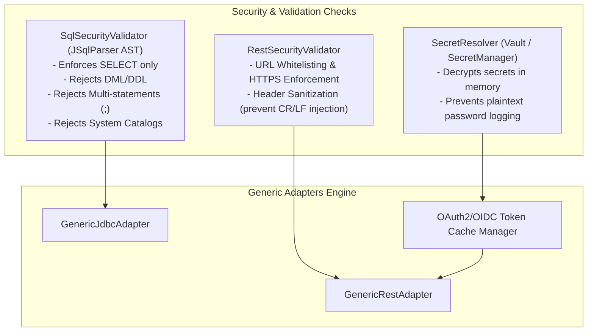

# Design Spec: Generic Declarative Integration Adapters (`GenericJdbcAdapter`, `GenericRestAdapter` & `SqlSecurityValidator`)

**Date**: 2026-08-17  
**Status**: Revised with API/OIDC Authentication & REST Extraction  
**Target Architecture**: Java 21 + Spring Boot 3.4.5 + Multi-tenant Hexagonal Integration Platform  

---

## 1. Overview & Objective

To eliminate the need for developing and compiling custom Java code for each new integration source (whether **Databases** like SAP HANA, SQL Server, PostgreSQL, MySQL or **REST/HTTP APIs** like SAP OData, Salesforce, external webhooks/REST endpoints), this specification defines a **Zero-Code Declarative Integration Adapter Engine**.

The engine supports:
1. **Generic Database Adapters (`GenericJdbcAdapter`)**: Controlled by `SqlSecurityValidator` (AST-based SQL guardrail).
2. **Generic HTTP/REST API Adapters (`GenericRestAdapter`)**: Supporting configurable endpoints, JSONPath extraction, and dynamic authentication (OIDC / OAuth2 Client Credentials, Bearer Token, Basic Auth, API Key).

---

## 2. Declarative Schema Extensions in `IntegrationProfileConfiguration`

The `IntegrationProfileConfiguration` record is extended to include two declarative JSON blocks:
1. `extractionConfig`: Defines how to pull data from the source (SQL for JDBC or HTTP/Path/Params for REST).
2. `authConfig`: Defines the authentication/security credentials and mechanism for external APIs.

```json
{
  "protocol": "REST",
  "connector": "generic-rest",
  "adapter": "generic-rest-adapter",
  "endpoint": "https://sap-gateway.company.com/sap/opu/odata/sap/API_BUSINESS_PARTNER",
  "credentialRef": "secret/sap/odata-service-user",
  "authConfig": "{\"authType\":\"OAUTH2_CLIENT_CREDENTIALS\",\"tokenUrl\":\"https://identity.qa.company.com/oauth2/token\",\"clientId\":\"integration-client-id\",\"clientSecretRef\":\"secret/sap/client-secret\",\"scope\":\"business-partner.read\"}",
  "extractionConfig": "{\"method\":\"GET\",\"path\":\"/A_BusinessPartner\",\"queryParams\":{\"$filter\":\"LastChangeDateTime ge datetimeoffset'{lastSyncWithBuffer}'\",\"$top\":\"100\"},\"headers\":{\"Accept\":\"application/json\"},\"responseJsonPath\":\"$.d.results\",\"watermarkFormat\":\"ISO_8601\",\"keyProperty\":\"BusinessPartner\"}",
  "mapping": "{\"customerId\":\"Customer\",\"legalName\":\"OrganizationBPName1\"}",
  "syncPolicy": "{\"cronExpression\":\"0 */10 * * * *\",\"overlapBufferSeconds\":120}"
}
```

---

## 3. Extraction Configuration (`extractionConfig`) Specification

### 3.1 JDBC Extraction Configuration (`protocol: "JDBC"`)
- `query` (`String`, required): The SQL `SELECT` query containing named parameter binding `:lastSyncWithBuffer`.
- `watermarkParam` (`String`, default: `"lastSyncWithBuffer"`): Parameter name used for incremental timestamp filtering.
- `keyColumn` (`String`, required): Column name for record primary key / business ID (for deduplication in Inbox).
- `fetchSize` (`Integer`, default: `500`): JDBC batch fetch size.

### 3.2 REST/API Extraction Configuration (`protocol: "REST"` / `"REST_ODATA"`)
- `method` (`String`, default: `"GET"`): HTTP method (`GET`, `POST`).
- `path` (`String`, optional): Relative endpoint path appended to `endpoint`.
- `queryParams` (`Map<String, String>`): Dynamic URL query parameters with `{lastSyncWithBuffer}` placeholder.
- `headers` (`Map<String, String>`): HTTP headers (e.g. `Accept: application/json`).
- `responseJsonPath` (`String`, default: `"$.d.results"` or `"$"`): JSONPath expression to isolate the array of items from the API response payload.
- `watermarkFormat` (`String`, default: `"ISO_8601"`): Timestamp formatting string (e.g. `"ISO_8601"`, `"EPOCH_MS"`, `"yyyy-MM-dd'T'HH:mm:ss'Z'"`).
- `keyProperty` (`String`, required): Property name within each item JSON for business deduplication.

---

## 4. Authentication Engine Specification (`authConfig`)

To handle external API security without code changes, the platform introduces the **`AuthenticationProviderRegistry`**.

### Supported `authType` Options:

#### 1. `OAUTH2_CLIENT_CREDENTIALS` / `OIDC`
- **Fields**: `tokenUrl`, `clientId`, `clientSecretRef`, `scope`, `grantType` (default: `"client_credentials"`).
- **Behavior**:
  - The adapter requests a Bearer JWT token from `tokenUrl` passing `client_credentials`.
  - Maintains an in-memory **Thread-Safe OAuth2 Token Cache** keyed by tenant and profile ID.
  - Automatically refreshes tokens before expiration (`expires_in - 60s`).
  - Injects `Authorization: Bearer <access_token>` into the outgoing HTTP request.

#### 2. `BEARER_TOKEN`
- **Fields**: `tokenRef` (Vault reference to a static or long-lived JWT).
- **Behavior**: Injects `Authorization: Bearer <token>` retrieved from Vault.

#### 3. `BASIC_AUTH`
- **Fields**: `credentialRef` (Vault reference containing `username` and `password`).
- **Behavior**: Injects HTTP `Authorization: Basic <base64(username:password)>`.

#### 4. `API_KEY`
- **Fields**: `headerName` (e.g. `"X-API-Key"`, `"Ocp-Apim-Subscription-Key"`), `keyRef` (Vault reference to key).
- **Behavior**: Injects `<headerName>: <key>` into request headers.

---

## 5. Security & Safety Architecture



1. **SQL Guardrail (`SqlSecurityValidator`)**: AST-based verification enforcing strict `SELECT` only, no multi-statements, no DML/DDL, and parameter binding enforcement.
2. **REST Guardrail (`RestSecurityValidator`)**: Validates HTTPS endpoints, sanitizes headers against CRLF injection, and enforces timeout limits (Connect timeout: 5s, Read timeout: 30s).
3. **Secret Security**: No secrets or passwords are stored in `IntegrationProfile` plaintext. All sensitive credentials (`clientSecretRef`, `keyRef`, `credentialRef`) reference HashiCorp Vault.

---

## 6. Verification & Testing Strategy

1. **Unit Tests**:
   - `SqlSecurityValidatorTest`: Test valid/invalid SQL syntax, injection attempts, and multi-statements.
   - `OAuth2TokenCacheTest`: Test token retrieval, caching, and proactive renewal on expiration.
   - `GenericRestAdapterTest`: Test wiremock-backed HTTP pulling, JSONPath parsing, and JSLT transformation.
2. **Integration Tests**:
   - Test `GenericJdbcAdapter` with MySQL Testcontainers.
   - Test `GenericRestAdapter` with WireMock container simulating OIDC authentication and SAP OData endpoints.
