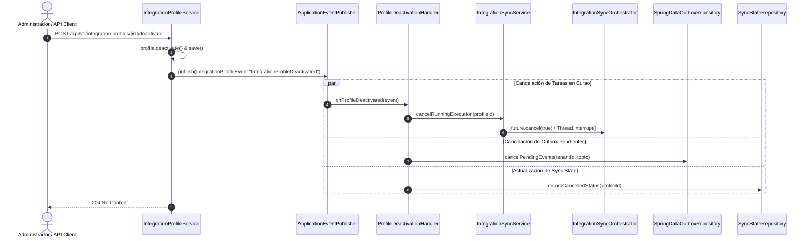

# Spec: Tratamiento y Cancelación de Ejecuciones no Finalizadas al Desactivar un Integration Profile

## 1. Resumen y Contexto
Al desactivar un `IntegrationProfile` (`POST /api/v1/integration-profiles/{profileId}/deactivate`), el sistema debe garantizar que:
1. Las ejecuciones de sincronización en curso (Inbound JDBC o Despachos Outbound) sean canceladas e interrumpidas de forma inmediata y segura.
2. Los eventos que ya hayan sido generados en `integration_outbox` pero que sigan con estado `PENDING` sean cancelados/descartados masivamente para que no se transmitan a Kafka ni a las APIs externas.
3. El estado de la última sincronización (`SyncState`) refleje el estado `CANCELLED` y el `lastWatermark` quede protegido e inalterado sin avanzar parcialmente.
4. Cualquier evento que ya estuviese en tránsito en Kafka sea descartado por `OutboundEventDispatcher` sin impactar los sistemas externos destino.

---

## 2. Arquitectura de Componentes



---

## 3. Especificación Detallada de Cambios

### 3.1. Dominio y Estados (`SyncRunStatus` y `SyncState`)
- **Ampliación de `SyncRunStatus`**:
  ```java
  public enum SyncRunStatus {
      SUCCESS,
      FAILED,
      CANCELLED
  }
  ```
- **Comportamiento en Cancelación**:
  - `last_run_status` se actualiza a `CANCELLED`.
  - `last_error` se registra como `"Execution cancelled due to profile deactivation"`.
  - `last_watermark` **no se actualiza** (se mantiene exactamente el valor de la corrida exitosa anterior).

### 3.2. Seguimiento y Cancelación de Ejecuciones (`IntegrationSyncService`)
- Mantener un mapa concurrente de ejecuciones activas:
  ```java
  private final Map<UUID, Future<?>> activeExecutions = new ConcurrentHashMap<>();
  ```
- Al disparar una sincronización (`dispatch`):
  - Se registra el `Future<?>` devuelto por el `ExecutorService` / `CompletableFuture`.
  - Al completar (normalmente o por excepción), se remueve del mapa.
- Exponer el método:
  ```java
  public void cancelRunningExecution(UUID profileId) {
      Future<?> future = activeExecutions.remove(profileId);
      if (future != null && !future.isDone()) {
          future.cancel(true); // Envía interrupción cooperativa al hilo
      }
  }
  ```

### 3.3. Interrupción Cooperativa en `IntegrationSyncOrchestrator`
- En el ciclo de extracción y mapeo:
  ```java
  for (Map<String, Object> row : rows) {
      if (Thread.currentThread().isInterrupted()) {
          log.info("Sync execution interrupted for profileId={} (tenantId={})", profile.id(), profile.tenantId());
          throw new SyncExecutionCancelledException("Execution was cancelled for profile " + profile.id());
      }
      // ... procesamiento normal ...
  }
  ```
- En caso de `SyncExecutionCancelledException`:
  - Se realiza `rollback` de la transacción activa (los eventos parciales de este lote no se guardan).
  - Se registra el estado `CANCELLED` en `SyncState`.

### 3.4. Cancelación Masiva de Outbox Pendientes (`SpringDataOutboxRepository`)
- Agregar consulta nativa en `SpringDataOutboxRepository`:
  ```sql
  UPDATE integration_outbox 
  SET status = 'CANCELLED', last_error = 'Profile deactivated'
  WHERE tenant_id = :tenantId 
    AND topic = :topic 
    AND status = 'PENDING'
  ```
- Con esto, el `OutboxRelayScheduler` omitirá de inmediato todos los eventos pendientes vinculados a dicho perfil/tópico.

### 3.5. Listener de Desactivación (`ProfileDeactivationHandler`)
- Clase listener que escucha eventos de desactivación de perfil:
  ```java
  @Component
  public class ProfileDeactivationHandler {
      @EventListener
      public void onProfileDeactivated(IntegrationProfileEvent event) {
          if (!"IntegrationProfileDeactivated".equals(event.eventType())) {
              return;
          }
          // 1. Cancelar ejecución activa en memoria
          syncService.cancelRunningExecution(event.profileId());

          // 2. Cancelar eventos en Outbox pendientes
          String topic = "integration." + event.state().businessDomain().trim().toLowerCase() + ".events";
          outboxRepository.cancelPendingByTenantAndTopic(event.tenantId(), topic);

          // 3. Registrar estado CANCELLED si había sincronización
          syncStateRecorder.recordCancelled(event.profileId());
      }
  }
  ```

### 3.6. Protección en `OutboundEventDispatcher`
- Al consumir un evento desde Kafka, `OutboundEventDispatcher` verifica que el perfil destino esté activo:
  - Si el perfil fue desactivado mientras el evento viajaba en Kafka, `matchingProfiles` estará vacío.
  - El listener Inbox procesa el mensaje sin emitir llamadas HTTP y registra el log `No active outbound REST profiles found for tenantId=...`.

---

## 4. Estrategia de Pruebas y Verificación

1. **Pruebas Unitarias**:
   - `ProfileDeactivationHandlerTest`: Verifica que al publicarse `IntegrationProfileDeactivated`, se invoque la cancelación de hilos, el update del Outbox y el registro de estado `CANCELLED`.
   - `IntegrationSyncServiceTest`: Verifica el registro y cancelación de `Future<?>` concurrentes.
   - `IntegrationSyncOrchestratorTest`: Simula una interrupción (`Thread.currentThread().interrupt()`) y verifica que se arroje `SyncExecutionCancelledException`, sin mutar el watermark.
2. **Pruebas de Integración**:
   - `ProfileDeactivationIntegrationTest`:
     - Inserta 100 registros Outbox `PENDING` para un perfil.
     - Lanza una sincronización pesada simulada.
     - Invoca `POST /api/v1/integration-profiles/{profileId}/deactivate`.
     - Aserción 1: El estado del perfil es `active = false`.
     - Aserción 2: Los 100 registros en `integration_outbox` pasan a `CANCELLED`.
     - Aserción 3: El hilo de sincronización se detiene inmediatamente.
     - Aserción 4: `integration_sync_state` tiene `last_run_status = 'CANCELLED'`.
3. **Suite Completa de Regresión**:
   - Ejecución de `mvn test` garantizando 100% de éxito en todos los módulos.
