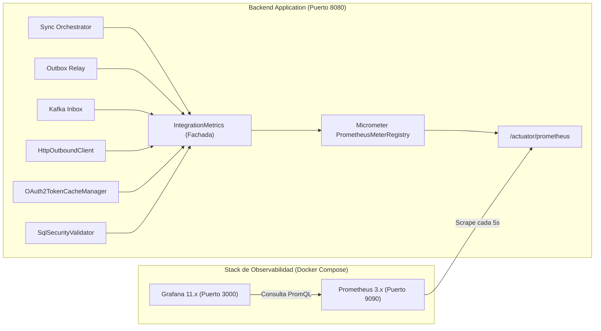

# Spec: Conjunto Integral de Métricas Prometheus y Dashboards de Observabilidad

## 1. Resumen y Objetivos
Implementar un ecosistema completo de observabilidad operacional para la **Plataforma Multitenant de Integración Flexible**, exponiendo métricas de negocio y técnicas mediante **Prometheus / Micrometer**, integrando un servicio de monitoreo en **Docker Compose** y proveyendo dashboards preconfigurados en **Grafana**.

---

## 2. Catálogo de Métricas de Dominio (`IntegrationMetrics`)

| Métrica | Tipo | Etiquetas (`Tags`) | Propósito |
|---|---|---|---|
| `integration.sync.duration` | Timer | `tenant_id`, `business_domain`, `external_source`, `status` | Duración en segundos de las corridas de extracción Inbound JDBC/REST. |
| `integration.sync.extracted.rows.total` | Counter | `tenant_id`, `business_domain`, `external_source` | Cantidad total de registros/filas extraídas desde orígenes de datos. |
| `integration.sync.failures.total` | Counter | `tenant_id`, `business_domain`, `error_type` | Cantidad de sincronizaciones fallidas por tipo de error. |
| `integration.outbox.events.saved.total` | Counter | `tenant_id`, `business_domain`, `event_type` | Total de eventos insertados en `integration_outbox`. |
| `integration.outbox.relay.duration` | Timer | `tenant_id`, `topic` | Duración del proceso de publicación a Kafka desde el Outbox. |
| `integration.outbox.relay.published.total` | Counter | `tenant_id`, `topic` | Total de eventos relayados a Kafka con éxito. |
| `integration.inbox.consumed.total` | Counter | `tenant_id`, `business_domain`, `topic` | Mensajes consumidos desde Kafka en `KafkaInboxListener`. |
| `integration.transformation.duration` | Timer | `tenant_id`, `business_domain`, `engine` | Tiempo de ejecución de transformaciones JSLT / FieldMapping. |
| `integration.dlq.forwarded.total` | Counter | `tenant_id`, `business_domain`, `error_reason` | Mensajes derivados a Dead Letter Queue (`integration.events.dlq`). |
| `integration.outbound.http.requests.total` | Counter | `tenant_id`, `connector`, `http_status`, `result` | Peticiones HTTP salientes clasificadas por código de estado. |
| `integration.outbound.http.duration` | Timer | `tenant_id`, `connector` | Latencia p50, p95 y p99 de las llamadas a APIs externas. |
| `integration.oauth2.token.requests.total` | Counter | `tenant_id`, `client_id`, `status` | Solicitudes de obtención de token OIDC a Keycloak. |
| `integration.oauth2.token.cache.hits.total` | Counter | `tenant_id`, `client_id` | Aciertos de caché en memoria de tokens JWT reutilizados. |
| `integration.sql.validation.blocked.total` | Counter | `tenant_id`, `violation_type` | Consultas SQL bloqueadas por el guardrail de seguridad AST. |

---

## 3. Arquitectura de Componentes

---

## 4. Cambios en Componentes y Código Fuente

### 4.1. Dependencias (`application/pom.xml`)
- `org.springframework.boot:spring-boot-starter-actuator`
- `io.micrometer:micrometer-registry-prometheus`

### 4.2. Fachada Centralizada (`IntegrationMetrics.java`)
- Se inyecta `MeterRegistry`.
- Registra contadores, temporizadores con distribución de percentiles y tags de baja cardinalidad.

### 4.3. Instrumentación de Clases Existentes
- **`IntegrationSyncOrchestrator`**: Mide tiempo de corrida y suma contador de filas extraídas.
- **`OutboxRelayScheduler`**: Mide duración del relay y eventos publicados a Kafka.
- **`KafkaInboxListener` / `InboxProcessor`**: Incrementa contador de consumo y contador de desvíos a DLQ.
- **`TransformationService`**: Mide tiempo de ejecución de transformación JSLT.
- **`HttpOutboundClient`**: Mide latencia HTTP y cuenta status codes 2xx/4xx/5xx.
- **`OAuth2TokenCacheManager`**: Cuenta requests a Keycloak y cache hits.
- **`SqlSecurityValidator`**: Cuenta infracciones SQL bloqueadas.

### 4.4. Configuración de Actuator (`application.yml`)
- Exponer `/actuator/prometheus` y `/actuator/health`.
- Habilitar percentiles de latencia para `integration.outbound.http.duration` e `integration.sync.duration`.

---

## 5. Aprovisionamiento de Infraestructura en `compose.yaml`

### 5.1. Servicio Prometheus
- Archivo de configuración: `deploy/prometheus/prometheus.yml`
- Scrape target: `integration-app:8080` en ruta `/actuator/prometheus`.

### 5.2. Servicio Grafana
- Puerto: `3000:3000`
- Datasource automático: `deploy/grafana/provisioning/datasources/datasource.yml`
- Dashboard JSON automático: `deploy/grafana/provisioning/dashboards/integration-platform-dashboard.json`
  - Paneles:
    1. **Throughput de Eventos (Eventos/Seg Inbound vs Outbound)**.
    2. **Latencia de Despacho HTTP (p50, p95, p99)**.
    3. **Tasa de Errores HTTP y DLQ**.
    4. **Estado de Circuit Breakers por Conector**.
    5. **Tasa de Aciertos de Caché OAuth2 (Keycloak Tokens)**.
    6. **Uso de JVM (Memoria Heap, CPU y Conexiones HikariCP)**.

---

## 6. Estrategia de Pruebas y Verificación

1. **Pruebas Unitarias**:
   - `IntegrationMetricsTest`: Valida que cada método registre correctamente en un `SimpleMeterRegistry` los contadores, timers y tags esperados.
2. **Pruebas de Integración**:
   - `PrometheusActuatorIntegrationTest`: Invoca `/actuator/prometheus` mediante MockMvc / TestRestTemplate y verifica que el texto de salida contenga los nombres de métricas `integration_outbound_http_requests_total`, `integration_sync_duration_seconds`, etc.
3. **Validación de Compilación y Suite Completa**:
   - `mvn test` en todos los módulos con 100% de éxito.
4. **Verificación en Docker Compose**:
   - `docker compose up -d`
   - Verificación de scraping exitoso en `http://localhost:9090/targets`.
   - Verificación de dashboard operativo en `http://localhost:3000`.
