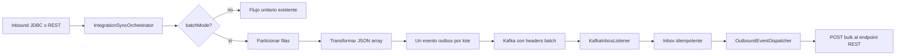

# Batch & Bulk Processing (FEAT1) — Diseño Técnico

**Fecha:** 2026-08-29  
**Estado:** Aprobado en conversación; pendiente de revisión de esta especificación

## Objetivo

Permitir que una sincronización inbound JDBC o REST agrupe los registros extraídos en lotes configurables, transforme cada lote como un JSON array, publique un evento outbox/Kafka por lote y realice una única llamada HTTP bulk por lote al perfil outbound correspondiente.

Cuando `batchMode` no esté habilitado, el comportamiento actual unitario debe permanecer sin cambios.

## Alcance

Incluye:

- Configuración declarativa de `batchMode` y `batchSize` en `extractionConfig`.
- Particionado común para filas extraídas por los adaptadores JDBC y REST.
- Transformación JSLT/field mapping/passthrough aplicada una vez por lote.
- Un evento outbox y un mensaje Kafka por lote.
- Propagación de metadatos de lote mediante headers Kafka.
- Despacho HTTP outbound del payload bulk ya transformado.
- Pruebas unitarias y de integración para ambos protocolos y para la compatibilidad no-batch.

Fuera de alcance:

- Micro-batching o buffering en el consumidor Kafka.
- ACK parcial de elementos dentro de un lote.
- Un campo separado `bulkEndpoint`; el `endpoint` del perfil outbound REST será el destino bulk cuando reciba un evento de lote.
- Cambios de esquema de base de datos, salvo que una incompatibilidad concreta del modelo persistido lo haga indispensable.

## Arquitectura y flujo



`IntegrationSyncOrchestrator` seguirá siendo responsable de la transacción de sync, extracción, transformación, persistencia de eventos y avance del watermark. La política de lote sólo modifica la unidad de trabajo de transformación y publicación; no modifica la semántica de watermark.

## Modelo de configuración

`ExtractionConfig` añadirá:

```java
Boolean batchMode
Integer batchSize
```

Reglas:

- `batchMode` por defecto es `false`.
- `batchSize` por defecto es `500`.
- Un `batchSize` nulo, cero o negativo se normaliza a `500`.
- El modo batch se acepta tanto para `JDBC` como para `REST`.
- La extracción sigue usando `fetchSize` y la validación de claves/watermark existente.

Ejemplo:

```json
{
  "query": "SELECT numero_motor, numero_placa, fecha_modificacion FROM vehiculos WHERE fecha_modificacion > :lastSyncWithBuffer ORDER BY fecha_modificacion ASC",
  "watermarkParam": "lastSyncWithBuffer",
  "watermarkColumn": "fecha_modificacion",
  "keyColumn": "numero_motor",
  "fetchSize": 1000,
  "batchMode": true,
  "batchSize": 500
}
```

Para REST se usarán los campos existentes `method`, `path`, `responseJsonPath`, `keyProperty` y los mismos dos campos de lote.

## Particionado y transformación

Después de extraer `rows`, el orquestador seleccionará una de estas ramas:

- `batchMode=false`: conserva el bucle actual, transforma cada fila como objeto JSON y publica eventos unitarios.
- `batchMode=true`: divide `rows` en sublistas contiguas de como máximo `batchSize`; serializa cada sublista como JSON array; ejecuta `transformationService.transform(batchJson, profile)` una vez por sublista; publica un evento por sublista.

No se crearán lotes vacíos. Para una extracción vacía no se transforma ni se publica ningún evento.

El script JSLT de un perfil batch debe recibir un array y puede usar la sintaxis `[ for (.) ... ]`. La plataforma no reescribirá scripts ni validará que el resultado tenga una forma concreta más allá de la validación existente del motor de transformación.

## Identidad, deduplicación y eventos

Los eventos batch usarán:

- `aggregateType`: dominio de negocio del perfil.
- `eventType`: `<domain>.batch.upserted`, en minúsculas.
- `topic`: `integration.<domain>.batch.events`.
- `payload`: resultado de transformar el array del lote.

El `aggregateId` batch será determinista a partir de tenant, dominio y las claves de negocio del lote en orden de extracción. Las claves se concatenarán en una representación inequívoca antes de aplicar `UUID.nameUUIDFromBytes`. Esto permite que un mismo lote lógico pueda identificarse de forma estable cuando el sync se repita por el buffer de watermark.

La deduplicación comparará el payload batch contra el último evento del mismo `aggregateId`, manteniendo la protección existente contra publicaciones repetidas. Los eventos unitarios seguirán usando la identidad y el evento actuales.

Si una fila no contiene la clave requerida, el sync fallará con la misma semántica actual: `keyColumn` para JDBC y `keyProperty` para REST.

## Contrato Kafka

`KafkaOutboxPublisher` conservará los headers actuales y añadirá para eventos batch:

- `X-Batch-Mode: true`
- `X-Batch-Size: <número de elementos del lote>`

Para compatibilidad con eventos antiguos, la ausencia de estos headers se interpretará como modo unitario.

`KafkaInboxListener` leerá ambos headers, tolerará headers ausentes o inválidos usando modo unitario, y pasará el contexto al dispatcher. La persistencia/idempotencia del inbox continuará identificando el mensaje por `eventId` y tenant.

## Despacho outbound

`OutboundEventDispatcher` recibirá el contexto batch junto con el payload. Para un evento batch:

- buscará los perfiles outbound REST del mismo dominio, aplicando los filtros actuales de dirección, tenant, origen y perfil activo;
- enviará directamente el payload recibido al `endpoint` del perfil, porque ya fue transformado para el lote;
- ejecutará una única llamada `HttpOutboundClient.send(...)` por perfil y por evento batch;
- conservará resolución de credenciales, resiliencia, rate limiting, circuit breaker y manejo de errores actuales.

Para eventos unitarios se mantendrá la transformación outbound existente. El criterio principal para reconocer un evento batch será `eventType` con sufijo `.batch.upserted`, complementado por el header batch propagado por Kafka.

## Errores, cancelación y watermark

- Un error de extracción, transformación, persistencia o publicación aborta el sync y conserva el watermark anterior mediante la semántica transaccional existente.
- Una cancelación entre lotes lanza `SyncExecutionCancelledException`; no se deben publicar lotes posteriores ni avanzar el watermark.
- Un error outbound conserva el flujo Inbox/DLQ actual y afecta al mensaje batch completo; no habrá reintentos parciales por item.
- La métrica de eventos outbox se registra una vez por evento batch. La métrica del sync reporta el total de filas extraídas, no el número de lotes.

## Archivos y responsabilidades

- `application/.../ExtractionConfig.java`: nuevos campos y defaults.
- `application/.../IntegrationSyncOrchestrator.java`: particionado, transformación batch, identidad/evento/topic batch y preservación del flujo unitario.
- `application/.../KafkaOutboxPublisher.java`: headers batch.
- `application/.../KafkaInboxListener.java`: lectura y propagación del contexto batch.
- `application/.../OutboundEventDispatcher.java`: envío directo del payload batch y compatibilidad unitario.
- Pruebas existentes de esos componentes: cobertura de defaults, JDBC, REST, particionado, deduplicación, headers, dispatcher y regresión no-batch.
- Documentación de configuración: ejemplo JDBC y REST con JSLT para arrays.

## Criterios de aceptación

1. Un perfil JDBC con `batchMode=true` y `batchSize=2`, al extraer cinco filas, genera como máximo tres eventos batch con tamaños 2, 2 y 1.
2. Un perfil REST con la misma configuración produce idéntica semántica de lote.
3. Cada lote se transforma una vez con el JSON array completo.
4. Cada evento batch usa el tipo, topic, payload e identidad deterministas definidos arriba.
5. Kafka publica los headers batch y el listener los propaga al dispatcher.
6. Cada evento batch produce una sola llamada HTTP bulk por perfil outbound compatible.
7. Un perfil sin `batchMode` conserva los eventos unitarios y su transformación actual.
8. La extracción vacía no publica eventos y no altera el watermark.
9. Los errores y cancelaciones no avanzan el watermark de forma incorrecta.

## Estrategia de pruebas

- Tests de `ExtractionConfig` para defaults y valores explícitos.
- Tests del orquestador para JDBC y REST, particionado, tamaños, payload array, tipo/topic, deduplicación y watermark.
- Tests del publisher para headers presentes en eventos batch y ausentes en eventos unitarios.
- Tests del listener para headers válidos, ausentes e inválidos.
- Tests del dispatcher para no retransfomar payloads batch y conservar la transformación unitaria.
- Ejecución del conjunto Maven del módulo `application` y de las pruebas de integración relevantes.
