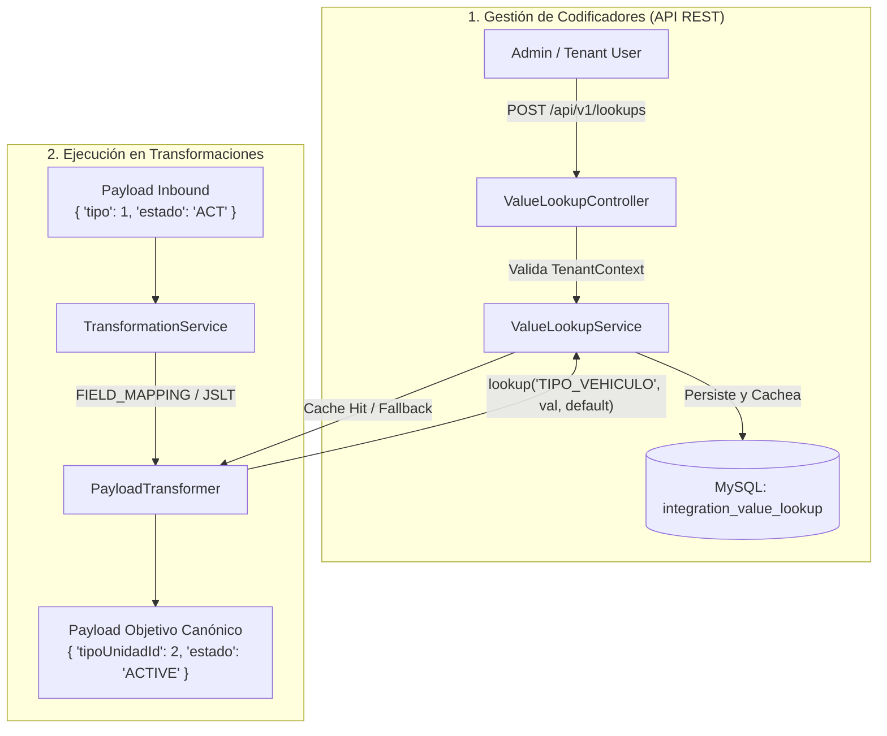

# Guía de Transformación con Lookups de Codificadores (Value Mapping)

Este documento describe la arquitectura, la configuración de APIs y el uso de **Value Lookups (Codificadores)** dentro de los motores de transformación (`FIELD_MAPPING` y `JSLT`) en la plataforma de integración.

---

## 1. Arquitectura de Codificadores (Value Lookups)

Los codificadores permiten traducir valores de códigos de sistemas externos (ej. SIGO, SAP HANA, etc.) hacia los identificadores o catálogos canónicos de CL2 Core, con soporte de valor por defecto (*fallback* default) cuando un código no se encuentra registrado.



---

## 2. Modelo de Persistencia (`integration_value_lookup`)

La tabla `integration_value_lookup` garantiza el aislamiento estricto por tenant y sistema externo:

```sql
CREATE TABLE integration_value_lookup (
    id BINARY(16) NOT NULL,
    tenant_id BINARY(16) NOT NULL,
    external_source VARCHAR(100) NOT NULL,
    catalog_code VARCHAR(100) NOT NULL,
    source_value VARCHAR(255) NOT NULL,
    target_value VARCHAR(255) NOT NULL,
    description VARCHAR(255) NULL,
    active BOOLEAN NOT NULL DEFAULT TRUE,
    created_at TIMESTAMP(6) NOT NULL,
    updated_at TIMESTAMP(6) NOT NULL,
    PRIMARY KEY (id),
    UNIQUE KEY uq_lookup_source (tenant_id, external_source, catalog_code, source_value),
    KEY idx_lookup_query (tenant_id, external_source, catalog_code, active)
);
```

---

## 3. Endpoints de la API REST (`/api/v1/lookups`)

Todos los endpoints requieren el header `X-Tenant-ID` (o token JWT con claim `tenant_id`).

### 3.1 Registrar o Actualizar un Mapeo Individual (Upsert)
* **Método**: `POST`
* **URL**: `http://localhost:8080/api/v1/lookups`
* **Headers**:
  ```http
  Authorization: Bearer <TOKEN_JWT>
  X-Tenant-ID: 11111111-1111-1111-1111-111111111111
  Content-Type: application/json
  ```
* **Body**:
  ```json
  {
    "externalSource": "sigo",
    "catalogCode": "TIPO_VEHICULO",
    "sourceValue": "1",
    "targetValue": "2",
    "description": "Mapeo de Auto a TipoUnidadId 2"
  }
  ```

### 3.2 Carga Masiva de Mapeos (Batch Upsert)
* **Método**: `POST`
* **URL**: `http://localhost:8080/api/v1/lookups/batch`
* **Body**:
  ```json
  [
    {
      "externalSource": "sigo",
      "catalogCode": "TIPO_VEHICULO",
      "sourceValue": "1",
      "targetValue": "2",
      "description": "Auto"
    },
    {
      "externalSource": "sigo",
      "catalogCode": "TIPO_VEHICULO",
      "sourceValue": "2",
      "targetValue": "5",
      "description": "Camion"
    },
    {
      "externalSource": "sigo",
      "catalogCode": "ESTADOS",
      "sourceValue": "ACT",
      "targetValue": "ACTIVE",
      "description": "Estado Activo"
    }
  ]
  ```

### 3.3 Consultar Códigos de un Catálogo
* **Método**: `GET`
* **URL**: `http://localhost:8080/api/v1/lookups?externalSource=sigo&catalogCode=TIPO_VEHICULO`

### 3.4 Eliminar un Mapeo
* **Método**: `DELETE`
* **URL**: `http://localhost:8080/api/v1/lookups/{id}`

---

## 4. Uso en Motor de Transformación `FIELD_MAPPING`

En la configuración del Integration Profile, añade la directiva `lookup` dentro de una regla de campo:

```json
{
  "businessDomain": "unidades",
  "externalSource": "sigo",
  "syncDirection": "OUTBOUND",
  "protocol": "REST",
  "endpoint": "https://api.qa.comsatel.com.pe/unidad/api/v1/unidad",
  "credentialRef": "secret/cl2/comsatel-unidad-credentials",
  "transformation": {
    "engine": "FIELD_MAPPING",
    "fields": [
      {
        "target": "alias",
        "sourcePath": "$.placa"
      },
      {
        "target": "tipoUnidadId",
        "sourcePath": "$.tipo_vehiculo",
        "type": "INTEGER",
        "lookup": {
          "catalogCode": "TIPO_VEHICULO",
          "defaultValue": "2"
        }
      },
      {
        "target": "estado",
        "sourcePath": "$.estado_codigo",
        "type": "STRING",
        "lookup": {
          "catalogCode": "ESTADOS",
          "defaultValue": "ACTIVO"
        }
      }
    ]
  }
}
```

---

## 5. Uso en Motor de Transformación `JSLT`

En scripts JSLT, utiliza la función nativa `lookup(catalogCode, sourceValue, defaultValue[, externalSourceOverride])`:

```javascript
{
  "tipoUnidadId": number(lookup("TIPO_VEHICULO", .tipo, "2")),
  "alias": .numero_placa,
  "estado": lookup("ESTADOS", .estado_orig, "ACTIVO"),
  "categoria": lookup("CATEGORIA_SAP", .cat_code, "GENERAL", "sap-hana"),
  "atributosUnidad": [
    {
      "atributoId": 1,
      "valor": .numero_placa
    },
    {
      "atributoId": 2,
      "valor": lookup("MARCAS", .marca_orig, "TOYOTA")
    }
  ]
}
```

---

## 6. Comportamiento y Fallback

| Escenario | Resultado |
|---|---|
| Código origen existe en BD para el Tenant y `externalSource` | Retorna el `targetValue` configurado. |
| Código origen no existe en BD, pero se especificó `defaultValue` | Retorna el `defaultValue` (ej. `"2"` o `"ACTIVO"`). |
| Código origen no existe en BD y no hay `defaultValue` (`null`) | Mantiene el valor original extraído. |
| Operaciones masivas de sincronización | Lecturas ultrarrápidas ($< 1$ ms) atendidas por la caché en memoria de `ValueLookupService`. |
